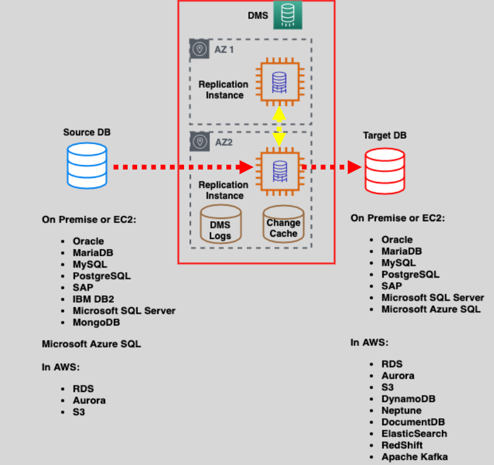
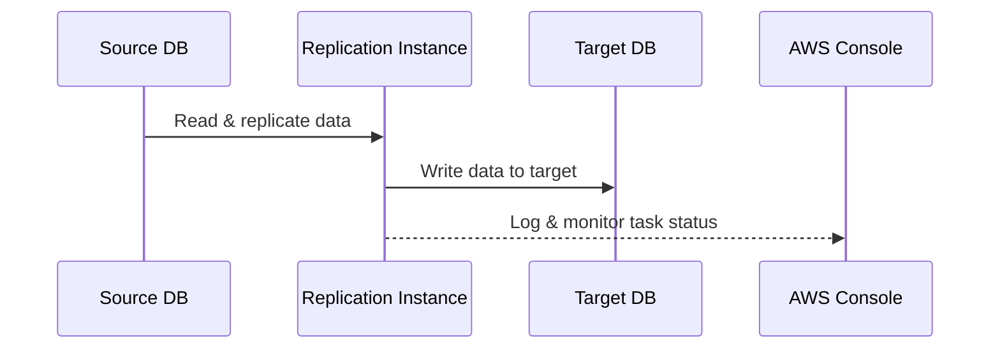
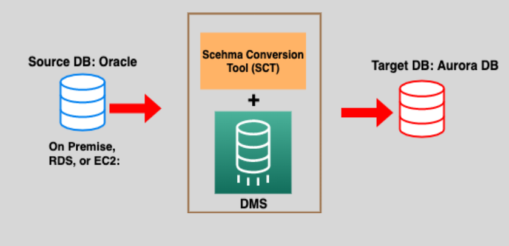

# 📂 **AWS Database Migration Service (DMS)**

_🚀 Migrate Databases Easily, Securely, and at Scale!_

**AWS DMS** (Database Migration Service) is a **fully managed service** that helps you **migrate databases quickly and securely** to AWS. Whether you're performing a **one-time lift** or setting up **ongoing replication**, DMS supports a wide variety of **relational, NoSQL**, and **data warehouse** engines.

  

---

## 🌟 **Why Use AWS DMS?**

| ✅ Benefit                       | 💬 Description                                                        |
| -------------------------------- | --------------------------------------------------------------------- |
| ⚡ **Fast and Reliable**         | Migrate data quickly with minimal downtime.                           |
| 🛠️ **Minimal Configuration**     | Launch a migration task in just a few clicks.                         |
| 🔄 **Supports Live Replication** | Sync data in near real-time for smooth cutovers.                      |
| 💸 **Pay-As-You-Go**             | No upfront costs – pay only for the compute and storage you use.      |
| 🔐 **Secure by Design**          | TLS encryption in transit, AWS KMS for data at rest.                  |
| 🌐 **Cross-Platform Support**    | Works with on-prem, cloud-to-cloud, hybrid, and AWS-native scenarios. |

---

## 🧩 **Core Migration Types**

### 1️⃣ **Homogeneous Migration** – _Same Engine → Same Engine_

🔹 **Example:** MySQL ➝ Amazon RDS for MySQL  
🔹 **Use Case:** Straightforward migrations, no schema conversion needed.

### 2️⃣ **Heterogeneous Migration** – _Different Engine → New Engine_

🔹 **Example:** Oracle ➝ Amazon Aurora  
🔹 **Use Case:** Useful when modernizing or adopting AWS-native databases.

💡 In heterogeneous migrations, **AWS DMS + AWS Schema Conversion Tool (SCT)** work together to convert schemas and migrate data.

---

## 🔧 **How AWS DMS Works**

### 🔁 Key Components

- **Source Endpoint**: Where data originates (e.g., on-prem DB, RDS, DynamoDB).
- **Target Endpoint**: The destination AWS database (e.g., Aurora, Redshift).
- **Replication Instance**: A managed EC2 under the hood that handles the migration tasks.

---

## 🔁 **Replication Instance Details**

  

---

### 💫 Key Features

- 💻 **Inside Your VPC** | Full control and security over the replication environment.
- 🌍 **Multi-AZ Support** | Enable high availability for production migrations.
- ⏱️ **Continuous Sync** | Sync data changes until you're ready to cut over to the target database.

---

### ❓ Why Is Replication Used for Migration?

You might wonder:

_“If we only want to migrate the database once, why bother with **ongoing replication**?”_

👉 Because replication solves 3 **critical** problems in **real-world migrations**

| 🧠 Real Challenge            | ✅ What Replication Solves                                       |
| ---------------------------- | ---------------------------------------------------------------- |
| Production DB must stay live | Keeps syncing changes after initial copy (zero downtime cutover) |
| Cutover can't be instant     | Let’s you test target DB while keeping source updated            |
| Business can't afford risk   | Rollback is safe—source stays untouched during replication       |

So replication is not just for syncing—it's what makes the **migration non-disruptive**, **safe**, and **smart**.

---

## 🧠 **When to Use AWS Schema Conversion Tool (SCT)?**

For **heterogeneous migrations**, where schema objects differ between database engines, use **SCT**:

### Step-by-Step

1. 🎯 **Scan Source Schema** (Oracle, SQL Server, etc.)
2. 🔁 **Convert to Target Format** (e.g., Aurora PostgreSQL)
3. 🧱 **Apply Converted Schema** to the target DB
4. 📦 **Use DMS** to migrate the actual data

  

---

## 🚀 **Common Migration Scenarios**

| Use Case                               | Tool(s) Used                 |
| -------------------------------------- | ---------------------------- |
| 🛠️ Lift-and-shift from Oracle to RDS   | DMS (homogeneous)            |
| 🔄 Convert & move SQL Server to Aurora | SCT + DMS (heterogeneous)    |
| 🌍 Hybrid setup with real-time sync    | DMS with ongoing replication |
| 🏭 Data warehouse migration            | DMS + SCT to Redshift        |
| 🔁 Cross-region database replication   | DMS                          |

---

## 💰 **Pricing Snapshot**

| Component               | Cost Structure                         |
| ----------------------- | -------------------------------------- |
| 🖥️ Replication Instance | Billed per vCPU-hour (like EC2)        |
| 🗂️ Data Transfer        | Charged if transferring across regions |
| 🧪 SCT                  | Free to use                            |

🔍 Use **AWS Pricing Calculator** for estimates:

👉 [https://calculator.aws.amazon.com/](https://calculator.aws.amazon.com/)

---

## ✅ **Quick Recap: DMS in a Nutshell**

| 📌 Feature                      | 💬 Summary                                      |
| ------------------------------- | ----------------------------------------------- |
| 🔧 Migration Types              | Homogeneous and Heterogeneous                   |
| 💻 What It Migrates             | Databases, Data Warehouses, NoSQL Stores        |
| ⏱️ Near Real-Time Replication   | Yes – syncs data continuously                   |
| 🔐 Security                     | TLS + KMS + IAM + VPC support                   |
| 🛠️ Schema Conversion Tool (SCT) | Use for heterogenous migrations                 |
| 💸 Pricing                      | Pay only for usage, no licenses or upfront fees |

---

## 🏁 Final Thoughts

Whether you're **modernizing** legacy systems, **moving to fully managed databases**, or enabling **ongoing cross-region sync**, **AWS DMS** is your reliable companion in the cloud migration journey.

👉 **Don't wait!** [Start your migration today](https://aws.amazon.com/dms/) and unlock the power of AWS DMS for your database migration needs!
