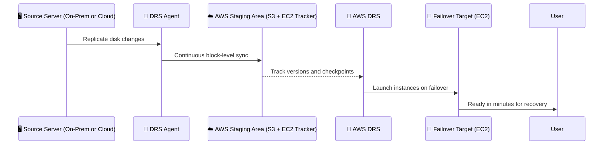

# 🔁♻️❤️‍🩹 **AWS Elastic Disaster Recovery (DRS)**

> _“Your safety net for critical workloads in the cloud.”_

**AWS Elastic Disaster Recovery (AWS DRS)** is the **primary AWS service** for implementing **cost-effective**, **high-speed**, and **reliable disaster recovery (DR)** across both on-premises and cloud-based environments.

It helps you **minimize downtime**, avoid data loss, and **failover to AWS in minutes** — all without the heavy lifting of traditional DR infrastructure.

---

  

---

## 🧠 **What is AWS DRS?**

**AWS DRS** is a **fully managed, active-passive DR solution** that replicates your physical or virtual servers to AWS **continuously and securely**, allowing you to **spin up EC2-based replicas on demand** during a disaster — or even for testing.

It gives you **point-in-time recovery**, **cross-region protection**, and **near real-time RPOs** (Recovery Point Objectives), all while being **affordable** and **scalable**.

---

## 🌟 **Key Features at a Glance**

| Feature                       | Description                                                             |
| ----------------------------- | ----------------------------------------------------------------------- |
| 🔁 **Continuous Replication** | Constantly syncs block-level changes from your source to AWS            |
| 💾 **Staging Area**           | Low-cost S3 + lightweight compute (no EC2/EBS until recovery is needed) |
| 🕒 **Point-in-Time Recovery** | Restore systems to previous healthy states from multiple restore points |
| 🌍 **Cross-Region Support**   | Replicate data to a secondary AWS Region for geo-redundant DR           |
| 🧰 **Non-Disruptive Testing** | Run DR drills anytime without interrupting production                   |
| 🧠 **Broad Platform Support** | Supports VMware, Hyper-V, physical servers, and other clouds            |

---

## ⚙️ **How AWS DRS Works**

1. **Agent Setup:** Install the Elastic Disaster Recovery agent on your source servers.
2. **Data Replication:**
   - The agent works with AWS DRS to continuously replicate server data to AWS.
   - Replicated data is stored in a **staging area** using low-cost storage like Amazon S3.
   - Compute resources in the staging area track and manage replication but do not run active instances.
3. **Failover and Recovery:**
   - During failover, AWS DRS provisions **Amazon EC2 instances** and **EBS volumes** based on the replicated data.
   - Applications are recovered and made operational in minutes.
4. **Testing and Monitoring:**
   - Perform disaster recovery drills without disrupting production systems.
   - Monitor replication health and readiness in real time.

---

---

## 🔌 **Supported Environments**

| Platform                 | Supported? |
| ------------------------ | ---------- |
| 🖥️ Physical Servers      | ✅         |
| 💻 VMware vSphere        | ✅         |
| 🖥️ Microsoft Hyper-V     | ✅         |
| ☁️ EC2 in another region | ✅         |
| 🧱 Other cloud VMs       | ✅         |

---

## 🎯 **Disaster Recovery in Action**

### ✅ **Day-to-Day (Passive Mode)**

- **DRS agent** replicates changes to **S3** in real time.
- Minimal compute runs in the **staging subnet** (no EC2, no EBS used).

### 🚨 **During a Disaster (Failover Mode)**

- Admin triggers **failover**.
- AWS DRS **spins up EC2 instances** using replicated disk images.
- Systems come online within **minutes** — fully booted and ready to serve.

### 🧪 **DR Drills (Testing Mode)**

- Simulate disaster scenarios without touching production.
- Validate that recovery works and test business continuity plans.

---

## 🔄 **Recovery Options**

| Type                         | What It Does                                         |
| ---------------------------- | ---------------------------------------------------- |
| 🔁 **Failover**              | Spin up EC2 + EBS from replicated data               |
| ⏪ **Point-in-Time Restore** | Recover to a specific previous snapshot              |
| 🧪 **Non-Disruptive Drill**  | Launch sandbox copies to test without affecting prod |

---

## ❓ **Is AWS DRS Active-Active?**

**No** — AWS DRS is an **active-passive DR** model:

- Your **primary systems remain active on-prem or in the cloud**.
- AWS holds **dormant copies** in a low-cost staging area until needed.

---

## 💸 **Pricing & Cost Efficiency**

| Cost Element          | You Pay For...                                      |
| --------------------- | --------------------------------------------------- |
| 💾 Storage            | Low-cost S3 for replicated data                     |
| 🧠 Tracking Compute   | Lightweight EC2 usage in staging area (minimal)     |
| 🚀 Recovery Resources | EC2 + EBS usage **only during failover or testing** |
| ✅ Agent Software     | Included — no additional license fees               |

### ✅ **Why It’s Cost-Efficient**

- **No hot standby infrastructure needed**
- **Pay-as-you-go** for storage + occasional compute
- **Much cheaper** than traditional DR colocation or mirrored hardware

---

## 🛡️ **Benefits of Using AWS DRS**

| Benefit                  | Why It Matters                                         |
| ------------------------ | ------------------------------------------------------ |
| ⚡ **Fast Recovery**     | Recover full systems in **minutes**, not hours or days |
| 📉 **Minimal Downtime**  | Meet strict RTO/RPO requirements                       |
| 🌍 **Geo-Redundancy**    | Add cross-region protection in clicks                  |
| 🔐 **Secure by Default** | Data encrypted in transit and at rest                  |
| 🔄 **Scalable**          | Protect 1 server or 1000+ — just replicate and go      |
| 🧪 **Easy Testing**      | Run DR drills **without disrupting production**        |

---

## 💡 **Use Cases**

- 🏢 **Enterprise DR for mission-critical systems**
- 🎓 **Education or government workloads needing resilience**
- 🧪 **Regulated industries requiring audit-proof DR plans**
- 🚧 **Migrate workloads by simulating failover**
- 🧰 **Augment legacy DR solutions with cloud-based resiliency**

---

## 🏁 **Conclusion**

> _“Disaster recovery shouldn’t be a disaster.”_

**AWS Elastic Disaster Recovery (DRS)** provides a **modern**, **automated**, and **affordable** DR solution for businesses of all sizes. With its **near-zero RPOs**, **fast failover**, and **cost-effective staging**, it’s your go-to service for business continuity in the cloud.

🔐 Be ready for the unexpected. With AWS DRS, your critical workloads are just minutes away from recovery.
