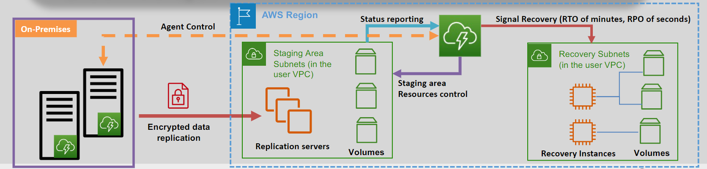

# 🔁♻️❤️‍🩹 Elastic Disaster Recovery Service (AWS DRS)

AWS Elastic Disaster Recovery (AWS DRS) is the **recommended service** for disaster recovery into AWS. It provides fast and reliable recovery of on-premises and cloud-based applications, ensuring minimal downtime and data loss.

---

    

---

## 🌟 Key Features

### 🔄 Continuous Data Replication

- The **Elastic Disaster Recovery agent** replicates source server data continuously to AWS.
- Data is stored in a **staging area subnet**, which includes **Amazon S3 for storage** and **minimal compute resources** for tracking changes.
- No actual **Amazon EC2 instances** or **EBS volumes** are created during replication. These resources are provisioned only when a failover is initiated.

### 🖥️ Broad Compatibility

- Supports recovery from:
  - On-premises physical infrastructure.
  - **VMware vSphere** and **Microsoft Hyper-V**.
  - Cloud environments.

### 📆 Point-in-Time Recovery

- Allows recovery of applications to specific points in time to minimize data loss during outages.

### 🌍 Cross-Region Recovery

- Facilitates the recovery of **Amazon EC2 instances** in a different AWS Region, ensuring geographic redundancy.

---

## 🎯 How It Works

1. **Agent Setup:** Install the Elastic Disaster Recovery agent on your source servers.
2. **Data Replication:**
   - The agent works with AWS DRS to continuously replicate server data to AWS.
   - Replicated data is stored in a **staging area** using low-cost storage like Amazon S3.
   - Compute resources in the staging area track and manage replication but do not run active instances.
3. **Failover and Recovery:**
   - During failover, AWS DRS provisions **Amazon EC2 instances** and **EBS volumes** based on the replicated data.
   - Applications are recovered and made operational in minutes.
4. **Testing and Monitoring:**
   - Perform disaster recovery drills without disrupting production systems.
   - Monitor replication health and readiness in real time.

---

## ❓ Is AWS DRS Active-Active?

No, AWS DRS is not an **active-active** solution. It operates as an **active-passive** disaster recovery system:

- The primary environment handles production workloads.
- The staging area stores replicated data, ready to spin up resources only during failover or testing.

---

## 💰 Is AWS DRS Cost-Efficient?

Yes, AWS DRS is highly cost-efficient:

- Uses **low-cost Amazon S3 storage** and minimal compute resources for replication.
- You pay for **EC2 instances and EBS volumes** only during failover or testing.
- Eliminates the need for a fully provisioned backup environment, saving costs compared to traditional disaster recovery setups.

---

## ✅ Why Choose AWS DRS?

- **Fast Recovery:** Recover applications within minutes, reducing downtime.
- **Scalability:** Supports environments of any size, from small businesses to enterprises.
- **Simplicity:** Easy to set up and manage with minimal operational overhead.
- **Cost-Effectiveness:** Pay-as-you-go pricing model ensures you only pay for what you use.

---

AWS Elastic Disaster Recovery ensures that your business remains resilient in the face of unexpected disasters. With its affordable, reliable, and scalable approach, it’s an essential service for safeguarding your critical applications and data.
