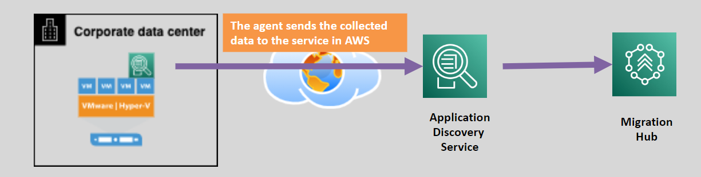

# 🔍 AWS Application Discovery Service: Plan Your Migration with Confidence

AWS Application Discovery Service helps businesses **plan their migration projects** by gathering detailed information about servers and applications in their on-premises data centers. It provides insights that simplify migration planning and enable a smooth transition to AWS.

---

    

---

## 🌟 Key Features

### 🛠️ Comprehensive Data Collection

- **Configuration, Usage, and Performance Data:** Gain visibility into server configurations, resource usage, and performance metrics.
- **Process and Dependency Mapping:** Identify running processes, network/traffic connections, and server dependencies.

### 🔄 Flexible Discovery Options

- **Agent-Based Discovery:** Install an agent on servers for granular data collection.
- **Agentless Discovery:** Use a VM on-premises to collect data without installing anything on servers.

### 📊 Integration with AWS Migration Hub

- **Centralized Management:** Plan and track migrations in one place using AWS Migration Hub.
- **Cost Estimation:** Use collected data to estimate the costs of running your infrastructure on AWS.

### 🔐 Secure Data Handling

- **Encrypted Data Storage:** Retain data securely within the service.
- **Export Capability:** Export collected data as CSV files for analysis or custom reporting.

---

## 🎯 Use Cases

### 1️⃣ Migration Planning

Gather insights into your on-premises infrastructure to:

- Identify server dependencies.
- Plan application migration strategies effectively.

### 2️⃣ Cost Estimation

Analyze server usage and performance data to predict:

- AWS costs for running workloads.
- Resource requirements for cloud environments.

### 3️⃣ Compliance and Documentation

Export server data for:

- Auditing purposes.
- Migration documentation.

---

## 🛠️ How It Works

1. **Setup and Configuration:**

   - Deploy the Application Discovery Service using either **agent-based** or **agentless** methods.
   - For agent-based discovery, install lightweight agents on your servers to collect in-depth data.
   - For agentless discovery, deploy a virtual machine (VM) on your on-premises network to passively gather server metadata.

2. **Data Collection:**

   - The service collects configuration, usage, and performance data from servers.
   - It maps dependencies, identifies network traffic patterns, and records running processes.

3. **Data Analysis:**

   - The collected data is analyzed to provide insights into server performance and interdependencies.
   - Use these insights to determine optimal migration strategies and identify potential challenges.

4. **Integration with AWS Migration Hub:**

   - The data is integrated into **AWS Migration Hub** to centralize migration planning and execution.
   - You can track migration progress and manage tasks from a single dashboard.

5. **Export and Reporting:**
   - Export the collected data as **CSV files** for detailed analysis.
   - Use these reports to estimate AWS costs, plan server grouping, and document the migration process.

---

## ✅ Why Use AWS Application Discovery Service?

- **Time-Saving:** Automates the discovery process, reducing manual effort.
- **Accurate Insights:** Provides detailed data to make informed migration decisions.
- **Seamless Integration:** Works with AWS Migration Hub to streamline planning and execution.
- **Secure and Flexible:** Offers both agent-based and agentless options with secure data handling.

---

AWS Application Discovery Service simplifies the complexities of migration planning by delivering valuable insights about your on-premises infrastructure. Whether you’re estimating costs or mapping dependencies, it’s an essential tool for a successful migration to AWS.
