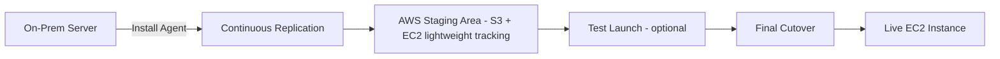

# ☁️💡 **CloudEndure Migration (Now AWS MGN): Migrate with Confidence**

> _“Move to the cloud with minimal downtime, zero headaches, and total confidence.”_

**CloudEndure Migration** was AWS’s robust, agent-based service for **automating large-scale cloud migrations** with minimal disruption. It’s now rebranded and fully integrated into AWS as the **AWS Application Migration Service (MGN)** — providing the same great functionality, but with tighter AWS console integration and native support.

---

## 🧠 **What Was CloudEndure Migration?**

**CloudEndure Migration** helped organizations **lift and shift** workloads to AWS by continuously replicating servers in real time, then allowing a **cutover** to the cloud with only a few minutes of downtime.

It supported **Windows/Linux**, multiple **cloud providers**, and **on-prem environments**, with a focus on **minimal disruption** and **automated cutovers**.

---

## 🔄 **The Evolution: CloudEndure → AWS MGN**

| Comparison Metric         | CloudEndure Migration             | AWS Application Migration Service (MGN)       |
| ------------------------- | --------------------------------- | --------------------------------------------- |
| 🏷️ **Branding**           | Acquired by AWS in 2019           | AWS-native service (successor to CloudEndure) |
| 🧰 **Management Console** | Managed via CloudEndure dashboard | Managed inside the AWS Console                |
| 🔌 **Integration**        | Limited AWS integration           | Full IAM, CloudWatch, and tagging support     |
| 💸 **Free to Use**        | Yes (for AWS migrations)          | Yes                                           |

> ✅ **AWS recommends MGN** for all current migration projects going forward.

---

## 🔧 **Core Features (CloudEndure / AWS MGN)**

| Feature                       | Description                                                                 |
| ----------------------------- | --------------------------------------------------------------------------- |
| 🔁 **Continuous Replication** | Real-time block-level replication to a staging area in AWS                  |
| 🕓 **Minimal Downtime**       | Final cutover usually takes just minutes due to pre-synced data             |
| ⚙️ **OS and App Flexibility** | Supports Linux, Windows, databases, web servers, and business applications  |
| 🌐 **Any-to-AWS Migration**   | From on-prem, other clouds, or across AWS regions                           |
| 🧪 **Test Anytime**           | Spin up test instances **without impact** to production                     |
| 🧰 **Automated Conversion**   | Converts physical/virtual workloads to bootable EC2 instances automatically |

---

## 📈 **Why Use CloudEndure Migration (Now MGN)?**

| Benefit                  | Why It Matters                                                             |
| ------------------------ | -------------------------------------------------------------------------- |
| ✅ **Simplicity**        | Fully automated — install the agent and let AWS handle the rest            |
| 🕒 **Speed**             | Near-zero downtime with fast cutover and real-time sync                    |
| 💰 **Cost-Free for AWS** | Completely free when migrating into AWS                                    |
| 🔒 **Secure**            | All data in-transit is encrypted over TLS, and at-rest with EBS encryption |
| 🔄 **Scalable**          | Supports hundreds of servers or full data centers                          |

---

## 🛠️ **How CloudEndure Migration Works**

### Breakdown

1. ✅ **Agent Installed** on source machines
2. 🔄 **Replication begins** in real-time to AWS (low-cost staging area)
3. 🧪 **Test launch** anytime without disruption
4. 🚀 **Cutover**: EC2 instance goes live in minutes

---

## 🔄 **Common Use Cases**

| Use Case                      | Example                                                      |
| ----------------------------- | ------------------------------------------------------------ |
| 🏢 **On-Prem to AWS**         | Move VMs or physical servers from a local data center to EC2 |
| ☁️ **Cloud-to-Cloud**         | Migrate workloads from Azure or GCP into AWS                 |
| 🛠️ **Disaster Recovery Test** | Validate recovery procedures with test launches in AWS       |
| 🧳 **Data Center Exit**       | Consolidate workloads to the cloud for cost and agility      |

---

## 📦 **Real-World Example: E-Commerce Migration**

**Scenario**:  
A fashion retailer wants to migrate its online store from VMware-based servers to AWS EC2 with minimal downtime.

**Steps**:

1. 🧩 Install the CloudEndure (MGN) agent on each VM.
2. 🔄 Start continuous replication to AWS.
3. 🧪 Run test EC2 instances to validate everything.
4. 🚀 Schedule a **cutover at midnight** with near-zero disruption.
5. 🎉 Online store is now live in AWS!

---

## 🧭 **When to Use CloudEndure / MGN**

| If You Need To...                           | Use CloudEndure (MGN) |
| ------------------------------------------- | --------------------- |
| 🔁 Rehost hundreds of workloads to AWS      | ✅                    |
| 💡 Minimize downtime                        | ✅                    |
| 🚀 Avoid full app refactoring               | ✅                    |
| 🧪 Test migration results before going live | ✅                    |
| ☁️ Move between clouds or AWS regions       | ✅                    |

---

## 📚 **Summary**

> _“CloudEndure Migration helped thousands migrate to the cloud — now AWS MGN takes it further.”_

If you're migrating legacy infrastructure, VMware workloads, or apps from another cloud, **AWS MGN** (formerly CloudEndure) gives you a **battle-tested, fully managed**, and **zero-cost** path to success.

| Topic           | Summary                                                |
| --------------- | ------------------------------------------------------ |
| 🧠 What is it?  | Real-time, automated workload migration service        |
| 🔁 Key Feature  | Continuous replication with minimal downtime           |
| 💸 Cost         | **Free for AWS migrations**                            |
| 🏁 Current Name | Now called **AWS Application Migration Service** (MGN) |
