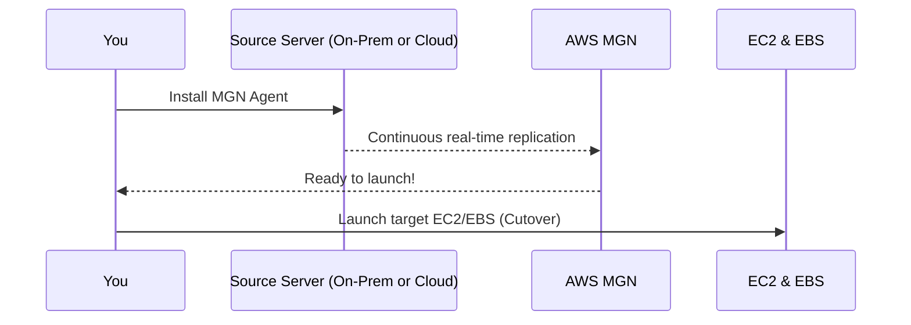

# 🎌 **AWS MGN (Application Migration Service)**

> Your lift-and-shift highway to AWS 🛣️☁️

**AWS Application Migration Service (MGN)** is AWS’s official **rehost (lift-and-shift)** solution, helping you move apps from your physical data center, VMware, Hyper-V, or other clouds to AWS **without changing the app**.  
It’s the **evolution of CloudEndure**, built to simplify, automate, and accelerate migrations with minimal downtime.

---

## 🌟 **Why Use AWS MGN?**

| ✅ Benefit                     | 🌐 Description                                                   |
| ------------------------------ | ---------------------------------------------------------------- |
| 🔄 **Fully Automated**         | Converts and launches servers in AWS with almost no manual steps |
| 💽 **Full System Replication** | Copies OS, apps, settings, and data — not just files             |
| 💰 **Cost-Efficient**          | Uses cheap S3 + staging compute; EC2/EBS are only used at launch |
| ⚙️ **Broad Compatibility**     | Works with physical servers, VMware, Hyper-V, and cloud VMs      |
| 🧪 **Testing & Validation**    | Run test instances in AWS without affecting source workloads     |

---

## ⚙️ **How AWS MGN Works**

### **Step-by-Step:**

1. **Install the MGN Agent** 🧩

   - Lightweight agent runs on your source machine.

2. **Real-Time Replication** 🔁

   - Your data is replicated continuously to a **staging area** in AWS (S3 + minimal compute).

3. **Launch/Test** 🚀
   - Test launch before cutover; final cutover spins up EC2 with your replicated image.

---

## 🧰 **Common Use Cases**

| Use Case                          | Example                                                                       |
| --------------------------------- | ----------------------------------------------------------------------------- |
| 🔄 **Rehost Migration**           | Move servers from data centers or other clouds to AWS EC2 without app changes |
| 🧪 **Pre-Migration Testing**      | Validate workloads in AWS with test launches                                  |
| 🛡️ **DR for Unsupported Regions** | Use MGN for disaster recovery into GovCloud, China, or AWS Outposts           |

---

## 📍 **MGN vs. AWS DRS (Elastic Disaster Recovery)**

| Feature                         | 🛠️ **AWS MGN**                  | ♻️ **AWS DRS** (Preferred)                 |
| ------------------------------- | ------------------------------- | ------------------------------------------ |
| 💼 **Primary Use Case**         | Lift-and-shift migrations       | Disaster recovery & cross-region DR        |
| 🔁 **Replication Model**        | Into staging; launched manually | Continuous + point-in-time recovery        |
| 🌍 **GovCloud / China Regions** | ✅ Supported                    | ❌ Not supported                           |
| 🧱 **AWS Outposts Support**     | ✅ Supported                    | ❌ Not supported                           |
| ⚡ **Automation & Efficiency**  | High                            | Higher                                     |
| 💸 **Cost Efficiency**          | Good                            | Excellent (pay only for storage + staging) |

> 🔑 **TL;DR:**  
> Use **MGN** for migrations or DR in special regions like **GovCloud**, **China**, or **AWS Outposts**.  
> Use **AWS DRS** for most **modern DR needs** — faster, smarter, and more feature-rich.

---

## 🕰️ **Where Did MGN Come From?**

| Evolution Timeline                              |
| ----------------------------------------------- |
| 🔹 CloudEndure acquired by AWS in 2019          |
| 🔹 MGN launched as native AWS service           |
| 🔹 AWS DRS introduced for advanced DR use cases |

---

## 🏁 **Final Thoughts**

🛠️ **AWS MGN** is your go-to tool for **rehost migrations** when you want:

- 🚫 No code changes
- ⚡ Fast setup
- ✅ Easy validation
- 💰 Lower costs
