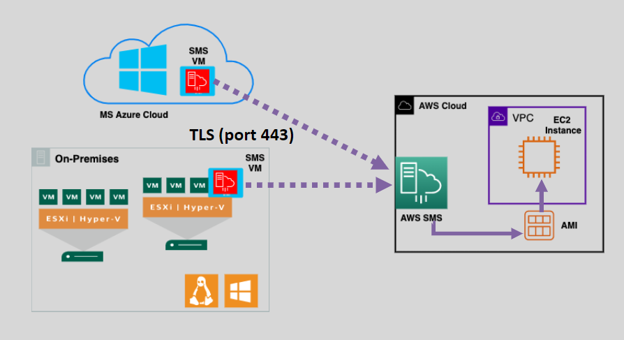
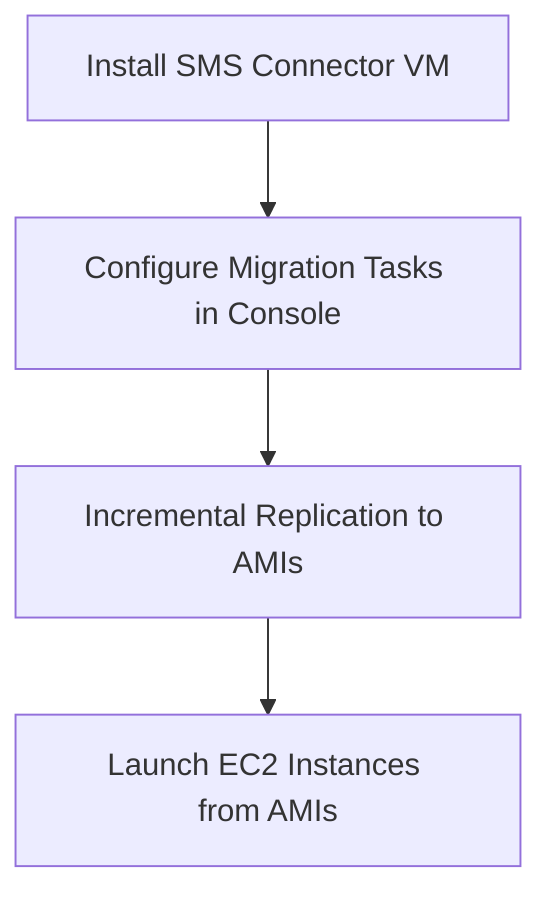

# 💻 **AWS Server Migration Service (SMS)**

_Simplify Virtual Machine (VM) Migration to AWS!_

**AWS Server Migration Service (SMS)** is a legacy AWS service that automates the **lift-and-shift** migration of **virtual machines** (VMs) from **on-premises** or **Microsoft Azure** environments to AWS. It replicates your servers as Amazon Machine Images (AMIs), so you can launch equivalent EC2 instances in the cloud — with **minimal downtime** and **manual effort**.

---

  

---

## 🚨 ⚠️ Deprecation Notice

**AWS Server Migration Service (SMS)** has been officially **discontinued**. As of March 31, 2022, AWS recommends using **AWS Application Migration Service (MGN)** for lift-and-shift migrations. citeturn0search0

---

### ❌ AWS SMS Is Deprecated

AWS SMS was once a tool for migrating virtual machines from on-premises or Azure environments to AWS. However, it lacked application awareness and advanced automation features. AWS has since consolidated its migration services, and SMS is no longer maintained.

---

### ✅ Recommended Alternative: AWS Application Migration Service (MGN)

AWS MGN is now the primary service for rehosting workloads to AWS. It offers real-time replication, automated server conversion, and broader OS and region support. MGN simplifies migrations by reducing manual processes and minimizing downtime. citeturn0search2

---

## 🌟 **Key Features of AWS SMS**

### 🔄 **Incremental Replication**

- Performs **ongoing, incremental syncs** of VMs to the cloud.
- Ensures that your **latest server state** is captured with each sync.
- Each sync creates a **new AMI** for that VM — ready to launch as an EC2 instance.

### 🧩 **Multi-Platform Support**

- Compatible with:
  - 🖥️ **VMware vSphere**
  - 🖥️ **Microsoft Hyper-V**
  - ☁️ **Microsoft Azure**
- Supports both **Linux** and **Windows** operating systems.

### 🔐 **Secure Migration**

- Data in transit is encrypted.
- Resulting **Amazon Machine Images (AMIs)** can be encrypted using **AWS KMS** for security at rest.

### 🛠️ **Orchestrated Multi-Server Migration**

- Migrate entire application stacks with dependencies.
- Group VMs logically for **parallel migration and testing**.

---

## 🔧 **How AWS SMS Works**

### 📝 **Step-by-Step:**

1. **📦 Deploy SMS Connector VM**

   - Install the lightweight **SMS connector appliance** in your VMware, Hyper-V, or Azure environment.

2. **🧭 Define Migration Tasks**

   - Use the **AWS Management Console** or **CLI** to group and schedule VM migrations.

3. **🔁 Incremental Replication**

   - SMS syncs changes **without shutting down** the source VM — enabling testing and staged cutover.

4. **🖼️ Create AMIs**

   - Each VM is transformed into an **Amazon Machine Image** in your AWS account.

5. **🚀 Launch EC2 Instances**
   - Use AMIs to launch cloud-based servers in any AWS region/VPC.

---

## 🎯 **Why Use AWS SMS?**

| 💡 Feature                  | 🔍 Benefit                                                         |
| --------------------------- | ------------------------------------------------------------------ |
| 🔄 Incremental Replication  | Sync changes during testing and before final cutover               |
| 📦 AMI Creation             | Quickly launch migrated workloads on EC2                           |
| 🛠️ Orchestration Support    | Group servers to maintain application consistency during migration |
| 🔧 OS Agnostic              | Supports both Linux and Windows VMs                                |
| 📣 Notification Integration | Use **SNS** to track migration events or failures                  |

---

## ⚠️ **Limitations & Deprecation Note**

While AWS SMS is still **available**, it is **no longer recommended for new migrations**.

### 🚫 **Limitations:**

- ❌ Does not detect **applications** or **databases** — only migrates the VM image.
- ❌ No real-time replication or failover capabilities.
- ❌ No native support for AWS Outposts or GovCloud.

---

## 🔁 **Better Alternative: AWS Application Migration Service (MGN)**

**AWS MGN** is the **next-gen evolution** of AWS SMS, built from the **CloudEndure technology**. It supports **real-time replication**, **automatic conversion**, and **more OS types and regions**.

| Feature                            | AWS SMS          | AWS MGN (Recommended)           |
| ---------------------------------- | ---------------- | ------------------------------- |
| 🔁 Incremental Replication         | Yes              | Yes (real-time)                 |
| 🧠 Application-Aware Migration     | No               | Yes                             |
| ⚙️ Region Support (e.g., GovCloud) | Limited          | Broader support                 |
| 🔄 Conversion to EC2               | Manual with AMIs | Automated with launch templates |
| ✅ Recommended By AWS              | ❌ Legacy tool   | ✅ Yes                          |

---

## ✅ **Summary**

**AWS SMS** is a solid, simple option for replicating VMs as EC2 instances — especially for small-scale, legacy VM migrations. But if you're planning any new or large-scale migrations, **use AWS MGN** instead for a **faster, smarter, and fully automated** migration experience.

---

## 🧠 **Final Thought:**

> _"AWS SMS is like taking snapshots and uploading them to AWS."_  
> _"AWS MGN is like cloning the VM in real-time, cutting over when you're ready."_

Use the right tool for your migration journey — and **future-proof your cloud**! ☁️🚀
