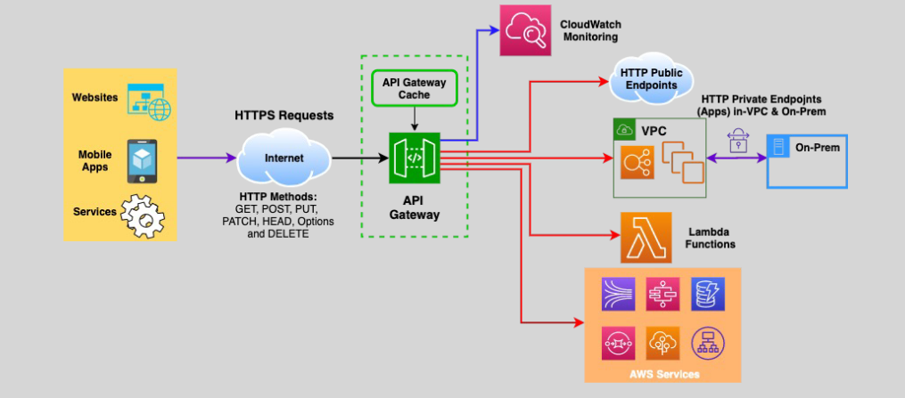

# 📊 **API Gateway – Monitoring: Ensuring Optimal Performance and Security**

Effective monitoring is crucial for maintaining the performance, reliability, and security of your APIs. Amazon API Gateway integrates seamlessly with various AWS services to provide comprehensive monitoring capabilities. This guide offers a clear and concise overview of API Gateway monitoring, highlighting key tools, features, and best practices.

---

## 🔍 **Monitoring Tools**

### 1. **Amazon CloudWatch Metrics**

- **Automatic Metrics Collection:** API Gateway sends metric data to CloudWatch every minute.
- **Key Metrics:**
  - **API Calls:** Number of requests made to your APIs.
  - **Latency:** Time taken to process API requests.
  - **Error Rates:** Frequency of failed API calls.
- **Usage:** Monitor API performance, set alarms for unusual activity, and gain insights into usage patterns.

### 2. **Amazon CloudWatch Logs**

- **Error Logging:** Capture detailed information about API errors and failures.
- **Execution Traces:** Record execution details to debug and analyze API behavior.
- **Performance Monitoring:** Track API performance metrics alongside logs for comprehensive analysis.

### 3. **Kinesis Data Firehose**

- **Log Streaming:** Send API Gateway logs to Kinesis Data Firehose for real-time processing and storage.
- **Use Cases:** Enable real-time analytics, data transformation, and long-term storage of API logs.

### 4. **AWS X-Ray**

- **Tracing Requests:** Trace API calls to downstream services to identify performance bottlenecks.
- **Service Graphs:** Visualize interactions between API Gateway and backend services.
- **Optimization:** Analyze and optimize the performance of your APIs and their integrations.

---

## 🛡️ **Key Monitoring Features**

- **Robust, Secure, and Scalable Access:**

  - API Gateway scales to handle hundreds of thousands of concurrent API calls.
  - Supports both stateful (WebSocket) and stateless (HTTP and REST) APIs.

- **API Versions and Release Stages:**

  - Host multiple API versions and manage different release stages (e.g., development, staging, production).

- **Canary Releases:**

  - Deploy new API versions incrementally to a subset of users to minimize impact and ensure stability.

- **Request Throttling and Monitoring:**

  - Protect backend services by throttling excessive requests and monitoring traffic patterns.

- **Caching Responses:**

  - Implement API caching to speed up responses and reduce backend load.

- **Integration with AWS Services:**
  - **AWS WAF:** Protect APIs from common web exploits and bots.
  - **CloudTrail:** Log API Gateway API calls for auditing and compliance.
  - **CloudWatch:** Comprehensive monitoring and alerting for API performance and health.
  - **CloudFront Integration:** Leverage CloudFront for DDoS protection and low latency responses.

---

## 🎯 **Use Cases**

1. **Performance Monitoring:**

   - Track latency and error rates to ensure APIs meet performance benchmarks.

2. **Security Auditing:**

   - Use CloudWatch Logs and CloudTrail to monitor and audit API access and usage.

3. **Real-Time Analytics:**

   - Stream API logs to Kinesis Data Firehose for real-time data processing and analytics.

4. **Optimizing User Experience:**
   - Utilize caching and throttling to deliver fast and reliable API responses.

---

## 🏁 **Conclusion**

Monitoring your APIs with Amazon API Gateway ensures they operate efficiently, securely, and reliably. By leveraging tools like CloudWatch Metrics, CloudWatch Logs, Kinesis Data Firehose, and AWS X-Ray, you gain comprehensive visibility into your API performance and security. Integrating these monitoring solutions with API Gateway’s scalable and secure infrastructure helps maintain optimal API functionality and enhances the overall user experience.
