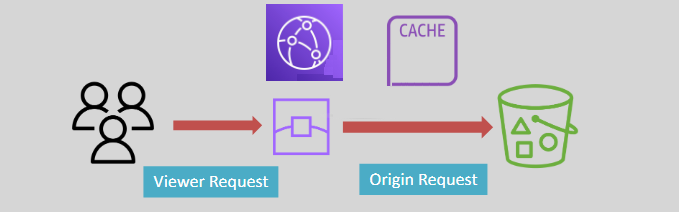

# **🧑‍💻 CloudFront – Cache Configuration**

Amazon CloudFront provides a variety of caching features to optimize content delivery and reduce latency. By configuring cache behaviors, cache keys, and cache policies, you can fine-tune how CloudFront caches and serves content to your users. Let’s break down these key components:

## **⚙️ Cache Behavior** _(what to receive)_

A **cache behavior** defines how CloudFront `handles requests based on a URL path pattern`. This configuration determines the path pattern, how requests are served, and the origin server to fetch content from.

### **Key Features of Cache Behavior**

- **Multiple Cache Behaviors**: You can configure multiple cache behaviors for different path patterns (e.g., **/images/\***, **/videos/\***). Each behavior applies to specific types of content.
- **Default Cache Behavior**: The default cache behavior is used when no other cache behavior matches the requested URL. It acts as a fallback for unmatched requests.
- **Path Pattern**: This defines the specific request path that a cache behavior applies to. For example, requests for image files like **\*.jpg** can have their own behavior, while video content can have another.

## **🗝️ Cache Key** _(what to include)_

A **cache key** is a unique identifier for each object in the cache. It helps determine whether a request for a resource will hit the cache or require fetching from the origin.

### **How Cache Keys Work**

- **Unique Identifier**: Every cached object has a unique cache key.
- **Cache Hit**: When a viewer requests a file, CloudFront checks if the cache key already exists in the cache. If it does, and the object is valid, it’s served from the cache.
- **Default Cache Key**: By default, the cache key is based on the CloudFront web distribution domain and the requested object’s path (e.g., **example.com/images/image.jpg**).
- **Cache Miss**: If the cache key doesn’t match or the object has expired, CloudFront fetches the object from the origin server.

## **📊 Cache Policy** _(what to cache)_

A **cache policy** controls how CloudFront `handles the caching of content`, including how long objects are cached and what information is included in the cache key.

### **Features of Cache Policy**

- **TTL (Time To Live)**: Defines how long an object is cached before CloudFront checks the origin server for updates.
- **Cache Key Information**: Specifies the headers, query strings, and cookies that CloudFront should include in the cache key.
- **Managed Policies**: CloudFront offers predefined (managed) cache policies, but you can also create custom cache policies to meet your specific needs.

### **Example**

A cache policy can include parameters like:

- **Query Strings**: Should CloudFront cache separate versions of a file based on query string parameters (e.g., **/image.jpg?size=small** and **/image.jpg?size=large**)?
- **HTTP Headers**: Whether headers like **Accept-Encoding** should be included in the cache key.
- **Cookies**: If cookies should be included to create a unique cache entry for each user.

## **🌍 Origin Request Policy** _(what to send)_

An **Origin Request Policy** defines what values CloudFront includes when it sends requests to the origin server. It ensures that only the necessary information (query strings, headers, cookies) is forwarded, which can help reduce the load on your origin.

  

---

### **Features of Origin Request Policy**

- **Customizable**: You can specify which query strings, headers, and cookies should be forwarded to the origin.
- **Improved Efficiency**: By controlling what’s forwarded to the origin, you can optimize performance and reduce unnecessary requests.

## **✅ Key Takeaways**

- **Cache Behavior**: Defines how CloudFront handles different request paths and where to serve content from.
- **Cache Key**: A unique identifier for cached content, helping determine if an object can be served from the cache.
- **Cache Policy**: Controls caching parameters, such as TTL and what data to include in the cache key.
- **Origin Request Policy**: Ensures only necessary information is sent to the origin server, optimizing performance.
