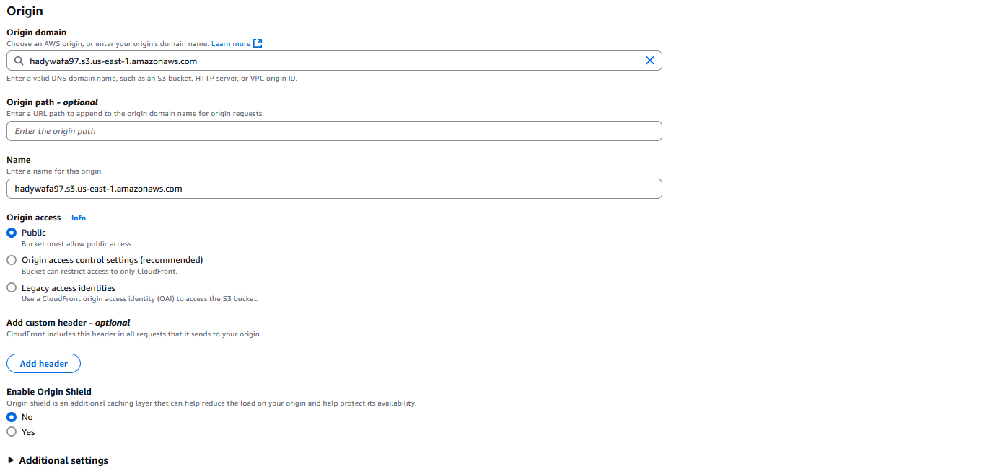
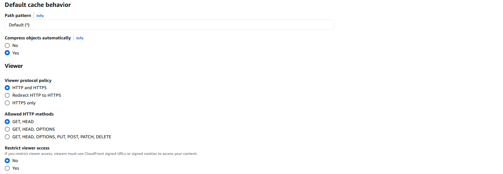
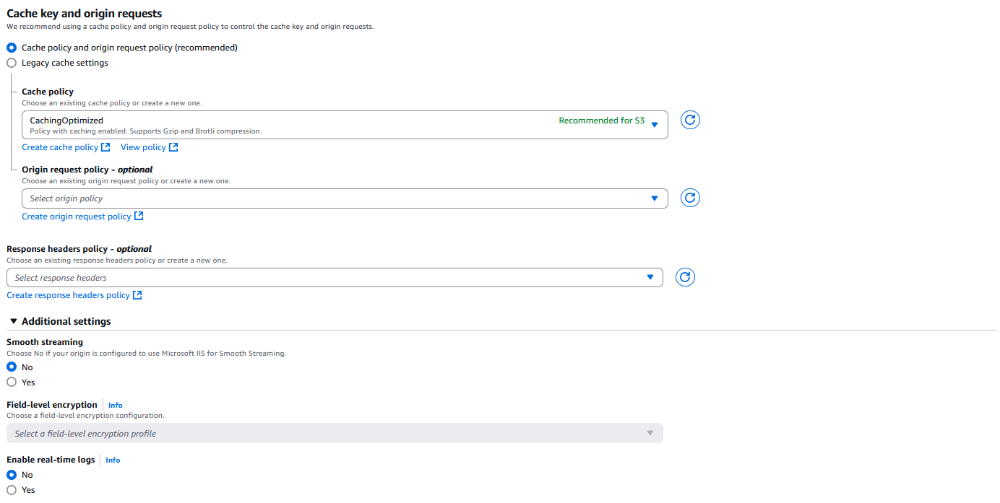
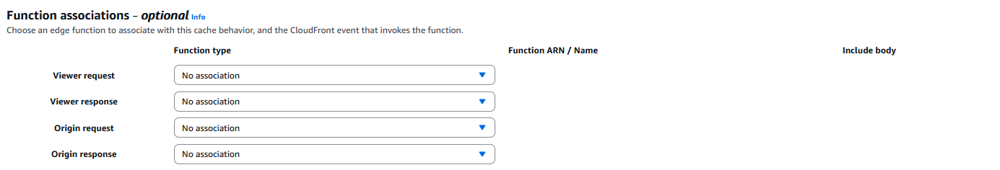
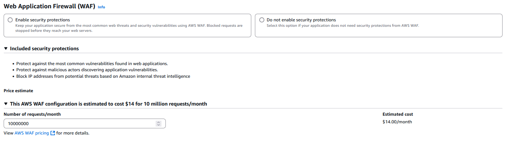
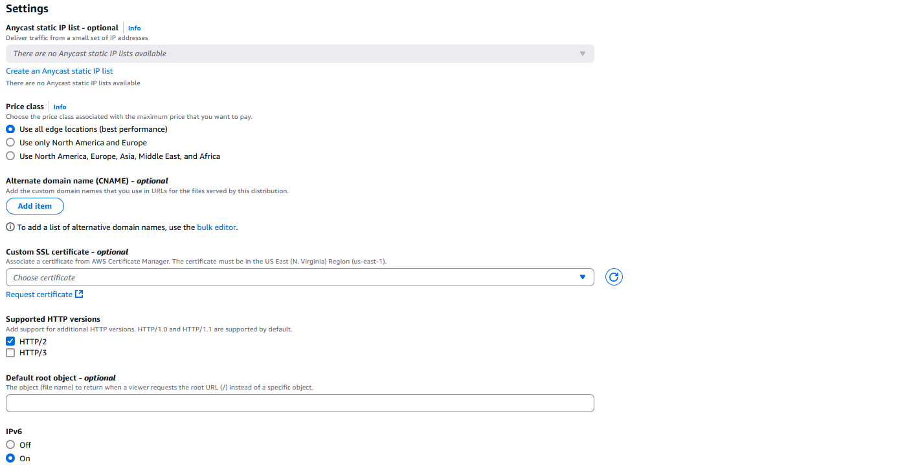
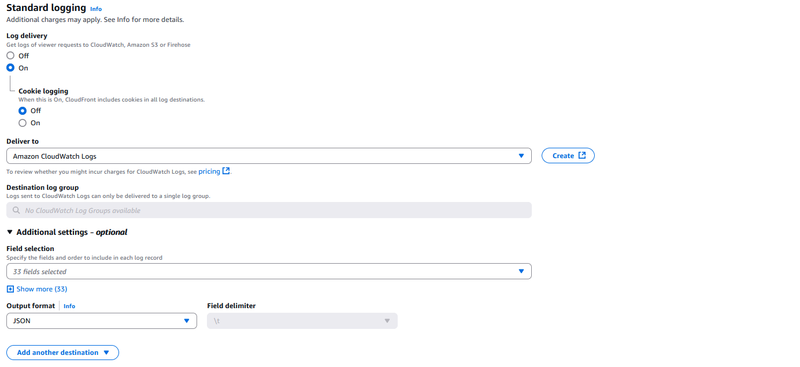

# Settings

## Origin

  

## Default Cache behavior

  

## Cache Key and origin requests

  

## Function associations

  

## Web Application Firewall (WAF)

  

## Settings

  

## Standard logging

  

