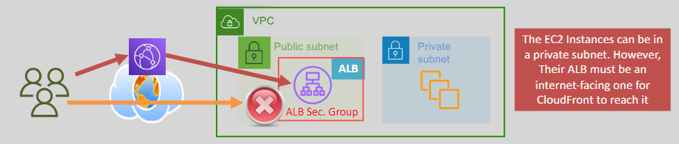
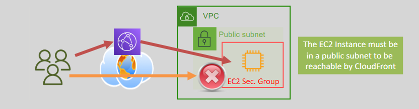

# **🔐 Limiting Origin Access with CloudFront**

> _Controlling access to your origin resources (like EC2, ALB, or S3 buckets) through Amazon CloudFront `only` ._

## **🌐 Limiting Origin Access Through CloudFront Only (EC2 & ALB)**

When using **EC2** or **ALB** as your origin, you may want to restrict direct access to these resources so that only CloudFront can serve content from them.

<div style="text-align: center;">
    
</div>

---

### **How it Works**

- **CloudFront Edge IP Ranges**: AWS provides the IP ranges for CloudFront edge servers. You can use these IP ranges to control access at the **Network Access Control List (NACL)** and **Security Group** levels for EC2 or ALB origins.
- **CloudFront Managed Prefix List**: AWS maintains a **prefix-list** that contains the IP address ranges of CloudFront edge servers. This list is regularly updated by AWS, so you don’t have to manually keep track of CloudFront’s changing IP addresses.
- **Security Group Configuration**: You can integrate the CloudFront managed prefix-list into your EC2 or ALB security group settings to allow only CloudFront to access your origin resources.

### **Benefits**

- **Enhanced Security**: Ensures that no unauthorized requests reach your EC2 or ALB resources, as only CloudFront edge servers are allowed to communicate.
- **Ease of Management**: AWS automatically updates the prefix-list, saving you from the need to update IP ranges manually.

**Prefix-list name** for CloudFront: `com.amazonaws.global.cloudfront.origin-facing`

## **🛑 Limiting Access Through CloudFront Only (S3 Bucket Origins)**

For **S3** bucket origins, you can use **Origin Access Control (OAC)** to restrict access, ensuring that only CloudFront can fetch content from your S3 buckets.

<div style="text-align: center;">
    
</div>
---

### **How it Works**

- **Origin Access Control (OAC)**: CloudFront acts as the principal, allowing authenticated access to your S3 buckets.
- **S3 Bucket Policies**: By applying OAC in the S3 bucket policy, you can ensure that only requests coming from CloudFront can access the bucket. This is particularly useful when you need to prevent public access to your S3 content.
- **Regular S3 Bucket**: The S3 bucket must be a standard bucket (not a website endpoint) for OAC to function properly.

### **Sample S3 Bucket Policy** (CloudFront OAC)

```json
{
  "Version": "2012-10-17",
  "Statement": {
    "Sid": "AllowCloudFrontServicePrincipalReadOnly",
    "Effect": "Allow",
    "Principal": {
      "Service": "cloudfront.amazonaws.com"
    },
    "Action": "s3:GetObject",
    "Resource": "arn:aws:s3:::<S3 bucket name>/*",
    "Condition": {
      "StringEquals": {
        "AWS:SourceArn": "arn:aws:cloudfront::<AWS account ID>:distribution/<CloudFront distribution ID>"
      }
    }
  }
}
```

### **📝 Signing (Authorization) Behavior**

- **Sign Origin Requests**: CloudFront will sign all requests to the S3 origin to ensure secure access.
- **Do Not Sign Requests**: If you disable signing, CloudFront will not sign any requests, and the `S3 bucket must be publicly accessible` from (Block public access (bucket settings)).
- **Pass on Authorization Header**: CloudFront can pass along the client’s authorization header or sign the request if no authorization header is provided.

## **💡 Best Practices for Origin Access Control**

- **Remove Public Access**: AWS recommends disabling public access to S3 buckets used as origins. This ensures that CloudFront is the only means to access your content.
- **Use Secure Connection**: Always use **HTTPS** for CloudFront to S3 connections to maintain secure data transmission.

---

By configuring **Origin Access Control (OAC)** and using CloudFront's IP prefix-list for EC2 and ALB origins, you can enforce tighter security around your resources, ensuring that only CloudFront is authorized to interact with your origins. This adds an extra layer of protection against unauthorized access.
