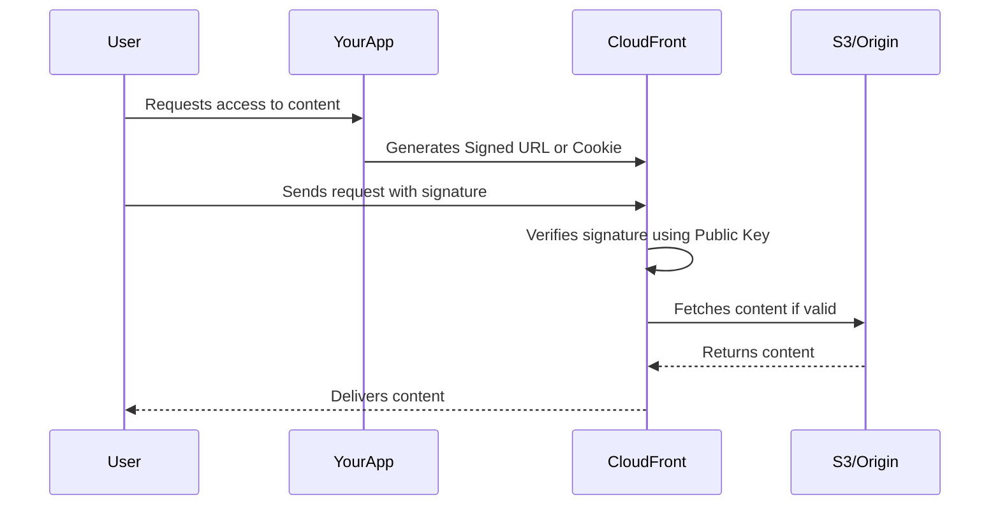
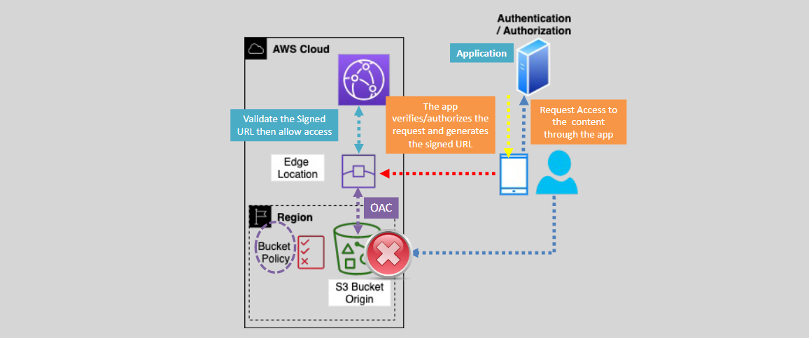

# 🔐 **Serving Private Content Securely Using CloudFront**

> _Protect videos, images, and documents by making them accessible only to authorized users._

---

## 🧠 **What Does "Private Content" Mean?**

Private content = content **you don’t want to be available to everyone**, like:

- Paid video files 🎥
- Confidential PDFs 📄
- Customer-specific downloads 🔒

When using CloudFront (AWS's CDN), by default **content is public** if you're distributing it from an S3 bucket or origin. But you can lock it down using:

### ✅ **Two Options**

1. **Signed URLs** – restrict access to specific files.
2. **Signed Cookies** – restrict access to multiple files at once.

---

## 🌐 **Why Use CloudFront for Private Content?**

- Faster delivery from edge locations (CDN).
- Access control using **your own rules** (who, when, where).
- Prevent link sharing or unauthorized access.

---

## 🔁 **How It Works (Behind the Scenes)**



---

<div style="text-align: center;">
    
</div>

---

## ✍️ **Signed URLs vs. Signed Cookies – Which to Use?**

| Feature           | **Signed URLs** 🔗       | **Signed Cookies** 🍪              |
| ----------------- | ------------------------ | ---------------------------------- |
| Access Control    | Individual files         | Multiple files                     |
| Ideal for         | Downloads, Single videos | Web apps, streaming                |
| Cookie Support    | Not needed               | Required                           |
| URL change needed | Yes                      | No                                 |
| Example           | One-time PDF download    | Netflix-style multiple file access |

---

## 🛠️ **How to Set It Up in AWS (New Console UI)**

Here’s a step-by-step to generate signed URLs or cookies.

---

### ✅ **Step 1: Create a CloudFront Key Pair**

> This key pair is used to **digitally sign** URLs or cookies.

1. Go to **AWS Management Console** → search for **CloudFront**.
2. On the left, go to **Key management** → **Public keys**.
3. Click **Create public key**.
   - Name: `MyCloudFrontKey`
   - Upload your **public key file** (You’ll generate this in next steps).
4. Go to **Key Groups** → **Create Key Group**.
   - Name: `MyKeyGroup`
   - Select the public key from the list.
   - Save.

---

### 🧾 **Step 2: Generate a Key Pair (Locally)**

Use OpenSSL to create the key pair.

```bash
openssl genrsa -out private_key.pem 2048
openssl rsa -pubout -in private_key.pem -out public_key.pem
```

- Upload `public_key.pem` in **Step 1**.
- Use `private_key.pem` in your app to generate signatures.

---

### 🔐 **Step 3: Restrict Your Content in CloudFront**

> Prevent public access.

1. Go to **CloudFront** → Select your distribution.
2. Choose the **Behavior** tab → Edit your behavior.
3. Under **Restrict Viewer Access (Use Signed URLs or Signed Cookies)**, set it to **Yes**.
4. Choose the **Key Group** you created.
5. Save changes.

---

### ✍️ **Step 4: Generate Signed URL (Example with Python)**

```python
from aws_cloudfront_signer import CloudFrontSigner
import rsa
from datetime import datetime, timedelta

def rsa_signer(message):
    with open('private_key.pem', 'rb') as key_file:
        private_key = rsa.PrivateKey.load_pkcs1(key_file.read())
    return rsa.sign(message, private_key, 'SHA-1')

key_id = 'YOUR_KEY_ID_FROM_CONSOLE'
signer = CloudFrontSigner(key_id, rsa_signer)

url = signer.generate_presigned_url(
    'https://your-distribution.cloudfront.net/private/video.mp4',
    date_less_than=datetime.utcnow() + timedelta(hours=1)
)

print(url)
```

---

## 💡 **Best Practices**

- ❌ Never use root user to create keys.
- ✅ Use short expiry time (e.g., 1 hour).
- 🔒 Store your **private key securely** (use AWS Secrets Manager).
- 📱 Use signed **cookies** for apps that load multiple files in one session.

---

## ✅ **Summary**

| Task                       | Tool                     |
| -------------------------- | ------------------------ |
| Restrict access to content | CloudFront Distribution  |
| Manage who can view it     | Signed URLs or Cookies   |
| Control permissions        | Key Groups & Private Key |
| Monitor access             | CloudFront + CloudTrail  |

---

## 🔎 Want to See It in Action?

Use the [official AWS doc for Signed URLs and Cookies](https://docs.aws.amazon.com/AmazonCloudFront/latest/DeveloperGuide/private-content-signed-urls.html) with examples in:

- Python
- JavaScript
- PHP
- C#
