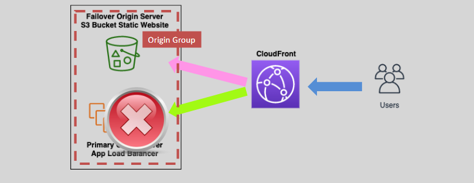
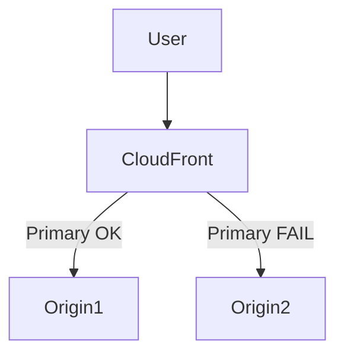
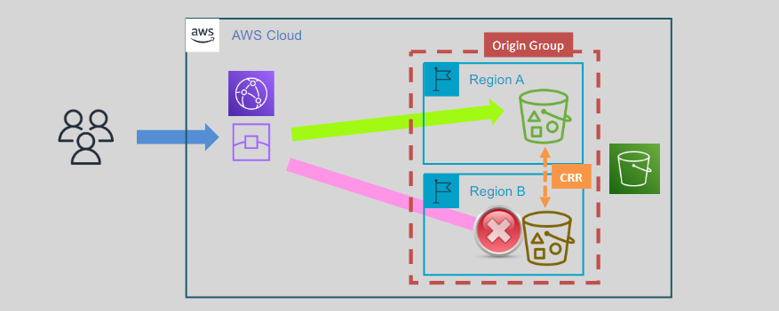

# 🚦 CloudFront Origin Groups for High Availability

    

---

## 🌍 What Are Origin Groups?

**Origin Groups** in CloudFront let you define **two origins**:

- 🟢 **Primary Origin**
- 🟡 **Secondary (Failover) Origin**

If the **primary origin fails**, CloudFront **automatically switches** to the **secondary origin** to serve your content. This ensures **high availability** for your website or app.

---

## 🛠️ How Failover Works

CloudFront checks the health of the **primary origin** based on:

- Timeout
- Connection failure
- Specific HTTP status codes (like `5xx`)

If it fails, CloudFront routes the request to the **secondary origin** in the **Origin Group**.

---

## 🧊 S3 Origin + CRR = Cross-Region HA

You can use **two S3 buckets** in **different AWS regions**:

- Primary: `my-bucket-us-east-1`
- Backup: `my-bucket-eu-west-1`

📤 Use **S3 Cross-Region Replication (CRR)** to sync content between them.

Then:

1. Set up an **Origin Group** in CloudFront.
2. Point it to both S3 buckets.
3. CloudFront uses the **primary** S3 bucket unless it’s down — then it **fails over** to the **replica**.

---

    

---

## ✅ Key Benefits

- 🔁 **Automatic failover** = less downtime.
- 🌐 **Global coverage** with S3 CRR.
- 🔒 **Consistent availability** for users worldwide.
- ⚙️ Multiple Origin Groups can be used per distribution.
