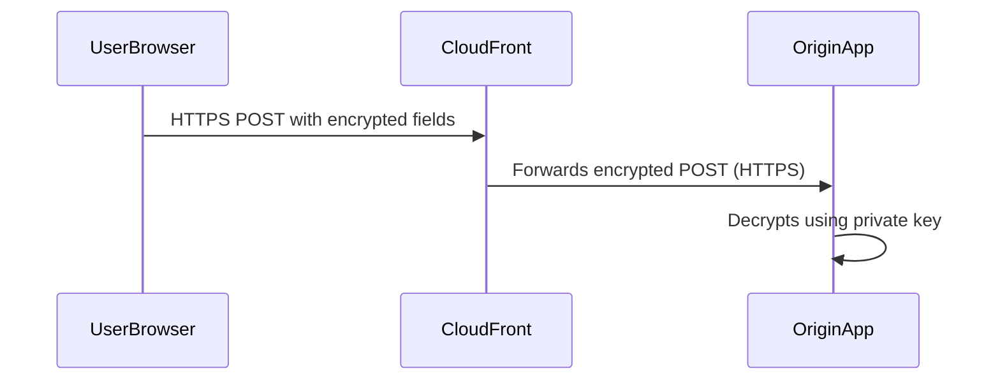
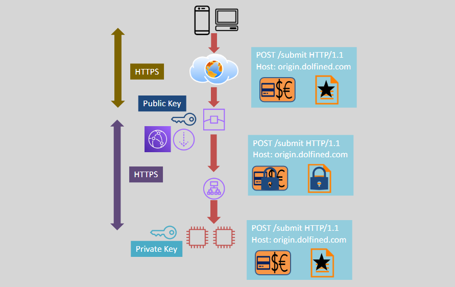

# 🛡️ Amazon CloudFront Field-Level Encryption

> _Secure sensitive form fields with end-to-end protection using asymmetric encryption._

---

## 🔐 What Is Field-Level Encryption?

**Field-Level Encryption** allows you to **encrypt specific fields** (like credit card numbers, SSNs, etc.) in **HTTP POST requests** — from the **user’s browser all the way to your backend application**.

This ensures that **sensitive data stays encrypted** during transit through all layers, including **CloudFront**, **edge locations**, and **origin servers**.

---

## 🧬 Key Features

| Feature                          | Description                                                                  |
| -------------------------------- | ---------------------------------------------------------------------------- |
| 🔑 **End-to-End Encryption**     | Sensitive fields are encrypted from user → CloudFront → origin → application |
| 🔐 **Asymmetric Encryption**     | Uses **public-private key pair** (RSA)                                       |
| 📥 **Up to 10 Fields**           | You choose which HTTP POST fields to encrypt                                 |
| 🔒 **Public Key on CloudFront**  | Used to encrypt the fields                                                   |
| 🧠 **Private Key at Origin App** | Used to decrypt the fields                                                   |

---

## 🔁 How It Works

---

    

---

## 🛠️ Setup Overview

1. **Generate an RSA key pair** (2048-bit recommended).
2. **Upload the public key** to CloudFront.
3. Create a **Field-Level Encryption Configuration**:
   - Define which POST fields to encrypt (max 10).
   - Attach the public key.
4. Configure your **CloudFront Distribution** to use this encryption config.
5. Your **application stack must have the private key** to decrypt those fields.

---

## 🎯 Use Cases

- 💳 Protect credit card or payment info in forms.
- 🧍 Encrypt personal identifiable information (PII).
- 🏥 Secure health-related data submissions.

---

## ✅ Security Benefits

- 🚫 Prevents unauthorized access to sensitive form data in transit.
- 🔒 Protects against data leaks from misconfigured proxies or middleboxes.
- 🌐 Ensures HTTPS encryption from edge to origin.
