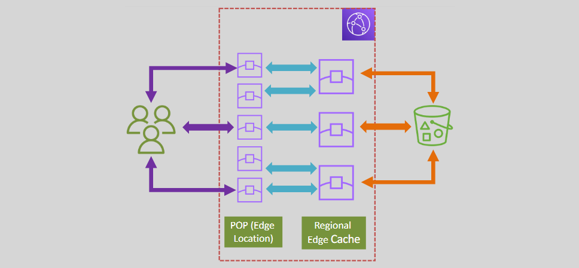
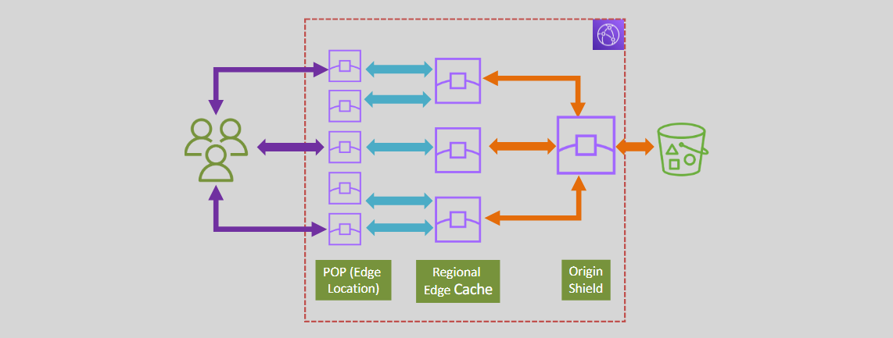

# 🧊 **CloudFront Origin Shield & Caching Layers**

> _Optimize your CDN strategy with smarter cache control and reduced origin load._

---

## 🌐 **Understanding CloudFront’s Caching Layers**

CloudFront’s design includes **multiple caching layers** to deliver content efficiently, reduce latency, and **protect your origin** from being overwhelmed with traffic.

### 📍 **1. Edge Locations (Points of Presence)**

- These are the **first layer** where CloudFront caches your content closest to end users.
- Frequently requested files (like images, videos, or HTML) are cached here for ultra-low latency.

### 🧭 **2. Regional Edge Caches**

- Act as **intermediate caches** between Edge Locations and your origin.
- When content isn't in the edge cache, CloudFront checks the **Regional Edge Cache** before going to your origin.

**Why it matters:**

- Reduces the number of origin fetches.
- Optimizes cache-hit ratios.
- Improves global delivery efficiency.

---

    

---

## 🛡️ **3. Origin Shield – Extra Protection for Your Origin**

**Origin Shield** is an **optional, centralized cache layer** between Regional Edge Caches and your origin.

    

---

### 🔁 What It Does

- **Consolidates requests** from multiple edge locations and regional caches.
- **Filters out duplicate requests**, sending only one request per object to your origin.
- Acts like a **shield** to offload and protect your origin infrastructure.

### 🧠 Why Use It?

| Feature                          | Benefit                                                               |
| -------------------------------- | --------------------------------------------------------------------- |
| 📉 **Reduces origin load**       | Helps prevent spikes and traffic surges from overwhelming your origin |
| 🧪 **Improves cache efficiency** | Centralizes requests and enhances cache-hit ratio                     |
| 💰 **Cost optimization**         | Fewer origin requests mean reduced data transfer and bandwidth costs  |
| 🚀 **Improves availability**     | Minimizes origin failures under high traffic                          |

---

### 🔧 Example Use Case: Global Product Launch

Imagine launching a new product with users accessing from around the world:

- Without Origin Shield → hundreds of edge locations send **duplicate requests** to your origin.
- With Origin Shield → only **one request** reaches your origin; others are served from cache.

---

## ✅ **Summary: Why Origin Shield Matters**

| Layer                | Role                                                              |
| -------------------- | ----------------------------------------------------------------- |
| Edge Locations       | Serve cached content closest to users                             |
| Regional Edge Caches | Act as second-level caches to reduce origin trips                 |
| **Origin Shield**    | Adds a third layer of protection by consolidating origin requests |

Together, these layers **maximize performance**, **improve cache hit ratios**, and **minimize backend load** — making CloudFront a powerful and efficient CDN solution for any scale.
