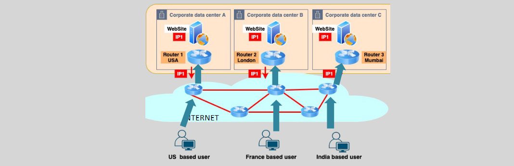
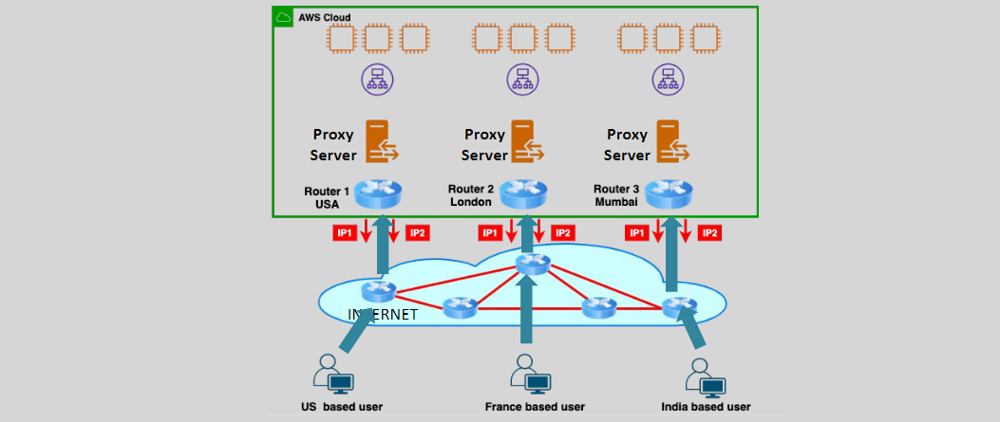
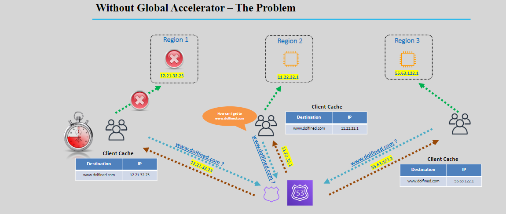
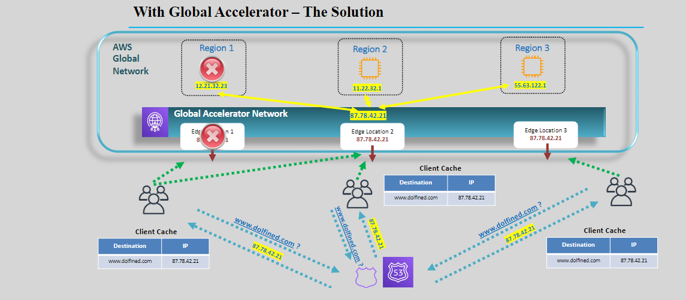

# 🌍 **AWS Global Accelerator: Enhancing Application Availability and Performance**

AWS Global Accelerator is a networking service designed to optimize the availability and performance of your applications by intelligently routing user traffic across multiple AWS regions and endpoints. This guide provides an in-depth look at AWS Global Accelerator, its components, benefits, use cases, and a comparison with Amazon CloudFront to help you make informed decisions for your infrastructure needs.

## 🧐 **What is AWS Global Accelerator?**

**AWS Global Accelerator** is a networking service that improves the availability and performance of your applications by directing user traffic through the AWS global network infrastructure. It provides two static Anycast IP addresses that serve as fixed entry points to your application endpoints (such as EC2 instances, Application Load Balancers, Network Load Balancers, and Elastic IPs) across multiple AWS regions.

### 📈 **Key Features:**

- **Static Anycast IPs:** Provides fixed entry points to your applications, simplifying DNS management.
- **Intelligent Traffic Routing:** Routes traffic to the optimal AWS endpoint based on health, geography, and policies.
- **Health Checks:** Continuously monitors the health of your application endpoints and reroutes traffic in case of failures.
- **Client IP Preservation:** Maintains the client’s IP address for compliance and security purposes.
- **Support for UDP and TCP:** Enables acceleration for both UDP and TCP-based applications.

## 🛠️ **Key Components**

### 🌐 **Anycast IP Addresses**

**Anycast IP** addresses are fundamental to how AWS Global Accelerator operates. They are static, internet-routable IP addresses that are advertised from multiple AWS edge locations worldwide.

#### 📊 **How Anycast IPs Work:**

1. **Multiple Advertisements:** The same Anycast IP address is advertised from multiple AWS edge locations.
2. **Nearest Routing:** User traffic is automatically routed to the nearest edge location based on network topology and routing policies.
3. **High Availability:** If one edge location becomes unavailable, traffic is rerouted to the next nearest location without client intervention.

#### 🌍 **Anycast IPs in AWS:**

- **Allocation:** Each Global Accelerator instance is assigned two static Anycast IPs for IPv4 or four for dual-stack (IPv4 and IPv6).
- **BYOIP Option:** Customers can bring their own IP addresses (BYOIP) to use with Global Accelerator.
- **Persistence:** The static Anycast IPs remain associated with the accelerator even when it is disabled, ensuring consistency.

## 🔄 **How AWS Global Accelerator Works**

AWS Global Accelerator enhances application performance and availability through intelligent traffic management:

1. **User Request:** A user initiates a request to your application using one of the Global Accelerator's static Anycast IPs.
2. **Routing via AWS Edge Locations:** The request is routed to the nearest AWS edge location using the AWS global network.
3. **Traffic Distribution:** Global Accelerator intelligently directs the traffic to the optimal endpoint based on policies, health checks, and performance metrics.
4. **Response Delivery:** The response travels back to the user via the optimized AWS network, ensuring low latency and high throughput.

### 📊 **Traffic Flow Diagram:**

## 🚀 **Benefits of AWS Global Accelerator**

AWS Global Accelerator offers numerous advantages to enhance your application's performance and reliability:

- **Intelligent Traffic Distribution:** Automatically routes traffic to the best-performing and healthiest endpoints.
- **Enhanced Fault Tolerance:** Continuously monitors endpoints and reroutes traffic in case of failures.
- **IP Whitelisting:** Provides a fixed set of IP addresses that can be whitelisted in your security applications.
- **Support for UDP and TCP:** Facilitates a wide range of applications, including gaming, VoIP, and real-time communication.
- **Improved Performance:** Leverages the AWS global network backbone to reduce latency and increase throughput.
- **DDoS Protection:** Integrates with AWS Shield for enhanced protection against Distributed Denial of Service (DDoS) attacks.
- **Client IP Preservation:** Maintains the original client IP address for security and compliance requirements.

## 🏷️ **Use Cases**

AWS Global Accelerator is versatile and caters to various application scenarios:

### 1. **Applications Requiring IP Whitelisting:**

- **Examples:** Autonomous vehicles, payment/retail transactions, healthcare applications, IoT services.
- **Benefit:** Simplifies security configurations by providing a fixed set of IP addresses.

### 2. **Multi-Region Applications:**

- **Examples:** Financial services, disaster recovery (DR) and failover setups.
- **Benefit:** Ensures high availability and resilience by distributing traffic across multiple AWS regions.

### 3. **UDP Traffic Applications:**

- **Examples:** Online gaming, Voice over IP (VoIP), Domain Name System (DNS) services.
- **Benefit:** Accelerates and optimizes real-time communication applications that rely on UDP.

### 4. **Live Video Ingestion for Media Applications:**

- **Examples:** Live streaming platforms, media content delivery.
- **Benefit:** Reduces latency and improves the reliability of latency-sensitive media applications.

## ⚔️ **AWS Global Accelerator vs. Amazon CloudFront**

While both AWS Global Accelerator and Amazon CloudFront are designed to enhance the performance and availability of applications, they serve different purposes and use cases. Below is a detailed comparison to help you understand their distinct functionalities:

| **Aspect**                      | **AWS Global Accelerator**                                 | **Amazon CloudFront**                                        |
| ------------------------------- | ---------------------------------------------------------- | ------------------------------------------------------------ |
| **Type of Service**             | Traffic accelerator and routing optimization               | Content Delivery Network (CDN)                               |
| **Primary Function**            | Improve application availability and performance           | Accelerate delivery of web content and media                 |
| **Traffic Protocols Supported** | TCP and UDP                                                | HTTP and HTTPS                                               |
| **IP Addressing**               | Static Anycast IPs                                         | Dynamic edge location IPs                                    |
| **Content Caching**             | No caching                                                 | Yes, caches static and dynamic content                       |
| **Integration**                 | ELB, EC2, Elastic IPs, etc.                                | S3, EC2, Lambda, API Gateway, etc.                           |
| **Use Cases**                   | High availability, real-time applications, IP whitelisting | Website acceleration, media streaming, API delivery          |
| **DDoS Protection**             | AWS Shield integration                                     | AWS Shield and AWS WAF integration                           |
| **Client IP Preservation**      | Yes                                                        | No (optional via headers)                                    |
| **Pricing Model**               | Based on accelerator usage and data transfer               | Based on data transfer and number of requests                |
| **Geographic Routing**          | Optimizes based on network paths and endpoint health       | Optimizes based on user location and proximity to edge sites |

## 🏁 **Getting Started with AWS Global Accelerator**

### 🔧 **Configuration Steps:**

1. **Sign in to the AWS Management Console:**

   - Navigate to the [AWS Global Accelerator Console](https://console.aws.amazon.com/global-accelerator/home).

2. **Create an Accelerator:**

   - Click on **"Create accelerator"**.
   - Provide a name for your accelerator.
   - Choose whether to enable **Dual-stack** (IPv4 and IPv6).

3. **Assign Anycast IP Addresses:**

   - AWS Global Accelerator automatically assigns two static Anycast IP addresses. Optionally, you can bring your own IPs (BYOIP).

4. **Configure Listeners:**

   - Define the port ranges and protocols (TCP/UDP) that the accelerator will listen on.

5. **Add Endpoint Groups:**

   - Associate AWS regions with endpoint groups.
   - Specify the endpoints (ALB, NLB, EC2 instances, Elastic IPs) within each group.

6. **Set Traffic Routing Policies:**

   - Choose how traffic should be routed (e.g., weighted, geolocation).

7. **Configure Health Checks:**

   - Set up health checks to monitor the availability of your endpoints.

8. **Review and Create:**
   - Review your settings and create the accelerator.

### 📋 **Configuration Tips:**

- **Redundancy:** Distribute your endpoints across multiple AWS regions to ensure high availability.
- **Security:** Use security groups and network ACLs to control traffic flow to and from your endpoints.
- **Monitoring:** Utilize Amazon CloudWatch to monitor the performance and health of your Global Accelerator.

## 📚 **Conclusion**

AWS Global Accelerator is a robust solution for enhancing the availability and performance of your applications on a global scale. By leveraging static Anycast IPs, intelligent traffic routing, and seamless integration with various AWS services, it ensures that your users experience minimal latency and high reliability. Whether you’re running real-time applications, requiring IP whitelisting, or managing multi-region deployments, Global Accelerator provides the tools necessary to optimize your application's network performance.
