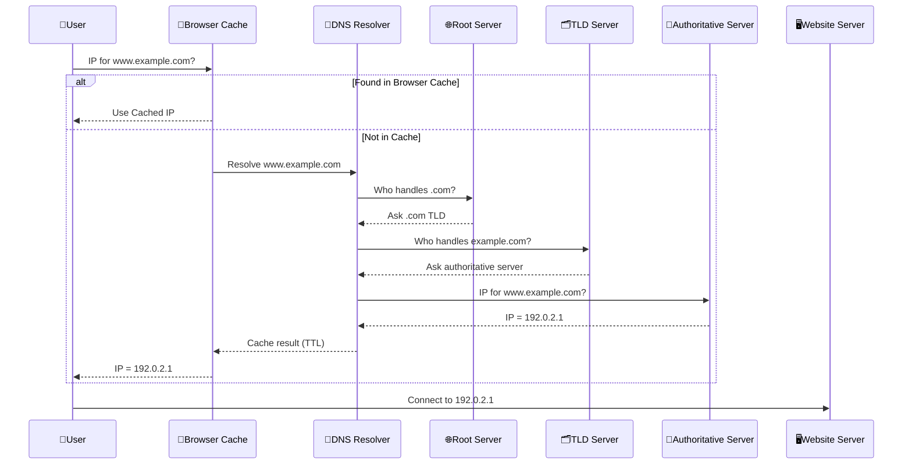

# 🌐 **DNS (Domain Name System)**

> _The internet’s phonebook – translating domain names to IP addresses for smooth web navigation._

---

## 🔍 **What Is DNS?**

DNS helps your browser find websites by translating human-friendly names like `www.example.com` into machine-readable IP addresses like `192.168.1.1`.

Without DNS, we'd have to memorize IP addresses instead of website names!

---

## 🧭 **How DNS Works (Step-by-Step)**

When a user enters a domain name, DNS works behind the scenes to resolve it into an IP address. Here's the full process — **including caching** at the browser level:

---

### 📶 Step-by-Step Flow

1. 👤 **User Inputs a Domain**

   - You type `www.example.com` into your browser.

2. 🦊 **Browser Cache**

   - The browser **first checks its internal cache**.
   - If the domain was recently visited and hasn't expired, it immediately uses the cached IP — **no DNS lookup needed**!

3. 🧠 **DNS Resolver (Recursive Resolver)**

   - If the browser has no cached record, it asks a DNS resolver (often provided by your ISP or public DNS like Google/Cloudflare).
   - The resolver checks its own cache too.

4. 🌐 **Root Nameservers**

   - If not cached, the resolver asks a **root server** to find where `.com` domains are handled.

5. 🗂️ **TLD Nameservers**

   - The root server points to the `.com` **TLD server**, which knows where to find `example.com`.

6. 📘 **Authoritative Nameserver**

   - The TLD server points to the **authoritative server** that holds the actual DNS records for `example.com`.

7. 🧠 **IP Returned and Cached**

   - The authoritative server returns the IP (e.g., `192.0.2.1`) to the resolver → then to your browser.
   - Both the **resolver and browser cache** this IP based on the **TTL** value.

8. 🌍 **User Connects to the Website**
   - Your browser uses the IP to reach the actual web server and loads the site.

---

### 🗺️ DNS Lookup with Caching – Visualized

---

## ⏱️ **What Is TTL (Time To Live)?**

**TTL** is a timer (in seconds) attached to each DNS record that tells browsers and resolvers how long to **cache** the result before asking again.

| TTL Value           | Meaning                       |
| ------------------- | ----------------------------- |
| **3600** (1 hour)   | Keep the IP cached for 1 hour |
| **86400** (1 day)   | Cache for 1 day               |
| **300** (5 minutes) | Cache for only 5 minutes      |

When the TTL **expires**, the resolver must start the DNS resolution process again to get a fresh IP.

> 💡 _Short TTLs give flexibility (for changing IPs), while long TTLs reduce DNS load and improve speed._

---

## 🧾 **DNS Records – Your Domain's Toolbox**

| 🏷️ Record Type | 📌 Purpose                                    |
| -------------- | --------------------------------------------- |
| **A**          | Maps domain to **IPv4** address               |
| **AAAA**       | Maps domain to **IPv6** address               |
| **CNAME**      | Aliases one domain to another                 |
| **MX**         | Directs email to mail servers                 |
| **NS**         | Lists DNS servers responsible for your domain |
| **PTR**        | Reverse lookup: IP → domain                   |
| **TXT**        | Text data (e.g., SPF, DKIM for emails)        |
| **SOA**        | Domain’s admin info and refresh settings      |

---

## 🔄 **🛟 Lifecycle of a DNS Request**

1. 🧑‍💻 User enters a domain in the browser.
2. 🦊 Browser checks cache.
3. 🧠 Resolver checks its cache.
4. 🌐 If needed, asks Root Server.
5. 🗂️ Then asks TLD Server.
6. 📘 Then asks Authoritative Server.
7. 🧠 Resolver returns IP → Browser uses IP to access the website.
8. 🧠 Resolver and browser cache the result based on TTL.

---

## 🧪 **DNS Caching – Speed & Efficiency**

| 🧠 Cache Level         | 🧩 Description                                    |
| ---------------------- | ------------------------------------------------- |
| **Browser Cache**      | Temporarily stores IPs to avoid repeating lookups |
| **Resolver Cache**     | Speeds up repeated queries from multiple users    |
| **TTL (Time to Live)** | Controls how long a DNS result stays cached       |

---

## 🔐 **DNS Security Considerations**

| 🛡️ Security Feature | 🔍 What It Does                                       |
| ------------------- | ----------------------------------------------------- |
| **DNSSEC**          | Verifies authenticity of DNS data (prevents spoofing) |
| **Anycast Routing** | Distributes traffic across global DNS servers         |
| **Rate Limiting**   | Prevents abuse and DDoS attacks on DNS                |

---

## ✅ **Quick Summary**

| Concept                 | Description                                |
| ----------------------- | ------------------------------------------ |
| 🌍 DNS                  | Converts domain names into IPs             |
| 🧠 Resolver             | Finds the IP via a chain of queries        |
| 📘 Authoritative Server | Stores actual DNS records                  |
| 🦊 Browser Cache        | Speeds up repeat visits locally            |
| ⏱️ TTL                  | Controls how long the DNS result is cached |
| 🛡️ Security             | Protects DNS from hijacking and overload   |
