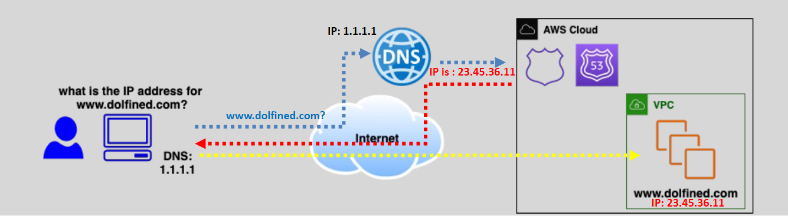

# 🌐 **AWS Route 53 – Scalable DNS for Public & Private Workloads**

> **Route 53** is Amazon’s highly available and scalable **Domain Name System (DNS)** service that routes user requests to AWS or external resources, with smart routing policies and deep integration with AWS services.

---

  

---

## 🧭 **What Is AWS Route 53?**

**AWS Route 53** is a fully managed DNS service that:

- Translates domain names like `www.example.com` into IP addresses.
- Works for both **internet-facing (public)** and **internal (private)** applications.
- Supports **domain registration**, **traffic routing**, and **health checking**.

🔎 **internet-facing workload** → Public Workloads such: Websites, APIs, or services accessed over the internet.  
🔒 **Internal Workloads** → Private Workloads such: databases, services inside a VPC.

---

## 🚀 **Key Features at a Glance**

| 🌟 Feature                 | 📌 Description                                           |
| -------------------------- | -------------------------------------------------------- |
| **DNS Record Management**  | Create, edit, and manage domain name records             |
| **Domain Registration**    | Register and manage domain names directly from AWS       |
| **Traffic Routing**        | Direct user requests with advanced routing policies      |
| **Health Checks**          | Monitor endpoints and route traffic only to healthy ones |
| **Public & Private Zones** | Manage DNS for both external and internal AWS services   |

---

## 🌍 **Public vs. Private Hosted Zones**

### 🌐 **Public Hosted Zones**

- Used for domains that are **accessible over the internet**.
- Enables routing to **websites**, **APIs**, **CDNs**, etc.

💡 _Example_:  
Creating a hosted zone for `example.com` and configuring `www.example.com` to point to a public Load Balancer.

---

### 🏢 **Private Hosted Zones**

- Used for **internal DNS resolution** within an **Amazon VPC**.
- Ideal for **intra-service communication**, **databases**, or **microservices**.

💡 _Example_:  
Creating a private zone for `internal.example.com`, used by internal apps like `db.internal.example.com`.

---

## ⚙️ **How Route 53 Works (High-Level Flow)**

1. **📦 Create a Hosted Zone**  
   Choose between **Public** or **Private** based on your use case.

2. **📝 Add DNS Records**  
   Add `A`, `CNAME`, `MX`, `NS`, or other record types to define routing behavior.

3. **🌐 Route Traffic**  
   When users enter your domain, Route 53 resolves it to the correct public or private IP address.

---

## 🏷️ **Common DNS Records in Route 53**

| Record    | Description                                          |
| --------- | ---------------------------------------------------- |
| **A**     | Maps domain to an **IPv4** address                   |
| **AAAA**  | Maps domain to an **IPv6** address                   |
| **CNAME** | Aliases one domain to another                        |
| **MX**    | Mail server routing                                  |
| **NS**    | Authoritative nameservers for the domain             |
| **TXT**   | Custom text (used for verification, SPF, DKIM, etc.) |
| **SOA**   | Start of Authority – domain control settings         |

---

## 📍 **Routing Policies in Route 53**

Route 53 offers powerful traffic control through **routing policies**:

| 🎯 Policy         | 🚦 Use Case                                   |
| ----------------- | --------------------------------------------- |
| **Simple**        | Route to a single static IP or endpoint       |
| **Weighted**      | Split traffic between resources (e.g., 70/30) |
| **Latency-Based** | Route to the region with lowest latency       |
| **Geolocation**   | Route based on user’s geographic location     |
| **Failover**      | Route to a backup when the primary fails      |

---

## 🧑‍⚕️ **Health Checks & Monitoring**

Route 53 supports **automatic health checks**:

- Checks resource health at regular intervals.
- Automatically reroutes traffic if a resource is marked as unhealthy.
- Used in **Failover** and **Multi-Region** scenarios.

---

## 🧠 **When to Use Public vs. Private Zones**

| Zone Type                  | Use Case                                                                                         |
| -------------------------- | ------------------------------------------------------------------------------------------------ |
| 🌐 **Public Hosted Zone**  | For **public websites**, APIs, and services accessible over the internet                         |
| 🏢 **Private Hosted Zone** | For **internal DNS resolution** inside a **VPC** (e.g., microservices, internal APIs, databases) |

---

## 💡 **Real-World Use Case**

Let’s say you have:

- **Frontend Website** (`www.example.com`) — publicly available.
  - ✅ Use **Public Hosted Zone**
- **Internal API** (`api.internal.example.com`) — only for backend services.
  - 🔒 Use **Private Hosted Zone**

This setup gives you global reach for your customers, and secure communication inside your AWS infrastructure.

---

## 📚 **Summary**

| ✅ Feature              | 💬 Description                                   |
| ----------------------- | ------------------------------------------------ |
| 🌐 **Route 53**         | AWS's DNS service for public and private domains |
| 🌍 **Public Zones**     | Resolve domains on the internet                  |
| 🔒 **Private Zones**    | Resolve domains inside AWS VPC                   |
| 🧭 **Routing Policies** | Control how traffic is directed to resources     |
| 🧑‍⚕️ **Health Checks** | Ensure traffic is routed only to healthy targets |

---

By using **Route 53**, you gain **fine-grained control** over your DNS infrastructure with **high availability**, **smart routing**, and **tight integration** with AWS — whether you’re running a public-facing application or a private internal service.
