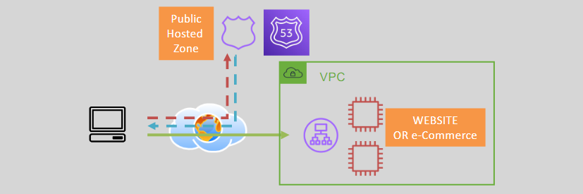
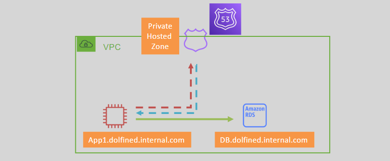
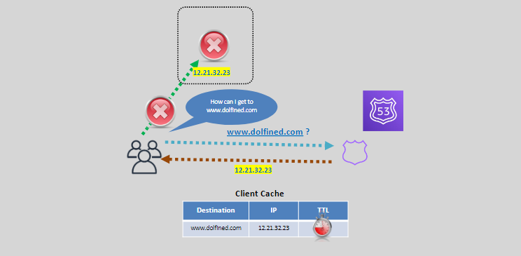
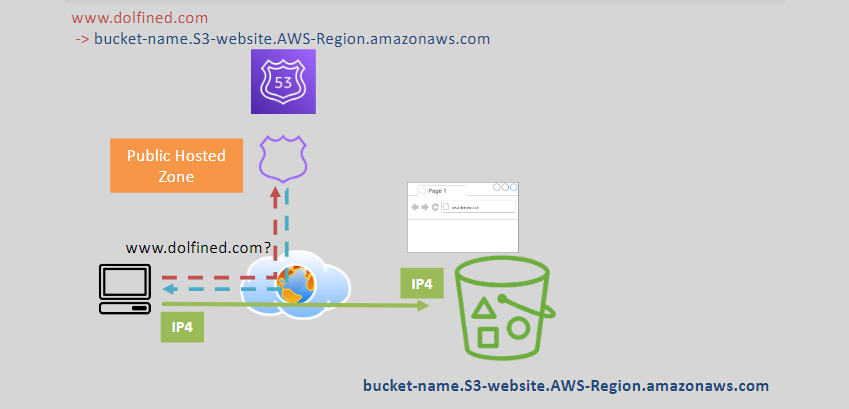

# 🌐 **Comprehensive Guide to Amazon Route 53**

> _A powerful, scalable DNS and domain management service for public and private workloads._

---

## 🛠️ **Core Functions of Route 53**

Amazon Route 53 is more than just a DNS service. It performs **three main roles**:

| 🔧 Function                | 📌 Description                                                                 |
| -------------------------- | ------------------------------------------------------------------------------ |
| 🌐 **Domain Registration** | Buy and manage custom domain names directly through AWS.                       |
| 📡 **DNS Management**      | Create and manage hosted zones and DNS records for routing domain traffic.     |
| ❤️ **Health Checks**       | Automatically check the health of resources and route traffic to healthy ones. |

---

## 🗂️ **Hosted Zones Overview**

A **Hosted Zone** is a container for DNS records.

### 🌍 **Public Hosted Zones**

- For **internet-facing** websites or APIs.
- DNS records are resolvable globally.

  

---

### 🔒 **Private Hosted Zones**

- For **internal DNS resolution** within one or more **VPCs**.
- Records are **not visible on the internet**.

  

---

## 🧾 **Supported DNS Record Types**

| 🏷️ Record Type | 🧩 Description                                                            |
| -------------- | ------------------------------------------------------------------------- |
| **A**          | Maps domain to an **IPv4** address.                                       |
| **AAAA**       | Maps domain to an **IPv6** address.                                       |
| **CNAME**      | Maps an alias to another domain name. ⚠️ Cannot be used at the zone apex. |
| **NS**         | Lists the **authoritative nameservers** for the domain.                   |
| **MX**         | Routes email traffic to mail servers.                                     |
| **TXT**        | Stores text data (SPF, DKIM, verification, etc.).                         |
| **SOA**        | Provides metadata like admin email and refresh times.                     |
| **Alias**      | AWS-specific record (explained below ⬇️).                                 |

---

## ⏳ **Understanding TTL (Time to Live)**

**TTL** defines how long DNS responses are **cached** by clients like browsers and resolvers.

| ⚙️ Component          | 📌 Description                                           |
| --------------------- | -------------------------------------------------------- |
| **Function**          | Controls DNS cache lifetime.                             |
| **Default TTL Range** | From seconds to **24–48 hours**.                         |
| **Impact**            | Long TTL → slower updates. Short TTL → more DNS queries. |
| **Best Practice**     | Balance between fast updates and reduced DNS traffic.    |

  

---

## 🔗 **Alias Records in Route 53**

**Alias Records** are a unique AWS Route 53 feature that acts like a CNAME but supports **AWS resources and apex domains**.

### 🚀 **Alias Targets Include**

- CloudFront Distributions
- S3 Static Website Endpoints
- ALB / NLB
- API Gateway
- VPC Endpoints
- Global Accelerator
- AppSync APIs
- Records in the same hosted zone

---

### ⚙️ **Alias Record Features**

| ✔️ Feature                  | 📌 Description                                        |
| --------------------------- | ----------------------------------------------------- |
| ✅ Free DNS queries         | Unlike CNAMEs, alias record queries are not billed.   |
| ✅ Supports zone apex       | Works at root domains (e.g., `dolfined.com`).         |
| ✅ Real-time AWS IP updates | Always points to the current AWS IPs of the target.   |
| ✅ Health check support     | Integrated health status if linked with AWS services. |

---

### ⚖️ **Alias Record vs. CNAME**

| Feature                     | **CNAME**                | **Alias**                 |
| --------------------------- | ------------------------ | ------------------------- |
| 💰 Billing                  | Chargeable per DNS query | Free                      |
| 🌐 Apex support             | ❌                       | ✅                        |
| 🔁 AWS Resource Integration | ❌                       | ✅                        |
| 🌍 External Targets         | ✅                       | ❌ (AWS only)             |
| 🔎 Resolver-visible         | Yes                      | Internal to Route 53 only |

---

### 🪣 **Alias with S3 Static Website**

  

🔹 Map a custom domain to your S3 static site endpoint  
⚠️ Cannot map directly to normal S3 buckets; use CloudFront as an intermediary if needed.

---

### 📡 **Alias with CloudFront and ALB**

  

🔹 **Configuration:**

- **CloudFront Distribution**: Uses ALB as the origin.
- **Alternate Domain Name**: Includes `www.dolfined.com`.
- **Alias Record**: Maps the domain to the CloudFront Distribution.

⚠️ **Behind the Scenes**: Route 53 resolves the ALB DNS hostname to ALB node IP addresses.

---

## 🩺 **Health Checks in Route 53**

Amazon Route 53 can monitor the **availability** of your resources using **health checks**.

### 📋 Key Details

| 🔍 Feature                 | 💡 Description                                           |
| -------------------------- | -------------------------------------------------------- |
| **Protocols Supported**    | HTTP, HTTPS, TCP                                         |
| **Healthy Status**         | Requires ≥ 18% of checkers to return a healthy status    |
| **Integrations**           | Works with **SNS** for alerts, Alias records for routing |
| **Public Access Required** | Target endpoints must be publicly accessible             |

---

### 🔄 **High Availability with Health Checks**

- Automatically reroutes traffic to backup endpoints on failure.
- Commonly used with **failover routing policies**.
- Must ensure **NACLs and security groups** allow Route 53 health checker traffic.

---

## 📘 **Conclusion & Best Use**

Amazon Route 53 gives you:

- ✅ **DNS management** for any scale
- ✅ **Flexible routing** options for latency, geolocation, or failover
- ✅ **Built-in health checks** for resilience
- ✅ **Tight AWS integration** with Alias records

---

### 🧠 **Final Tips**

- Use **Public Hosted Zones** for websites or APIs accessible on the internet.
- Use **Private Hosted Zones** for DNS resolution inside your VPCs.
- Set TTLs thoughtfully to balance performance and update responsiveness.
- Use **Alias records** when pointing to AWS resources — they’re free, fast, and smart.
