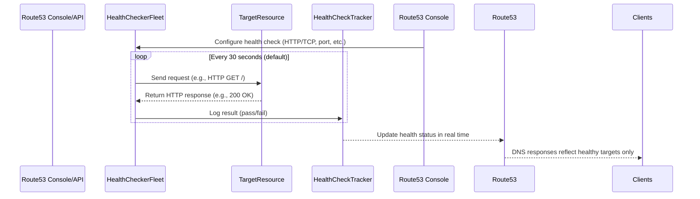

# 🧠 **Deep Dive: How Route 53 Health Checks Work Internally**

## 💡 **What is a Health Check in Route 53 (on the surface)?**

It’s a mechanism where **Route 53 continuously checks** whether a specific endpoint (like a web server, load balancer, or API) is **available and responsive**.

If it fails (i.e., the resource is unhealthy), Route 53 **stops routing traffic** to it and shifts traffic to a healthy one (if you're using failover, weighted, or latency-based routing).

But… that’s the surface! Let’s look deeper.

---

## 🧬 **Behind the Scenes: Internal Workflow**



---

## 🔩 **1. Global Health Checker Fleet**

AWS uses a **fleet of distributed health checker agents** across the globe (roughly 15–20 regions). These are **dedicated EC2 instances or containers**, not part of your AWS VPC.

🧠 Think of them as AWS's internal mini probes:

- Spread across multiple AWS regions.
- Act **independently** and do not share cached results.
- Each one checks your endpoint **directly over the internet** (public access required).

By default, at least **3–5 health checkers** run **simultaneous probes** to your endpoint.

---

## ⚙️ **2. What Does a Health Checker Do Exactly?**

Depending on what you configure:

| Protocol       | Behavior                                                                                    |
| -------------- | ------------------------------------------------------------------------------------------- |
| **HTTP**       | Sends an HTTP `GET` to the path you define (e.g., `/health`) and expects an HTTP 2xx or 3xx |
| **HTTPS**      | Same as HTTP, but uses TLS handshake before sending request                                 |
| **TCP**        | Opens a socket connection on the target port and checks if the connection is successful     |
| **Calculated** | Uses the status of other health checks to determine overall health (like OR/AND logic)      |

Each probe:

- **Does not use caching** — real-time response only.
- Times out in **4 seconds** (customizable).
- Retries a few times before failing.

---

## 📊 **3. Majority Vote System (Consensus Logic)**

Health check results are stored in AWS's **internal health tracker database**, and AWS uses a **quorum-based model**:

✅ If **~80%** of health checkers report success → ✅ Target is **Healthy**  
❌ If **>20%** report failure → ❌ Target is **Unhealthy**

This avoids false alarms from transient network issues in a single region.

> 📌 So the health status isn’t based on **a single probe**, but a **consensus of multiple global checkers**.

---

## 🧠 **4. Real-Time Sync with Route 53 DNS**

Once a resource is marked **unhealthy**, Route 53:

- Immediately **excludes it from DNS responses**.
- If using **failover routing**, it switches to the backup.
- For **weighted or latency routing**, the unhealthy target's weight is ignored.

This change propagates **almost instantly** — AWS Route 53 caches TTLs, but health check overrides apply **regardless of TTL** if you're using **evaluate target health = true**.

---

## 🔁 **5. Evaluate Target Health (Alias Records)**

If you're using **Alias Records**, you don’t need a separate health check.

Instead:

- AWS queries the **target AWS service’s health** internally.
- For example: ALB, NLB, or CloudFront’s backend health.
- It’s more efficient and doesn’t require public exposure.

---

## 🧪 **Example: HTTP Health Check Flow**

1. You configure a health check:

   - Protocol: `HTTPS`
   - IP: `3.122.150.10`
   - Path: `/health`
   - Port: `443`
   - Interval: `30s`

2. Every 30 seconds, multiple AWS agents from around the world do:

   ```ini
   GET https://3.122.150.10/health
   ```

3. They check:

   - TLS handshake successful?
   - HTTP status code is `200` or `302`?
   - Response time < timeout?

4. If 4 out of 5 agents get OK responses → ✅ healthy.
   If 3 fail → ❌ unhealthy → Route 53 stops routing traffic to it.

---

## 🔐 **Important Security Notes**

- Your resource **must be publicly accessible** to health checkers.
- You can **restrict health checker IPs** via AWS published [health check IP ranges](https://docs.aws.amazon.com/general/latest/gr/route53.html#route53-ip-ranges).
- For internal/private endpoints, consider **evaluating target health** using AWS-native services (like ALB/NLB) instead of direct health checks.

---

## ⚠️ **Common Mistakes and Misunderstandings**

| ❌ Mistake                                        | ✅ Fix                                                      |
| ------------------------------------------------- | ----------------------------------------------------------- |
| Blocking health checker IPs                       | Allow Route 53 IP ranges in security groups/NACLs           |
| TTL too high                                      | TTL won't stop failover, but keep it reasonable for caching |
| Monitoring internal resources using public checks | Use **Alias + target health evaluation** instead            |

---

## ✅ **Summary: How Route 53 Health Checks Actually Work**

| Layer              | What Happens                                                   |
| ------------------ | -------------------------------------------------------------- |
| 🧠 Configuration   | You define endpoint, path, interval, port, protocol            |
| 🌍 Health Checkers | Multiple global AWS agents ping your target in real time       |
| 🧮 Consensus Logic | Aggregates results, requires ~80% agreement for "healthy"      |
| 🔄 DNS Impact      | Health status dynamically affects which IPs Route 53 returns   |
| 🔌 Integration     | Alias records can use AWS service-native health without probes |

---

Let me know if you'd like to:

- Simulate this using a **curl + mock health check endpoint**.
- See how this works with **failover and latency-based routing**.
- Visualize this with logs or metrics via **CloudWatch integration**.
