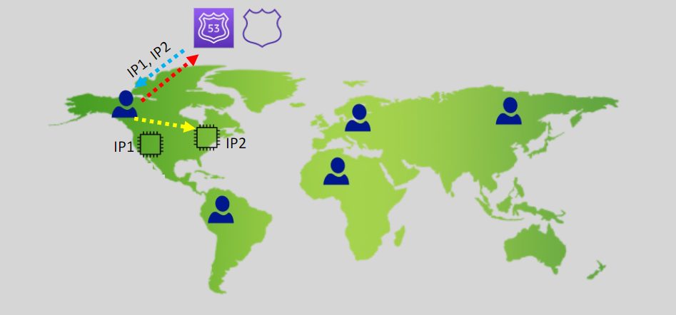
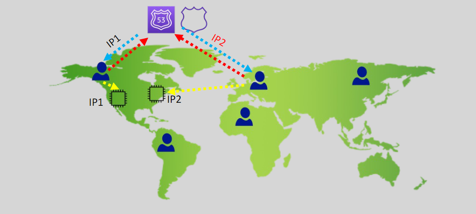
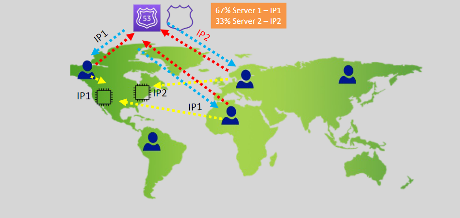
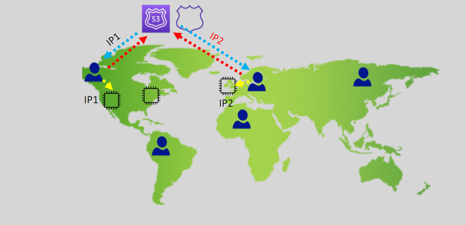
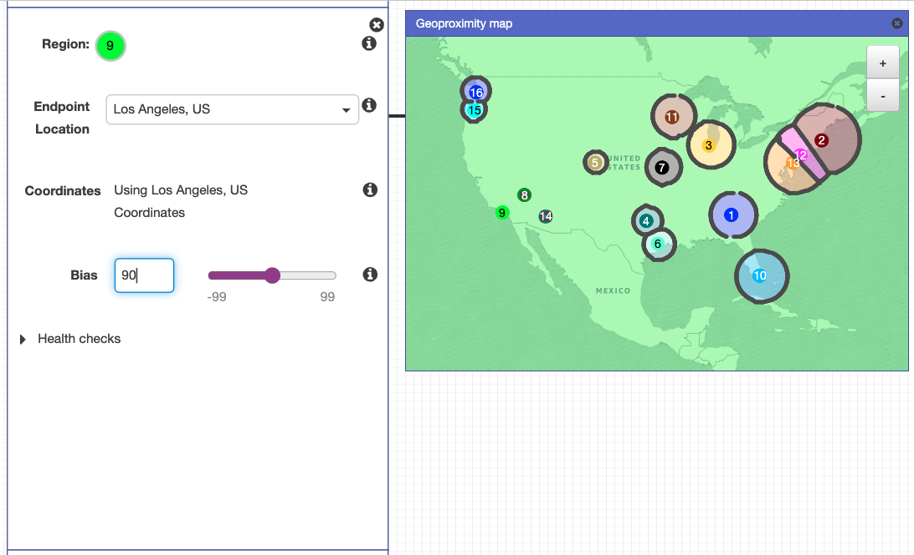
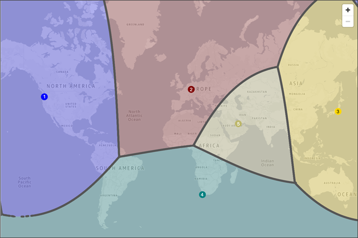
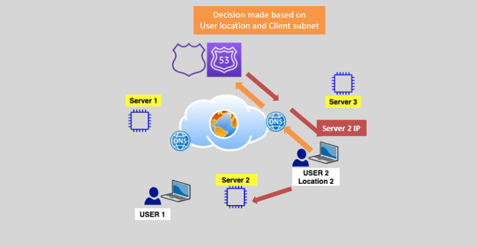
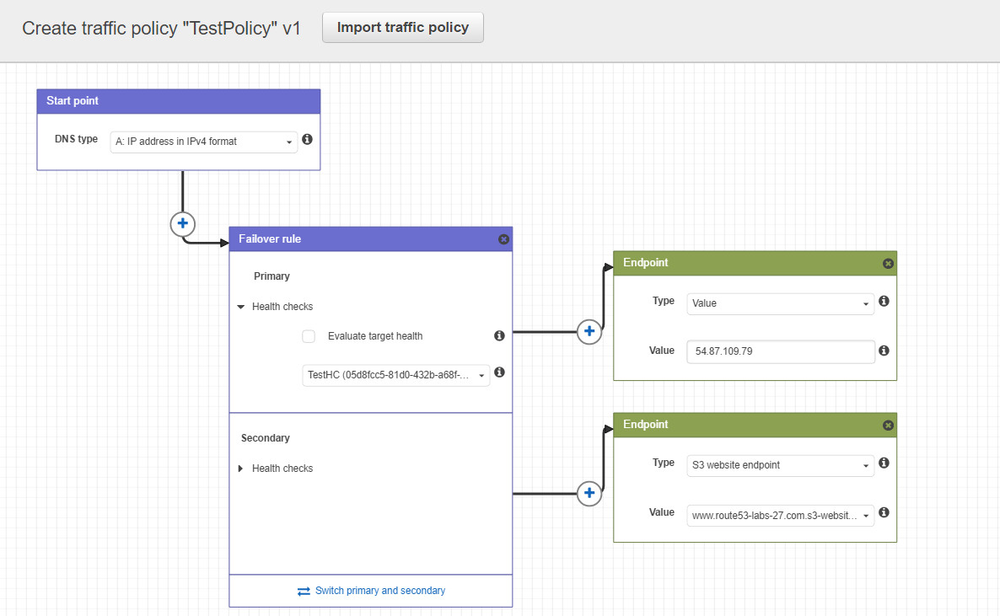

# 🗺️ **Amazon Route 53 Routing Policies: A Comprehensive Guide**

Amazon Route 53 offers a variety of routing policies to control how end-users are directed to your applications. Understanding these policies enables you to optimize performance, ensure high availability, and manage traffic effectively. This guide explores each routing policy in detail, making it easy to choose the right strategy for your needs.

## 🔄 **1. Simple Routing Policy (No Health Checks)**

  

---

**Simple Routing** is the most straightforward routing policy in Route 53, ideal for directing traffic to a single resource.

> ⚠️ R53 Return all mapped ips for your record and your browser randomly(may be round-roben) choose one of them (not latency or weighted)

### 📌 **Key Features:**

- **Single Resource Target**: Best suited when you have one resource (e.g., a single web server) serving your content.
- **No Health Checks**: Does not support health checks, meaning Route 53 won't monitor the health of your resource.
- **Use Case Limitation**: Not recommended for multiple resources as it doesn't provide redundancy or failover capabilities.

### 🚫 **Limitations:**

- **No Failover Support**: If the single resource becomes unavailable, Route 53 cannot automatically redirect traffic to another resource.
- **No Load Balancing**: Cannot distribute traffic across multiple resources.

## 🛡️ **2. Failover Routing Policy (Active/Passive Failover)**

  

---

**Failover Routing** is designed to improve the availability of your application by routing traffic to a primary resource and failing over to a secondary resource if the primary becomes unhealthy.

### 📌 **Key Features:**

- **Active/Passive Setup**: Directs traffic to a primary (active) resource under normal conditions and to a secondary (passive) resource when the primary fails.
- **Supports Health Checks**: Monitors the health of the primary resource and automatically redirects traffic if it becomes unhealthy.
- **Short TTL Recommendation**: Set TTL to 60 seconds or less to ensure quick failover.

### 🔧 **Configuration Steps:**

1. **Primary and Secondary Records**: Create two DNS records—one for the primary resource and one for the secondary.
2. **Associate Health Checks**: Attach health checks to the primary record to monitor its status.
3. **Failover Behavior**: Route 53 automatically switches to the secondary record if the primary fails.

### ⚠️ **Considerations:**

- **Client Cache TTL**: Unable to influence client-side caching TTL, which might affect how quickly clients see the failover.

### 🛠️ **Use Cases:**

- Ensuring high availability by maintaining a backup resource.
- Disaster recovery setups where secondary resources take over during outages.

## ⚡ **3. Latency Routing Policy (Active/Active)**

  

---

**Latency Routing** directs traffic based on the lowest latency from the user to the application resources, enhancing user experience by minimizing response times.

### 📌 **Key Features:**

- **Active/Active Configuration**: Distributes traffic to multiple resources simultaneously based on latency.
- **Supports Health Checks**: Ensures traffic is only directed to healthy resources.
- **Automatic Integration with CloudFront**: Works seamlessly with CloudFront distributions to optimize content delivery.

### 🚀 **Benefits:**

- **Improved Performance**: Users experience faster load times by connecting to the nearest or fastest resource.
- **Global Distribution**: Ideal for applications with a worldwide user base.

### 🛠️ **Use Cases:**

- Applications with users spread across different geographic regions.
- Services requiring low latency, such as gaming or streaming platforms.

## ⚖️ **4. Weighted Routing Policy (Active/Active)**

  

---

**Weighted Routing** allows you to distribute traffic across multiple resources in specified proportions, enabling fine-grained control over traffic distribution.

### 📌 **Key Features:**

- **Proportional Traffic Distribution**: Assign weights to each resource to determine the percentage of traffic they receive.
- **Supports Health Checks**: Ensures traffic is only sent to healthy resources based on health check status.
- **Flexibility**: Easily adjust weights to scale resources or manage traffic spikes.

### 🎯 **Use Cases:**

- **Load Balancing**: Distribute traffic evenly or according to capacity across multiple servers.
- **A/B Testing**: Direct a percentage of traffic to a new version of your application for testing purposes.
- **Cloud Bursting**: Temporarily route additional traffic to backup resources during high demand.
- **Disaster Recovery (DR)**: Gradually shift traffic to a secondary site in case of failures.

### 📊 **Example:**

- **Resource A**: Weight 70 (70% of traffic)
- **Resource B**: Weight 30 (30% of traffic)

## 🌍 **5. Geo-location Routing Policy (Active/Active)**

  

---

**Geo-location Routing** directs traffic based on the geographic location of the DNS query source, allowing for region-specific content delivery.

> ⚠️ While **geo-location** routing prioritizes the user's geographic location, **latency** routing prioritizes the speed of response by directing traffic to **the closest and fastest resource**, _even if it's outside the user's region_.

### 📌 **Key Features:**

- **Location-Based Routing**: Routes traffic according to the user's geographic location.
- **Supports Health Checks**: Ensures traffic is only sent to healthy resources within the specified region.
- **Default Record**: Configures a default routing policy for locations not explicitly defined.

### 🌐 **Use Cases:**

- **Regulatory Compliance**: Adhere to data sovereignty laws by directing traffic to specific regions.
- **Content Localization**: Serve region-specific content to enhance user experience.
- **Data Distribution Rights**: Manage content distribution based on geographic restrictions.

### 🛠️ **Configuration Steps:**

1. **Define Geographic Regions**: Specify which regions should route to which resources.
2. **Create Location-Based Records**: Assign DNS records to each geographic region.
3. **Set a Default Record**: Handle traffic from regions not explicitly defined.

## 🔢 **6. Multi Value Answer Routing Policy**

  

---

**Multi Value Answer Routing** allows Route 53 to return multiple IP addresses in response to DNS queries, enhancing redundancy and availability.

### 📌 **Key Features:**

- **Multiple IP Responses**: Responds with up to 8 healthy IP addresses per DNS query.
- **Supports Health Checks**: Ensures only healthy resources are included in responses.
- **Simple Implementation**: Similar to Simple Routing but with added redundancy.

### 🚫 **Limitations:**

- **Not a Substitute for Load Balancing**: Does not distribute traffic based on load or other advanced metrics.

### 🛠️ **Use Cases:**

- **Redundancy**: Provide multiple endpoints to ensure availability if one resource fails.
- **Basic Load Distribution**: Slightly distribute traffic without advanced load balancing features.

## 📍 **7. Geo-Proximity Routing Policy**

  
  

---

**Geo-Proximity Routing** directs traffic based on the geographic locations of users and resources, with the ability to adjust the bias to shift traffic more or less towards specific resources.

### 📌 **Key Features:**

- **Proximity-Based Routing**: Routes traffic based on the geographic proximity of users to resources.
- **Bias Adjustment**: Use bias values to influence the distribution of traffic, expanding or narrowing the coverage area of resources.
- **Requires Traffic Flow**: Utilizes Route 53 Traffic Flow for configuration.

### 🛠️ **Configuration Steps:**

1. **Enable Traffic Flow**: Access Route 53 Traffic Flow to create and manage routing policies.
2. **Define Resource Locations**: Specify the geographic locations of your resources.
3. **Set Bias Values**: Adjust bias to control the extent of traffic distribution towards each resource.

### 🌐 **Use Cases:**

- **Optimized Traffic Distribution**: Balance traffic based on user and resource locations.
- **Enhanced Performance**: Improve user experience by directing traffic to the nearest or most optimal resource.
- **Dynamic Traffic Management**: Adjust traffic flow in real-time based on changing conditions or requirements.

## 🧩 **8. IP-Based Routing Policy**

  

---

**IP-Based Routing** allows you to route traffic based on the client's IP address, providing precise control over traffic distribution.

### 📌 **Key Features:**

- **Client IP Address Filtering**: Routes traffic based on the client’s subnet or source IP address.
- **Supports EDNS Client Subnet**: Utilizes the EDNS Client Subnet extension to obtain the client’s IP range.
- **Requires Configuration**: Upload client subnet location information into Route 53 for accurate routing.

### 🚀 **Benefits:**

- **Enhanced Precision**: Direct traffic based on specific IP ranges, allowing for granular control.
- **Improved User Experience**: Ensure users are directed to the most appropriate resource based on their location.

### 🛠️ **Configuration Steps:**

1. **Enable EDNS Client Subnet**: Ensure your DNS resolvers support EDNS Client Subnet.
2. **Upload Client Subnet Information**: Provide Route 53 with client subnet location data.
3. **Define Routing Rules**: Create routing rules based on client subnets to direct traffic accordingly.

### 🌐 **Use Cases:**

- **Targeted Traffic Management**: Direct specific IP ranges to designated resources.
- **Compliance and Security**: Enforce access controls based on client locations.
- **Customized Content Delivery**: Serve tailored content to users from particular IP ranges.

## 🛠️ **Traffic Flow and Advanced Routing Features**

  

---

### 🎨 **Traffic Flow Feature:**

Route 53 Traffic Flow enables the creation and management of complex routing policies through a visual editor, simplifying the configuration of intricate routing scenarios.

### 📋 **Key Features:**

- **Visual Editor**: Easily design and visualize traffic policies using a user-friendly interface.
- **Traffic Policies**: Create policies that can include hundreds of records in a hierarchical record tree.
- **Versioning**: Maintain multiple versions of a traffic policy for testing and deployment.
- **Automatic Record Management**: Automatically create and update DNS records based on the traffic policy.

### 💰 **Cost Consideration:**

- **Monthly Charge**: There is a monthly fee of \$50 per traffic policy record.

## 📊 **Comparison of Routing Policies**

| **Routing Policy**     | **Health Checks** | **Active/Passive** | **Active/Active** | **Weighted Traffic** | **Geographic Control** | **Load Balancing** | **Use Cases**                               |
| ---------------------- | ----------------- | ------------------ | ----------------- | -------------------- | ---------------------- | ------------------ | ------------------------------------------- |
| **Simple**             | ❌                | ❌                 | ❌                | ❌                   | ❌                     | ❌                 | Single resource routing                     |
| **Failover**           | ✅                | ✅                 | ❌                | ❌                   | ❌                     | ❌                 | High availability, disaster recovery        |
| **Latency**            | ✅                | ❌                 | ✅                | ❌                   | ❌                     | ✅                 | Performance optimization, global users      |
| **Weighted**           | ✅                | ❌                 | ✅                | ✅                   | ❌                     | ✅                 | Load balancing, A/B testing, cloud bursting |
| **Geo-location**       | ✅                | ❌                 | ✅                | ❌                   | ✅                     | ❌                 | Content localization, regulatory compliance |
| **Multi Value Answer** | ✅                | ❌                 | ❌                | ❌                   | ❌                     | ❌                 | Redundancy, basic load distribution         |
| **Geo-Proximity**      | ❓\*              | ❌                 | ✅                | ❌                   | ✅                     | ❌                 | Optimized traffic distribution              |
| **IP-Based**           | ❓\*              | ❌                 | ❌                | ❌                   | ✅                     | ❌                 | Targeted traffic management, security       |

\* **Note**: Health checks are supported, but configuration specifics may vary.

## 📚 **Conclusion**

Amazon Route 53 provides a robust set of routing policies tailored to various application needs, from simple single-resource setups to complex, multi-faceted traffic management strategies. By leveraging these policies—such as Failover, Latency, Weighted, Geo-location, Multi Value Answer, Geo-Proximity, and IP-Based Routing—you can enhance your application's performance, reliability, and user experience.

## 📌 **Additional Resources**

- [Amazon Route 53 Documentation](https://docs.aws.amazon.com/Route53/latest/DeveloperGuide/Welcome.html)
- [Route 53 Traffic Flow](https://docs.aws.amazon.com/Route53/latest/DeveloperGuide/traffic-flow.html)
- [Configuring Health Checks](https://docs.aws.amazon.com/Route53/latest/DeveloperGuide/health-checks.html)
