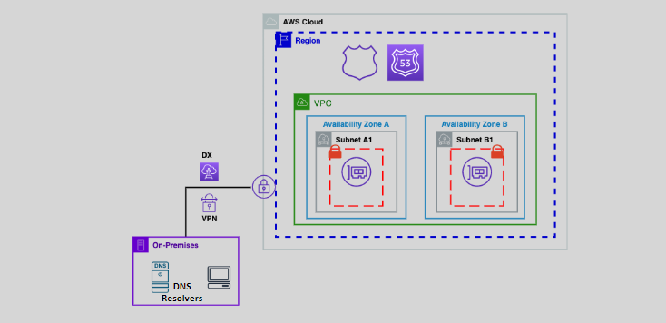
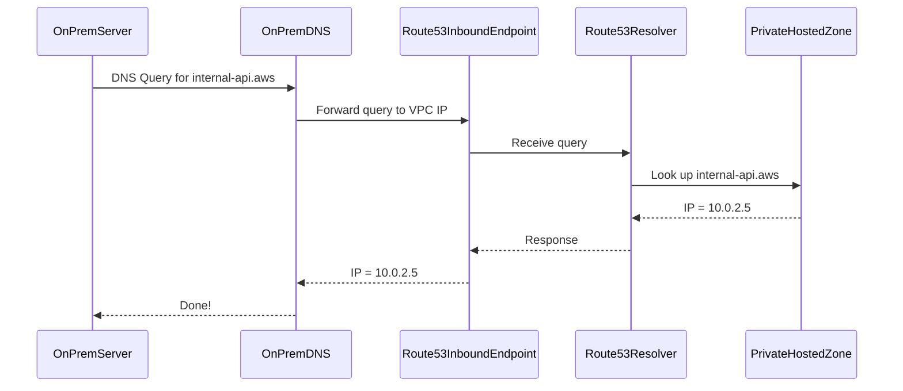
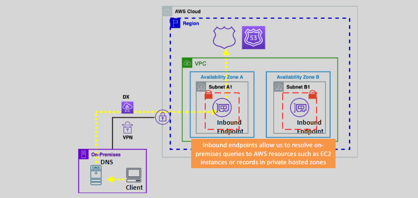
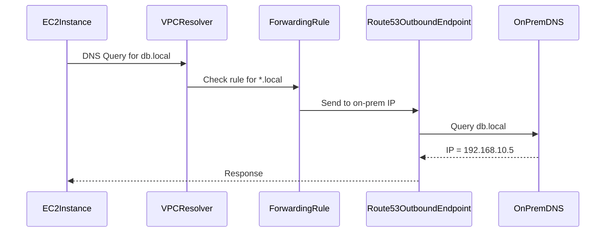
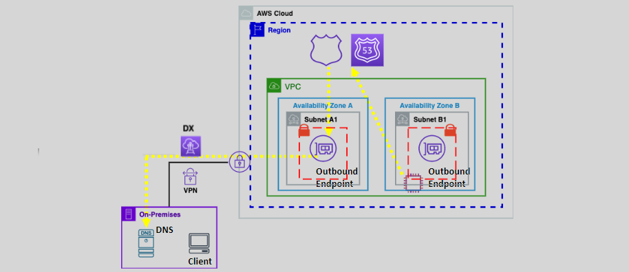

# 🔍 **Amazon Route 53 Resolver – Simple & Deep Hybrid DNS**

> _Your bridge between on-premises and AWS DNS worlds._  
> Let’s understand how DNS flows, not just use it!

---

## 🌐 **What Is Route 53 Resolver?**

Imagine you have:

- A **VPC in AWS**
- A **local data center (on-premises)**

Now… both sides have **servers that need to talk to each other by DNS names** — like `db.local`, `app.internal`, etc.

**Route 53 Resolver** is the **middleman DNS translator** that:

- Lets **on-premises servers** resolve AWS domain names.
- Lets **AWS servers** resolve **on-premises domain names**.

It does that using:

- **Inbound Endpoints** → DNS queries from on-premises → AWS
- **Outbound Endpoints** → DNS queries from AWS → on-premises

---

  

---

## 🔁 **How DNS Resolution Works with Route 53 Resolver**

Let’s go through the two directions, **with visuals and real-world thinking**.

---

### 🔄 **1. Inbound DNS Flow: On-Premises → AWS (Private Hosted Zones)**

🧠 **Goal**: Your **on-prem server** wants to resolve a domain in your **AWS VPC**, like `internal-api.aws`.

#### 🛠️ What You Do

| Step                           | Description                                                   |
| ------------------------------ | ------------------------------------------------------------- |
| 🔌 Create **Inbound Endpoint** | Adds IPs inside your VPC for accepting DNS queries            |
| 🔐 Open Port 53                | Use **security groups** to allow DNS (TCP/UDP 53)             |
| 🔗 Connect your network        | Use **VPN or Direct Connect** to link your on-premises to AWS |
| ⚙️ Configure on-prem DNS       | Forward queries like `*.aws` to that inbound IP               |

#### 🧭 What Happens Internally

---

  

---

### 🔄 **2. Outbound DNS Flow: AWS → On-Premises**

🧠 **Goal**: An **EC2 inside AWS** wants to resolve a name in your **on-premises DNS**, like `db.local`.

#### 🛠️ What You Do

| Step                            | Description                                       |
| ------------------------------- | ------------------------------------------------- |
| 🔌 Create **Outbound Endpoint** | Creates VPC IPs that can send DNS traffic out     |
| 📄 Create **Rules**             | Tell Route 53: "For `*.local`, use these DNS IPs" |
| 🔐 Open firewall ports          | Allow DNS traffic to your on-prem DNS server      |

#### 🧭 What Happens Internally

---

  

---

## 🧠 **Quick Summary of the Two Flows**

| DNS Flow Direction | Purpose                                                  | Setup Needed                            |
| ------------------ | -------------------------------------------------------- | --------------------------------------- |
| 🏠 On-Prem → AWS   | Access **AWS VPC private DNS** (like `internal-api.aws`) | **Inbound Endpoint**                    |
| ☁️ AWS → On-Prem   | Access **on-prem DNS** (like `db.local`)                 | **Outbound Endpoint + Forwarding Rule** |

---

## 🔐 **Security Essentials**

| 🔐 Security Item          | Explanation                                                                                    |
| ------------------------- | ---------------------------------------------------------------------------------------------- |
| **Security Groups**       | Inbound/Outbound endpoints use **ENIs** — attach SGs to allow port 53 (TCP + UDP)              |
| **NACLs**                 | Make sure your subnets allow port 53                                                           |
| **VPN or Direct Connect** | Required — AWS health checkers or resolvers **can't reach on-prem directly over the internet** |

---

## 📘 **Best Practices (Simplified)**

✅ Create **redundant endpoints** in multiple AZs  
✅ Only allow traffic from **trusted IPs**  
✅ Monitor queries via **Route 53 Resolver Query Logging**  
✅ Automate setup with **Terraform** or **CloudFormation**

---

## 🧪 Real-World Example

### Scenario

You have:

- An EC2 in `dev-vpc` → needs to talk to `db.mycorp.local` (on-prem)
- A service in `on-prem` → needs to call `auth.dev.aws` (in your VPC)

### Your Setup

| Action                                                                     | Setup |
| -------------------------------------------------------------------------- | ----- |
| For `auth.dev.aws` → On-prem → Inbound Resolver                            |       |
| For `db.mycorp.local` → AWS → Outbound Resolver + Rule for `.mycorp.local` |       |

🎯 Now, DNS works **both ways** — clean, secure, and managed!

---

## ✅ Conclusion

**Route 53 Resolver** acts as your **hybrid DNS bridge**:

- Inbound = on-prem → AWS
- Outbound = AWS → on-prem

It uses **custom endpoints**, **rules**, and **secure tunnels** (VPN/DX) to make DNS resolution seamless between worlds — no more split-brain DNS or static IP hacks.
