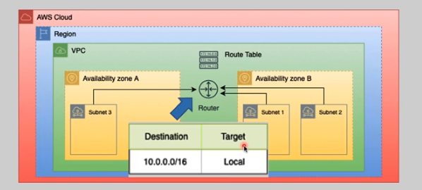
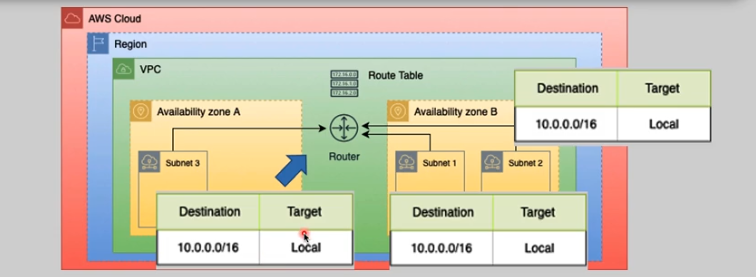
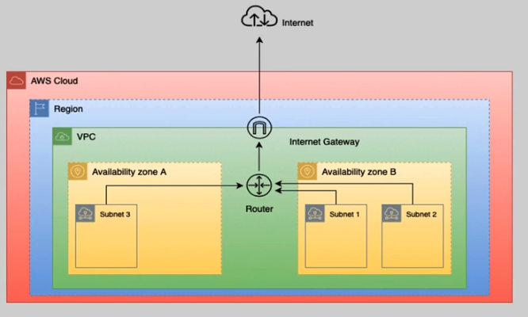
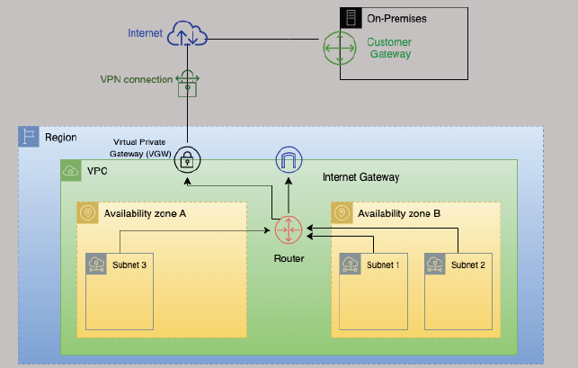
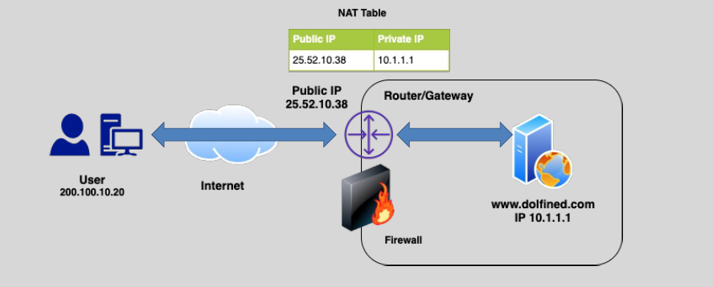
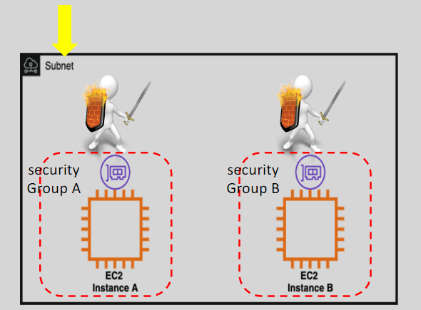
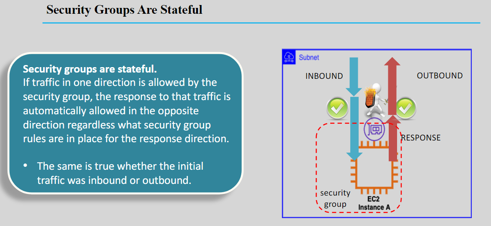
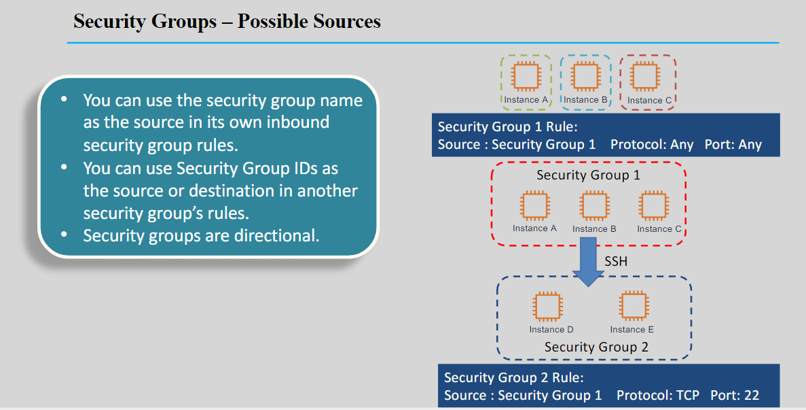
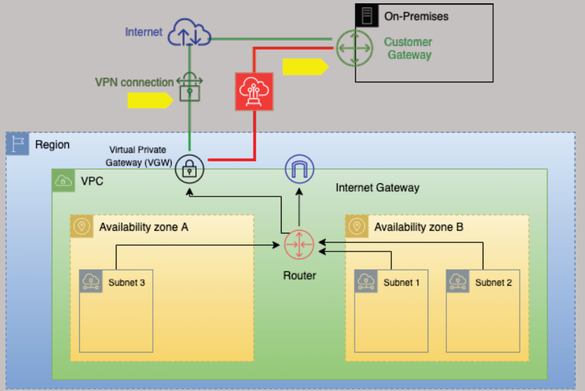
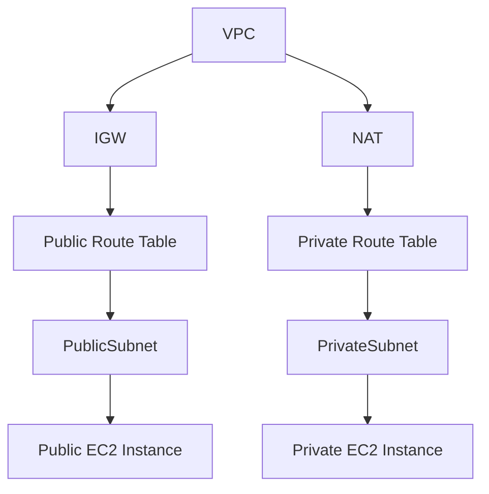

# 🌐 AWS Virtual Private Cloud (VPC): The Ultimate Guide

Ready to become the master of AWS VPC? Buckle up—this guide covers everything from **fundamentals** to **advanced concepts** with behind-the-scenes insights. Let’s dive in! 🐳

---

## 📚 What is a VPC? (Official Definition)

**AWS Virtual Private Cloud (VPC)** lets you provision a logically isolated network in the AWS cloud, giving you complete control over IP address ranges, subnets, route tables, gateways, and security settings.

Simply put, think of a VPC as your private playground inside AWS’s giant public park 🌳—secure and entirely yours!

---

## 🚧 VPC Basic Rules

- ✅ A default VPC exists automatically in every AWS region.
- ❌ You can’t stretch a VPC across multiple regions.
- 🌍 Each VPC covers multiple Availability Zones (AZs) within one region.

---

## ⚙️ Essential VPC Components

### 📐 1. CIDR Blocks

- A CIDR (Classless Inter-Domain Routing) block defines IP ranges.
- Default CIDR can’t change after creation.
- We can expand the VPC address pool by adding up to 4 additional secondary CIDRs Blocks.
  - [Limitation Can Be Found Here](https://docs.aws.amazon.com/vpc/latest/userguide/configure-your-vpc.html#vpc-cidr-blocks)

> Example: `10.0.0.0/16`

---

### 📂 2. Subnets

- we can configure multiple subnets per VPC
- in each AZ we can have one or more subnets
- A subnet `cannot` stretch between AZs
- Subnet in a VPC cannot overlap

**Example Structure**:

- `10.0.1.0/24` (Subnet-AZ1)
- `10.0.2.0/24` (Subnet-AZ2)

---

  

---

### 🚦 3. Implied Router

- The implied router is used to communicate among the subnets in a VPC and between the VPC and the outside world (inside/outside of AWS).
- We cannot access or login to implied router, it is fully managed by AWS. (but we can add route table to it)
- Routing among VPC subnets is guaranteed by default.
- Automatic routing between VPC subnets is guaranteed.

---

  

---

### 📑 4. Route Tables

- It is created for implied router and It is apply on subnet level
- Each VPC includes a default "main" route table.
- A subnet can associate with one route table at a time, but one route table can serve multiple subnets.
- Custom route tables can be created as needed.
- Routing among VPC subnets is guaranteed by default.

---

  

---

### 🌉 5. Internet Gateway (IGW)

- `Only one IGW` can be attached to a VPC at a time.
- Enables internet access.
- Highly available and horizontally scalable.
- Managed entirely by AWS.
- It will never become a traffic bottleneck.
- supporting both IPv4 and IPv6.

---

  

---

### 🔏 6. Virtual Private Gateway (VGW)

- `Only one VGW` can be attached to a VPC at a time.
- It is used for Hybrid Cloud Connectivity
- IGW is hz scaled, redundant and highly available.
- Fully managed by AWS
- supporting both IPv4 and IPv6.

---

  

---

### 🚪 7. NAT Gateway/Instance

- Enables private subnet instances to reach the internet without being publicly accessible.
- Managed (Gateway) or self-managed (Instance).

---

  

---

### 🔒 8. Security Groups (SGs)

- Stateful firewall attached to instances (Acts as a virtual firewall at the instance (ENI) level).
- Allow-rules only (implicit deny).
- **whitelist-based** (no deny rules).
- Evaluates all rules; changes apply instantly.
- Supports multiple SGs per EC2 instance ENI.
- **Inbound** is traffic that comes from outside to the instance
- **Outbound** is traffic that goes from the instance to outside.

---

---

---

---

### 🛡️ 9. Network ACLs (NACLs)

- Stateless firewall applied at the subnet level.
- Supports explicit allow/deny rules.
- Rules evaluated sequentially.
- Default explicit deny at the end.

---

  

---

### 🎯 **Security Groups vs. NACLs Quick Reference**

| 🔑 Feature      | 🟢 Security Groups | 🟡 Network ACLs |
| --------------- | ------------------ | --------------- |
| Level           | Instance (ENI)     | Subnet          |
| Rule Type       | Allow Only         | Allow & Deny    |
| Stateful        | ✅ Yes             | ❌ No           |
| Rule Evaluation | All at once        | Sequential      |

---

## 🌐 VPC Connectivity Options

### ☁️ 1. Internet Connectivity

- Public subnets via IGW.
- Private subnets via NAT.

---

### 🔗 2. Hybrid Cloud Connectivity

Combine AWS with your on-premises environment through:

1. **VPN (Virtual Private Network)** 🌍

   - Over the internet
   - Quick to deploy
   - Cost effective
   - Secure
   - Not reliable (some times be slow)

2. **Direct Connect (DX)** ⚡
   - Over fiber cable
   - Long lead times
   - Low latency and high bandwidth
   - Private but not secure

---

  

> Pro tip: Use both for **maximum security and reliability**!

---

## 🕵️ Behind-the-Scenes: Hidden Availability Zones (AZs)

Sometimes AWS temporarily hides AZs due to:

- 🔧 _Capacity Management_: AWS may hide certain AZs to manage capacity and ensure optimal performance.
- 🚨 _Maintenance or Issues_: AZs might be hidden due to ongoing maintenance or issues.

**How to Enable/Disable AZs:**

- From **AWS Management Console**: Go to the **VPC Dashboard > Settings > Zones**.

**⚠️ Considerations:**

- You can enable it by `opt-in`
- if you want disable a enabled az you must call aws support.
- Opting in to hidden AZs may incur additional costs.

---

## 🪪 IAM Identity Center

AWS Identity Center, also known as **AWS IAM Identity Center**, is a service that helps you **manage workforce access to AWS applications and resources**. It allows you to connect your existing identity provider (like Okta, Google Workspace, or Microsoft Active Directory) to AWS, providing a **single sign-on (SSO) experience** for your users.

Here are some key features:

- **Centralized Management**: Manage user access to multiple AWS accounts and applications from a single place.
- **Single Sign-On**: Users can access AWS services with one set of credentials.
- **Integration with AWS Applications**: Seamlessly integrates with AWS managed applications like Amazon QuickSight and Amazon SageMaker Studio.
- **Improved Security and Visibility**: Provides better control and visibility over user access, making it easier to audit and monitor activities.

We recommend that you use Identity Center to provide console access to a person. With Identity Center, you can centrally manage user access to their AWS accounts and cloud applications.

---

## 📋 Credential Report

- **Credential Reports**: Snapshot of IAM user credentials (available for 4 hours).
- Lists all IAM users and credential statuses (stored for up to 4 hours).

---

## 🚩 Public vs Private Subnets (Explained Clearly)

  

- **Public:** Connected directly to IGW for internet access.
- **Private:** No direct IGW connectivity, requires NAT for internet access.

---

## 🧩 Example Architecture: Typical VPC Setup

---

## 🌍 VPC Networking Extras

### 🔖 Autonomous System Number (ASN)

An **Autonomous System Number (ASN)** is a unique identifier used for routing internet traffic between different networks. In AWS, ASNs are used in services like **AWS Direct Connect** and **Virtual Private Cloud (VPC)** to manage BGP (Border Gateway Protocol) routing.

ThinK of **Autonomous System Number (ASN)** as an `ID for a group of IPs range` that are managed by one organization.

**Key Points:**

- **VPC**: ASNs help in advertising your IP address ranges with your own ASN instead of AWS's default ASN.
- **AWS Direct Connect**: You can configure a private ASN for your Virtual Private Gateway or Direct Connect gateway.

### 📍 IPAM (IP Address Manager)

- Efficiently manages IP allocation across AWS VPCs.

---

## 🚨 Common Mistakes & Best Practices

- Always separate public-facing resources and sensitive data.
- Regularly review Security Group and NACL rules.
- Combine Direct Connect and VPN for critical applications.

---

📖 **Further Reading & References:**

- [Official AWS VPC Documentation](https://docs.aws.amazon.com/vpc/latest/userguide/)
- [AWS Networking Basics](https://aws.amazon.com/what-is/networking/)
- [AWS Direct Connect](https://aws.amazon.com/directconnect/)
- [AWS VPN](https://aws.amazon.com/vpn/)

---
