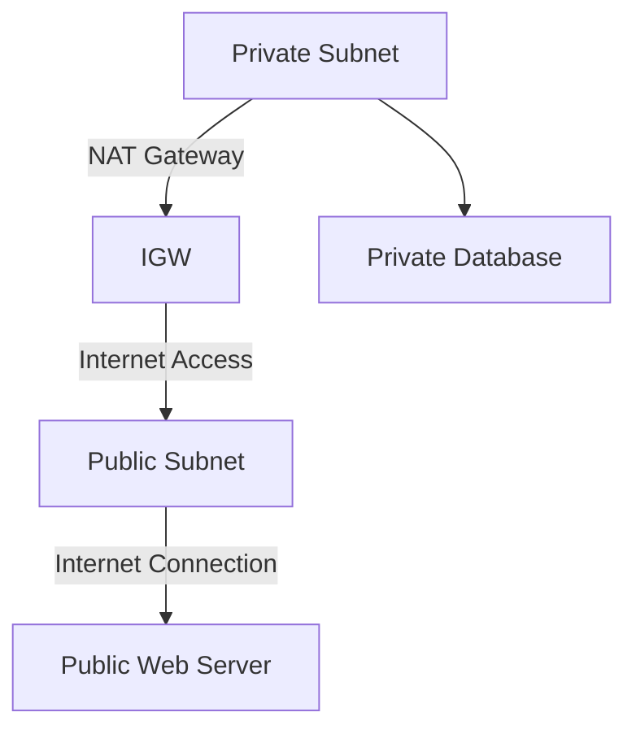
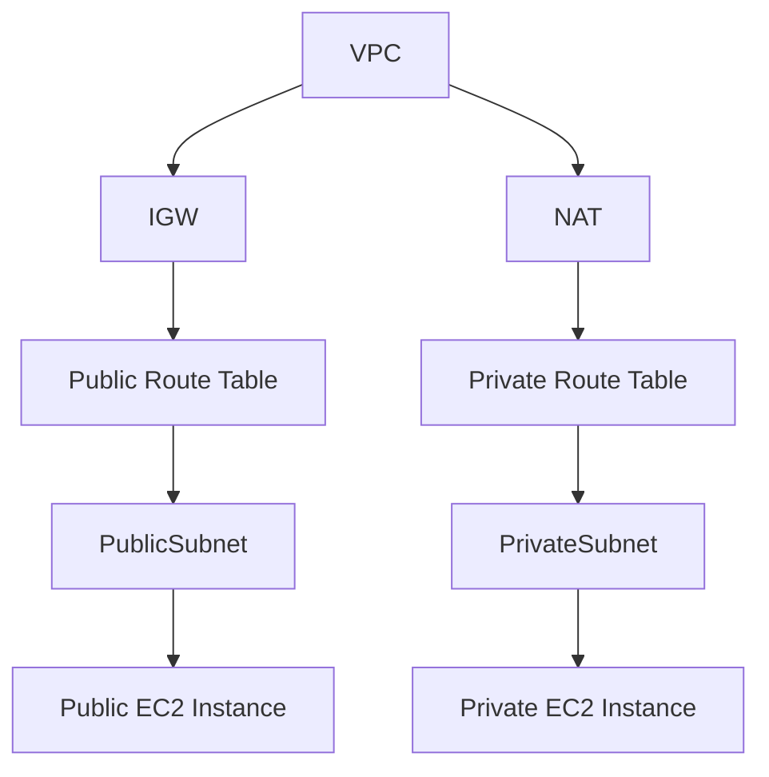

# 🌐 AWS Virtual Private Cloud (VPC): The Ultimate Guide

Ready to become the master of AWS VPC? Buckle up—this guide covers everything from **fundamentals** to **advanced concepts** with behind-the-scenes insights. Let’s dive in! 🐳

---

## 📚 What is a VPC? (Official Definition)

**AWS Virtual Private Cloud (VPC)** lets you provision a logically isolated network in the AWS cloud, giving you complete control over IP address ranges, subnets, route tables, gateways, and security settings.

Simply put, think of a VPC as your private playground inside AWS’s giant public park 🌳—secure and entirely yours!

---

## 🚧 VPC Basic Rules

- ✅ A default VPC exists automatically in every AWS region.
- ❌ You can’t stretch a VPC across multiple regions.
- 🌍 Each VPC covers multiple Availability Zones (AZs) within one region.

---

## ⚙️ Essential VPC Components

### 📐 1. CIDR Blocks

- A CIDR (Classless Inter-Domain Routing) block defines IP ranges.
- Default CIDR can’t change after creation.
- Expandable with up to 4 secondary CIDRs.

Example: `10.0.0.0/16`

---

### 📂 2. Subnets

  

- A subnet lives inside one AZ only.
- You can create multiple subnets per AZ.
- Subnets can't overlap.

**Example Structure**:

- `10.0.1.0/24` (Subnet-AZ1)
- `10.0.2.0/24` (Subnet-AZ2)

---

### 🚦 **Implied Router**

  

- AWS manages this hidden router.
- Handles routing between VPC subnets and the external world.
- Automatic routing between VPC subnets is guaranteed.

### 🌉 4. Internet Gateway (IGW)

  

- Enables internet access.
- Highly available and horizontally scalable.
- Managed entirely by AWS.
- **Only one IGW** per VPC, supporting both IPv4 and IPv6.

---

### 🚪 5. NAT Gateway/Instance

- Enables private subnet instances to reach the internet without being publicly accessible.
- Managed (Gateway) or self-managed (Instance).

---

### 📑 **Route Tables**

  

- Each VPC includes a default "main" route table.
- A subnet can associate with one route table at a time, but one route table can serve multiple subnets.
- Custom route tables can be created as needed.

---

### 🔒 6. Security Groups (SGs)

  
  
  
  

- Stateful firewall attached to instances (Acts as a virtual firewall at the instance (ENI) level).
- Allow-rules only (implicit deny).
- **whitelist-based** (no deny rules).
- Evaluates all rules; changes apply instantly.
- Supports multiple SGs per EC2 instance ENI.

---

### 🛡️ 7. Network ACLs (NACLs)

  

- Stateless firewall applied at the subnet level.
- Supports explicit allow/deny rules.
- Rules evaluated sequentially.
- Default explicit deny at the end.

---

### 🎯 **Security Groups vs. NACLs Quick Reference**

| 🔑 Feature      | 🟢 Security Groups | 🟡 Network ACLs |
| --------------- | ------------------ | --------------- |
| Level           | Instance (ENI)     | Subnet          |
| Rule Type       | Allow Only         | Allow & Deny    |
| Stateful        | ✅ Yes             | ❌ No           |
| Rule Evaluation | All at once        | Sequential      |

---

## 🌐 VPC Connectivity Options

### ☁️ Internet Connectivity

- Public subnets via IGW.
- Private subnets via NAT.

---

### 🔗 Hybrid Cloud Connectivity

Combine AWS with your on-premises environment through:

1. **VPN (Virtual Private Network)** 🌍

   - Over internet, quick deployment, secure but sometimes slow.

2. **Direct Connect (DX)** ⚡
   - Dedicated fiber, reliable, private, high-speed, but slow initial setup.

---

  

> Pro tip: Use both for **maximum security and reliability**!

---

## 🌍 VPC Networking Extras

### 🔖 Autonomous System Number (ASN)

- Unique identifier for routing traffic between different networks (used with BGP routing).

### 📍 IPAM (IP Address Manager)

- Efficiently manages IP allocation across AWS VPCs.

---

## 🕵️ Behind-the-Scenes: Hidden Availability Zones (AZs)

Sometimes AWS temporarily hides AZs due to:

- 🔧 Capacity management.
- 🚨 Maintenance activities.

You can opt-in for hidden AZs via the AWS Management Console.

> ⚠️ **Note:** Opting in to hidden AZs may incur additional costs.

---

## 📋 Credential Reports & IAM Identity Center

- **Credential Reports**: Snapshot of IAM user credentials (available for 4 hours).
- **AWS IAM Identity Center**: Centralized workforce access and Single Sign-On (SSO) management.

---

## 🚩 Public vs Private Subnets (Explained Clearly)

- **Public Subnet**: Direct internet access.
- **Private Subnet**: Indirect internet access through NAT Gateway (secure and hidden).

---

## 🧩 Example Architecture: Typical VPC Setup

---

## 🚨 Common Mistakes & Best Practices

- Always separate public-facing resources and sensitive data.
- Regularly review Security Group and NACL rules.
- Combine Direct Connect and VPN for critical applications.

---

## 🎉 Wrapping Up

Congratulations! You've reached expert-level knowledge on AWS VPCs 🎓. You now have the full picture—from basic concepts to practical implementation and troubleshooting tips. Keep exploring, experimenting, and growing your AWS mastery!

---

📖 **Further Reading & References:**

- [Official AWS VPC Documentation](https://docs.aws.amazon.com/vpc/latest/userguide/)
- [AWS Networking Basics](https://aws.amazon.com/what-is/networking/)
- [AWS Direct Connect](https://aws.amazon.com/directconnect/)
- [AWS VPN](https://aws.amazon.com/vpn/)

---

✨ **Happy Clouding! ☁️**
