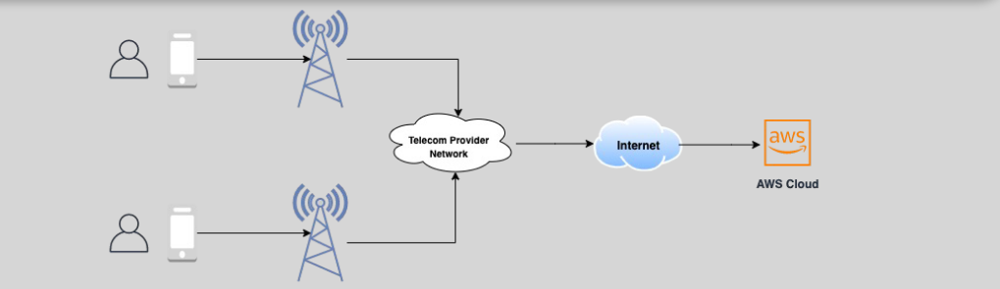
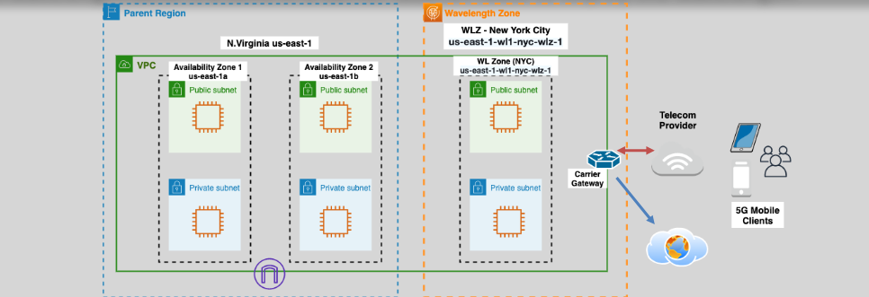

# **🛜 AWS Wavelength (5G)**

**AWS Wavelength** is a service designed to bring **AWS compute and storage services** closer to end-users, enabling ultra-low latency applications by extending **AWS infrastructure** to the **edge of telecommunication networks**. This is particularly beneficial for applications that require real-time responses, such as those used in **5G networks** and **mobile devices**.

---

    

## **🚀 What is AWS Wavelength?**

- **AWS Wavelength** integrates **AWS services** with **telecom carrier 5G networks**, providing ultra-low latency for applications that need to respond in near real-time.
- It brings **compute, storage, and AWS services** closer to mobile and edge devices, allowing for applications to run closer to end-users.
- A **Wavelength Zone** is a specialized **availability zone** located within a telecommunications carrier's network infrastructure. These zones are connected to AWS regions, allowing them to access other AWS services.

    

---

### **🖧 Wavelength Zones and VPCs**

- AWS customers can opt in to use **Wavelength Zones** within supported regions.
- **VPCs** can be extended to one or more Wavelength Zones to leverage low-latency communication directly within the carrier network.
- A **Carrier Gateway** is used to route traffic to/from Wavelength Zones, providing high-speed, bidirectional communication with mobile devices and on-premises resources.

## **⏱️ How Does AWS Wavelength Impact Application Latencies?**

- **5G networks** deliver significant performance improvements over **4G networks**, providing speeds **up to 10 times faster**.
- Running **real-time applications** in the cloud from a centralized AWS region can lead to higher latencies, particularly for telecom provider-connected users and IoT devices.
- By using **Wavelength**, applications can be deployed at the **edge of the telecom provider’s network**, drastically reducing the latency for applications that need to process real-time data, like **live streaming**, **gaming**, or **smart manufacturing**.

## **🔌 Carrier Gateway**

The **Carrier Gateway** provides connectivity between the **Wavelength Zone** and the **internet**. Here’s how it works:

- It **serves bidirectional communication** between the **AWS Wavelength** zone and the **telecom network**, supporting **4G/LTE** and **5G**.
- It **only allows outbound traffic** to resources connected to the internet. There’s **no inbound connection** through the carrier gateway.
- It should be configured as the **default gateway** (0.0.0.0/0) in the **Wavelength Zone's** route table.
- The gateway **performs NAT (Network Address Translation)** on the **Wavelength instances’ IP addresses**, mapping them to the **Carrier IP addresses** assigned by the telecom provider.

### **🔧 Components in the Wavelength Zone**

- **Wavelength instances** (EC2) run at the edge of the telecom network.
- **Storage** like **EBS** (Elastic Block Storage) is also available within the zone for high-speed access.
- AWS services like **ECS**, **EKS**, and **CloudWatch** can be used to monitor and scale your applications in real-time.

## **🛠️ Supported AWS Services**

AWS Wavelength extends several AWS services to the edge, including:

- **EC2** (and Auto Scaling)
- **EBS** (Elastic Block Store)
- **ECS** and **EKS** (Elastic Container Service and Elastic Kubernetes Service)
- **EC2 SSM** (System Manager)
- **CloudWatch** for monitoring
- **CloudTrail** for auditing and logging
- **CloudFormation** for infrastructure provisioning

## **🎮 Use Cases for AWS Wavelength**

AWS Wavelength is ideal for a wide range of real-time, latency-sensitive applications, such as:

- **Connected Vehicles**: Real-time processing of HD maps and sensor data for autonomous driving.
- **Media and Entertainment**: Low-latency live streaming and high-speed media processing.
- **AR/VR**: Immersive experiences requiring fast communication and rendering.
- **Smart Factories**: Real-time data processing for IoT devices and machine learning workloads.
- **Real-Time Gaming**: Multiplayer online games requiring low-latency interactions.
- **AI/ML in Healthcare**: Real-time healthcare data analysis for fast decision-making.

## **📚 Conclusion**

**AWS Wavelength** enables ultra-low latency applications by placing AWS compute and storage services at the **edge of telecom networks**, directly connecting to **5G** and **mobile devices**. It’s a game-changer for industries that require **real-time processing**, including **gaming, media, and IoT**. With **AWS Wavelength**, businesses can deliver **faster, more responsive applications**, benefiting from the power of AWS while minimizing network latency.
