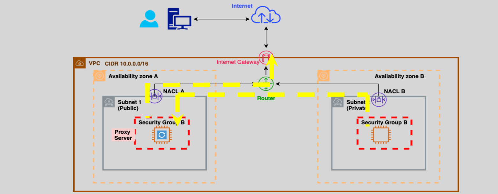
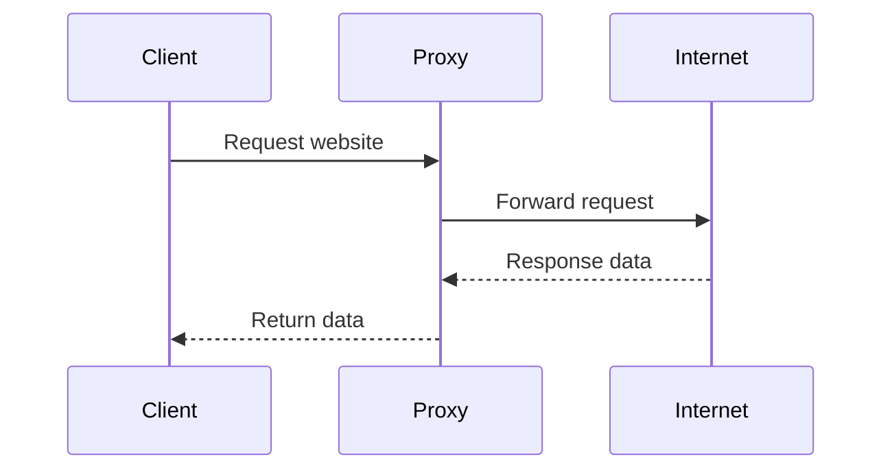
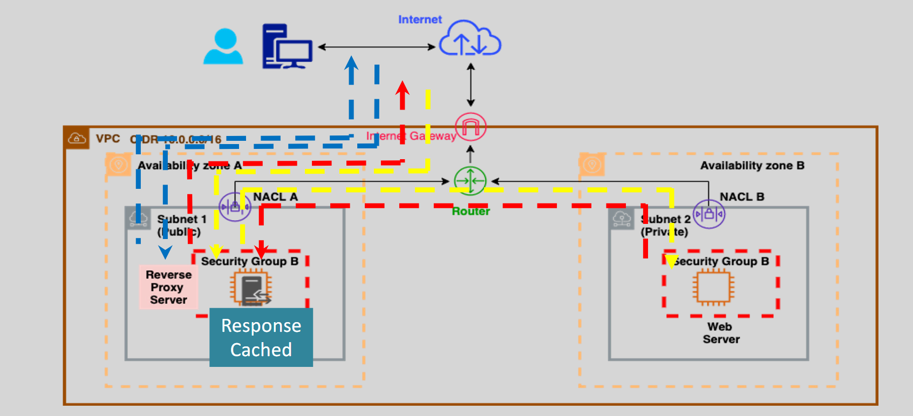
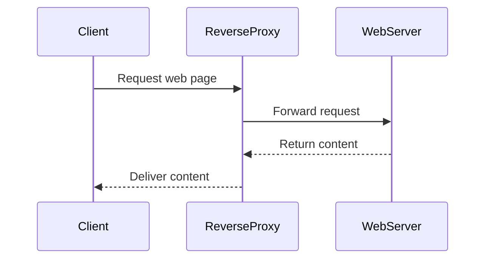

# 🌐 Proxy vs. Reverse Proxy: The Complete Guide

Understanding **proxies** and **reverse proxies** is crucial for effective web management, security, and performance. Let's demystify these concepts clearly, practically, and visually!

---

## 🧩 What is a Proxy?

  

---

A **proxy server** acts as an intermediary between your computer (client) and the internet. When you send a request, it first goes through the proxy server before reaching the internet.

### 📌 Official Definition

A proxy server is an intermediary server separating end-user clients from the websites they browse.

### ⚙️ How a Proxy Works

- Client sends request ➡️ Proxy server ➡️ Internet
- Response travels back through Proxy server ➡️ Client

### 🛡️ Proxy Server Use-Cases

- **Privacy:** Hides client IP address.
- **Security:** Filters traffic, blocks malicious requests.
- **Caching:** Stores frequently accessed web content.

---

## 🔄 What is a Reverse Proxy?

  

---

A **reverse proxy** sits in front of web servers, forwarding client requests to these servers. It provides an additional layer between the client and your backend infrastructure.

### 📌 Official Definition

A reverse proxy is a server that forwards client requests to one or more backend servers.

### ⚙️ How a Reverse Proxy Works

- Client ➡️ Reverse Proxy ➡️ Backend Servers
- Backend Servers respond ➡️ Reverse Proxy ➡️ Client

### 🛡️ Reverse Proxy Use-Cases

- **Load Balancing:** Distributes client requests across multiple servers.
- **Security:** Protects backend servers from direct exposure.
- **Caching & Compression:** Speeds up web performance.
- **SSL Termination:** Handles encryption and decryption.

---

## 🔍 Key Differences

| Feature              | Proxy                            | Reverse Proxy                   |
| -------------------- | -------------------------------- | ------------------------------- |
| **Location**         | Sits between client and internet | Sits between client and servers |
| **Use-Case**         | Protects and anonymizes clients  | Protects and manages servers    |
| **Traffic Flow**     | Outbound from client             | Inbound to servers              |
| **Security Purpose** | Client anonymity                 | Backend server protection       |

---

## 🚦 Real-World Examples

- **Proxy:** VPN services, Corporate internet gateways.
- **Reverse Proxy:** NGINX, HAProxy, Cloudflare services.

---

## 📌 Quick Summary

- **Proxy:** Protects and manages client-side internet access.
- **Reverse Proxy:** Protects, balances, and optimizes backend servers.

Both play vital roles in managing web traffic, enhancing security, and optimizing web performance.

---

🎓 **Further Reading & Resources:**

- [NGINX Reverse Proxy Guide](https://docs.nginx.com/nginx/admin-guide/web-server/reverse-proxy/)
- [Cloudflare Reverse Proxy](https://www.cloudflare.com/learning/cdn/glossary/reverse-proxy/)

---

✨ **Happy Networking! 🌐**
