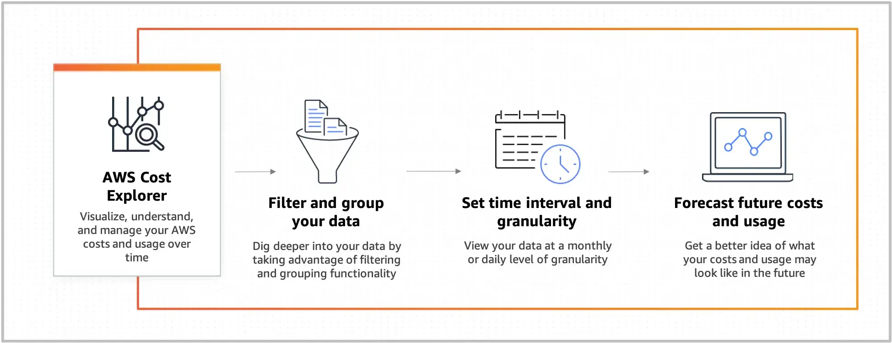
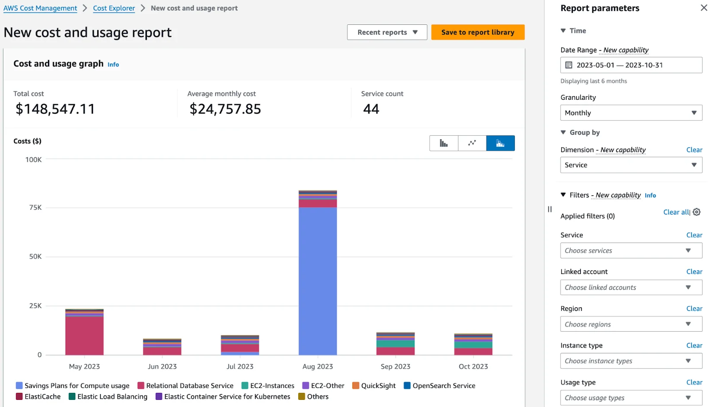

# 📊 AWS Cost Explorer: Visualize and Analyze Your Costs

AWS Cost Explorer is a tool that provides insights into your AWS spending. It allows you to visualize, analyze, and manage your costs effectively, helping you identify trends and optimize your cloud expenses.

---

    
    

---

## 🌟 Key Features

### 📈 Cost Visualization

- View your **AWS spending trends** over time with intuitive graphs.
- Break down costs by **service**, **region**, or **linked accounts**.

### 🔍 Usage Analysis

- Analyze usage patterns to understand which resources drive costs.
- Track spending by **tags** for granular insights.

### 📆 Forecasting

- Predict future costs based on historical data.
- Plan budgets with accurate forecasts.

---

## 🎯 Use Cases

- **Expense Management:** Identify cost-saving opportunities by analyzing trends.
- **Budget Planning:** Use forecasts to align cloud spending with financial goals.
- **Cost Allocation:** Allocate costs to specific teams or projects using tags.

---

## ✅ Benefits

- **Clarity:** Gain a detailed understanding of AWS costs.
- **Optimization:** Discover areas to reduce expenses.
- **Proactive Management:** Plan ahead with accurate cost predictions.

---

AWS Cost Explorer is an essential tool for businesses looking to manage their AWS expenses effectively. With its visualizations and detailed insights, you can take control of your cloud costs with confidence.
