# 💻🔐 **Active Directory Authentication & Authorization Flow**

When a user logs in to **Windows**, AD performs authentication and authorization using **Kerberos or NTLM**, then grants access to network resources.

---

## **🛠️ Step-by-Step Explanation of AD Authentication & Authorization Flow**

### **1️⃣ User Login & Authentication Process**

1. The **user enters credentials** (`Username/Password`) in Windows.
1. The **Windows client** sends an **authentication request** to a **Domain Controller (DC)**.
1. If Kerberos is used, the **DC issues a Ticket Granting Ticket (TGT)**.
1. If NTLM is used, the **DC verifies the password hash**.
1. The **user is authenticated**, and login is successful.

---

### **2️⃣ Authorization & Resource Access Process**

1. The **user requests access** to a network resource (e.g., file server, database).
1. The **Windows client contacts AD** for authorization.
1. The **Domain Controller (DC) verifies user permissions** using **Active Directory group memberships**.
1. If the user is **authorized**, the **resource server grants access**.
1. If unauthorized, access is denied.

---

### **🖥️ Detailed Sequence Diagram of AD Authentication & Authorization**

```mermaid
sequenceDiagram
    autonumber
    participant User as User (Employee)
    participant Workstation as Windows Client
    participant DC as Domain Controller (AD DS)
    participant GC as Global Catalog (GC)
    participant FileServer as File Server
    participant AppServer as Application Server

    Note over User: 🔹 User logs in to a Windows PC

    User->>Workstation: 1️⃣ Enters Username & Password
    Workstation->>DC: 2️⃣ Sends Authentication Request (Kerberos or NTLM)

    alt Using Kerberos Authentication
        DC->>Workstation: 3️⃣ Issues Ticket Granting Ticket (TGT)
    else Using NTLM Authentication (If Kerberos Unavailable)
        DC->>Workstation: 3️⃣ Verifies Password Hash & Grants Access
    end

    Note over Workstation: ✅ User is authenticated and logged in

    Note over User: 🔹 User Requests Access to a File Server

    User->>Workstation: 4️⃣ Requests Access to Shared Files
    Workstation->>GC: 5️⃣ Queries Global Catalog for Group Membership
    GC->>Workstation: 6️⃣ Returns User's Group Membership Info

    Workstation->>DC: 7️⃣ Requests Authorization for File Access
    DC->>DC: 8️⃣ Checks Group Policies & ACL Permissions
    alt User Has Required Permissions
        DC->>FileServer: 9️⃣ Sends Access Approval
        FileServer->>User: 🔟 Grants Access to Files
    else User Lacks Required Permissions
        DC->>User: ❌ Access Denied (Insufficient Permissions)
    end

    Note over User: 🔹 User Requests Access to an Enterprise Application

    User->>AppServer: 1️⃣1️⃣ Opens an Enterprise App
    AppServer->>DC: 1️⃣2️⃣ Validates User Credentials & Permissions
    alt User Has Permission
        DC->>AppServer: 1️⃣3️⃣ Approves Access
        AppServer->>User: 1️⃣4️⃣ Loads Application Dashboard
    else User Lacks Permission
        DC->>User: ❌ Access Denied
    end
```

---

## **📌 Explanation of Key Components**

| **Component**                    | **Function**                                           |
| -------------------------------- | ------------------------------------------------------ |
| **User (Employee)**              | A person trying to log in and access resources         |
| **Windows Client (Workstation)** | The user's device where authentication starts          |
| **Domain Controller (DC)**       | Authenticates the user and enforces security policies  |
| **Global Catalog (GC)**          | Stores user information for multi-domain searches      |
| **File Server**                  | Hosts shared files that require authorization          |
| **Application Server**           | Provides access to enterprise apps based on user roles |

---

## **⚙️ Key Takeaways**

### **1️⃣ Authentication (Who Are You?)**

✔ Uses **Kerberos (default) or NTLM (legacy)** for secure login  
✔ **DC verifies credentials** and issues **TGT (if Kerberos is used)**  
✔ **Successful login** allows access to the local system

### **2️⃣ Authorization (What Can You Access?)**

✔ **User requests access** to network resources (file shares, applications)  
✔ **DC checks group memberships & security policies**  
✔ **If permitted**, access is granted; otherwise, it is denied

---

## 🏆 **Final Thoughts**

✔ **AD Authentication & Authorization** ensures secure **user login & access control**  
✔ **Kerberos is the preferred authentication protocol** (stronger security than NTLM)  
✔ **Group Policies & ACLs enforce access restrictions** to protect sensitive data

💡 **Active Directory centralizes authentication & authorization, making enterprise security robust and manageable!** 🚀
