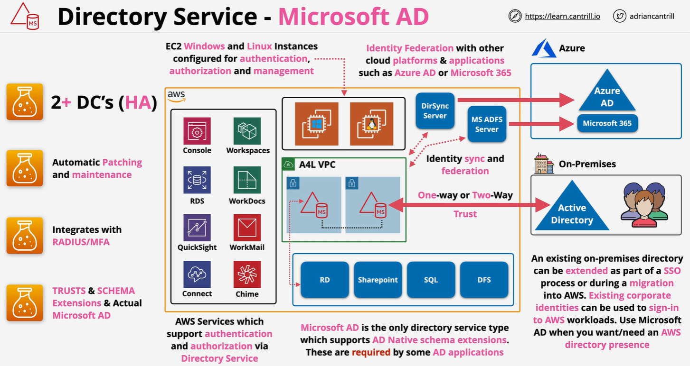
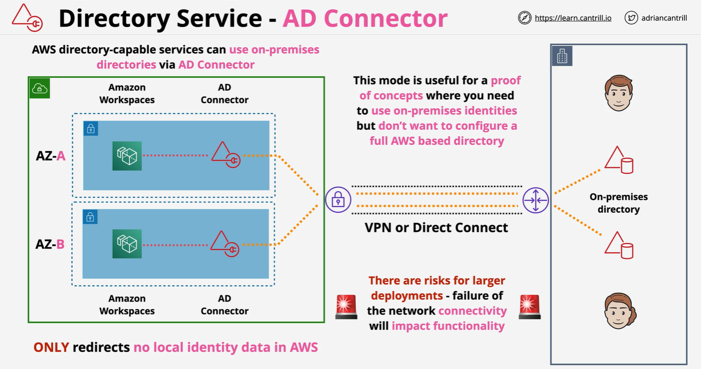

# **AWS Directory Service 🌐**

AWS Directory Service is a **fully managed service** that allows organizations to run **Microsoft Active Directory (AD), Simple AD, or connect with on-premises AD** in the AWS Cloud.

It helps businesses:  
✅ **Securely authenticate & manage users** across AWS and on-premises environments.  
✅ **Enable Single Sign-On (SSO) & access control** for AWS resources.  
✅ **Extend existing AD environments** into AWS with **AWS Managed Microsoft AD**.

🔹 **Why Use AWS Directory Service?**

- **Reduces IT overhead** – Fully managed, no need for complex setups.
- **Seamlessly integrates with AWS services** – EC2, RDS, WorkSpaces, FSx, and more.
- **Supports hybrid IT environments** – Extend existing **on-premises AD** to AWS.

---

## 🔑 **Key Features of AWS Directory Service**

✔ **Fully Managed Active Directory (AD)** – No need to manage domain controllers manually.  
✔ **Secure Authentication & Access Control** – Supports **Kerberos, LDAP, NTLM, and MFA**.  
✔ **Integration with AWS Services** – EC2, S3, WorkSpaces, RDS, and FSx.  
✔ **Scalability & High Availability** – Automatically replicates AD data across multiple Availability Zones (AZs).  
✔ **Hybrid AD Integration** – Connects with **on-premises Active Directory** using **AWS AD Connector**.

---

## 🏗️ **AWS Directory Service Offerings**

AWS provides **multiple directory options** to meet different use cases:

| **Service**                  | **Best For**                                                    | **Key Features**                                                 |
| ---------------------------- | --------------------------------------------------------------- | ---------------------------------------------------------------- |
| **AWS Managed Microsoft AD** | Enterprises needing **full AD features** in AWS                 | Fully managed **Microsoft AD**, supports **trust relationships** |
| **AD Connector**             | Organizations wanting to **extend on-premises AD to AWS**       | **No AD replication**, acts as a **proxy to on-prem AD**         |
| **Simple AD**                | Lightweight **directory service** for Linux & Windows workloads | Compatible with **LDAP-based applications**                      |
| **Amazon Cognito**           | Web & mobile apps needing **user authentication**               | Supports **OAuth, OpenID Connect, SAML**                         |

---

## 🛠️ **AWS Managed Microsoft AD**

💡 **A fully managed Active Directory running in AWS, built on Windows Server AD.**

✔ **Deploys actual Microsoft AD** in AWS, with full **Group Policies, Kerberos, LDAP, and domain trust support**.  
✔ **Multi-Availability Zone (AZ) deployment** for high availability.  
✔ **Supports seamless authentication** for Amazon WorkSpaces, RDS, FSx, and EC2 Windows.

🔹 **Use Case:**

- Enterprises migrating workloads to AWS **while maintaining full AD functionality**.
- Applications that require **Active Directory authentication** in AWS.
- **Hybrid IT environments** where AWS needs to trust on-premises AD domains.

---

<div align="center" style="padding:0 20px">
  
</div>

---

## 🛠️ **AWS AD Connector**

💡 **A lightweight directory service that acts as a proxy to on-premises AD.**

✔ **Does not store user credentials in AWS** (No replication).  
✔ Allows AWS applications **to authenticate with existing on-prem AD users**.  
✔ Works well for **AWS Single Sign-On (SSO), Amazon WorkSpaces, and EC2 access control**.

🔹 **Use Case:**

- Organizations **already using on-prem AD** and want to **authenticate AWS workloads without full migration**.
- Businesses that need **AWS SSO for existing Active Directory users**.

---

<div align="center" style="padding:0 20px">
  
</div>

---

## 🛠️ **Simple AD**

💡 **A lightweight, AWS-managed directory service for small-scale environments.**

✔ **Built on Samba 4**, supports **basic LDAP, Kerberos, and DNS**.  
✔ Cost-effective for **small businesses and simple authentication needs**.  
✔ No **trust relationships** or **Group Policy support**.

🔹 **Use Case:**

- Startups & small businesses needing **basic authentication & user management**.
- Linux-based workloads that require an **LDAP directory service**.

---

## 🔑 **Authentication & Authorization with AWS Directory Service**

### **1️⃣ Authentication (Who Are You?)**

- Uses **Kerberos, NTLM, LDAP, and SAML** for verifying user identities.
- Supports **Single Sign-On (SSO) across AWS services**.
- Users sign in using **Active Directory credentials**.

### **2️⃣ Authorization (What Can You Access?)**

- AWS services check **IAM roles & AD group memberships** to grant or deny access.
- Supports **AWS IAM integration** for enforcing security policies.

---

## **🔗 AWS Directory Service Integration with AWS Services**

AWS Directory Service **integrates with** several AWS services for seamless authentication:

| **AWS Service**                         | **Integration with AWS Directory Service**     |
| --------------------------------------- | ---------------------------------------------- |
| **Amazon WorkSpaces**                   | Use AD credentials for Virtual Desktop sign-in |
| **Amazon EC2 (Windows)**                | Join EC2 instances to Active Directory         |
| **Amazon FSx for Windows**              | Enforce access control via Active Directory    |
| **Amazon RDS (SQL Server, PostgreSQL)** | Authenticate databases using AD users          |
| **AWS Single Sign-On (AWS SSO)**        | Federate AD users for AWS IAM access           |

---

## 🏗️ **How to Set Up AWS Managed Microsoft AD**

### **1️⃣ Deploy AWS Managed AD**

1. Navigate to **AWS Directory Service Console** → Click **Create Directory**.
2. Select **AWS Managed Microsoft AD**.
3. Choose a **fully qualified domain name (FQDN)** (e.g., `corp.example.com`).
4. Select **VPC & Subnets** for AD deployment.
5. AWS automatically **creates Domain Controllers across multiple Availability Zones (AZs)**.

---

### **2️⃣ Configure AWS Resources to Use AD**

✅ **Join EC2 Windows Instances to AWS AD**

```powershell
Add-Computer -DomainName "corp.example.com" -Credential "corp\admin"
Restart-Computer
```

✅ **Enable AD Authentication for Amazon RDS**

```sql
CREATE LOGIN [corp\john.doe] FROM WINDOWS;
```

✅ **Apply IAM Role-Based Access Control**

```json
{
  "Effect": "Allow",
  "Action": "ec2:RunInstances",
  "Resource": "*",
  "Condition": { "StringEquals": { "aws:PrincipalTag/ADGroup": "Developers" } }
}
```

---

## **🤔 When to Use AWS Directory Service**

✔ **Managing Windows workloads in AWS**  
✔ **Hybrid IT environments extending on-prem AD**  
✔ **Centralized user authentication for AWS resources**  
✔ **Enforcing security & compliance with Group Policies**

---

## **✅ Conclusion**

AWS Directory Service **simplifies identity management in AWS**, providing:  
✔ **Seamless AD integration for authentication & access control**  
✔ **Fully managed AD deployment with high availability**  
✔ **Support for hybrid cloud environments & AWS IAM policies**

💡 **AWS Directory Service is essential for securely managing users & workloads in AWS!** 🚀
