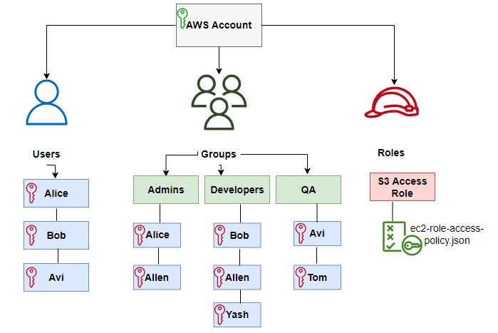
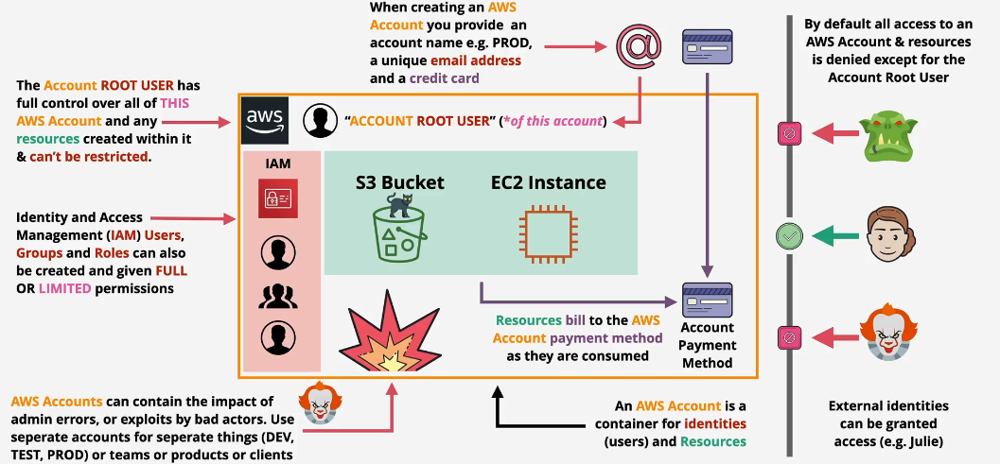

# 🌟 **AWS Account: Your Gateway to the AWS Cloud**

An **AWS account** is your **entry point** into the Amazon Web Services ecosystem. It gives you access to a wide range of cloud services via the **AWS Management Console**, **CLI**, and **APIs**, enabling you to **provision resources**, **manage costs**, and **securely scale** your infrastructure.

It’s more than just a login—it’s how you structure your cloud presence, organize workloads, and control access across your organization.

<div align="center">
  
</div>

---

## 🎯 **Top Use Cases for AWS Accounts**

| Use Case 🧩                     | Description                                                                                       |
| ------------------------------- | ------------------------------------------------------------------------------------------------- |
| **🔧 Environment Segmentation** | Separate accounts for dev, staging, and production to isolate workloads and control access.       |
| **💳 Centralized Billing**      | Use [AWS Organizations](https://aws.amazon.com/organizations/) to group accounts under one payer. |
| **🔐 Compliance and Isolation** | Enforce specific security and compliance rules using Service Control Policies (SCPs).             |
| **👥 Team/Project Isolation**   | Assign one account per project, product, or business unit to simplify tracking and billing.       |

---

## 🔑 **Root Account Privileges (Use Sparingly!)**

<div align="center">
  
</div>

---

The **root user** has **full account access**. Use only for:

- 🔁 Changing account email or password
- 💵 Managing billing preferences and payments
- ❌ Closing the AWS account
- 🔒 Resetting lost permissions for IAM users
- 🛍 Registering in the **Reserved Instance Marketplace**

➡️ **Best Practice:** Use the root account **only when absolutely necessary**, and always **enable MFA**.

---

## 🛠️ **Creating and Securing an AWS Root Account**

### ✅ **1. Create a New AWS Account**

1. Go to [aws.amazon.com](https://aws.amazon.com) and click **Create an AWS Account**.
2. Enter:
   - Email
   - Account name
   - Password
3. Add payment info (credit/debit card required).
4. Verify identity (email/SMS).
5. Choose a support plan (Basic is free).

---

### ✅ **2. Secure the Root Account with MFA**

```plaintext
🛑 Root user access should be tightly secured.
```

1. Log in to AWS Console as the **root user**.
2. Go to **My Account > Security Credentials**.
3. Click **Activate MFA**.
4. Choose a virtual MFA device (e.g., Google Authenticator).
5. Scan the QR code and enter the 2 generated codes.
6. You're protected 🎉

---

## 🔐 **Password & Root Account Management**

### 🛡️ **Default Password Policy for IAM Users**

- Minimum 8 characters
- Must include letters, numbers, and special characters
- Cannot be similar to the username or email

➡️ **You can customize** password policies via IAM settings.

- Enforce changes immediately for new passwords.
- Apply expiration policies for regular password updates.

> 💡 Note: This policy does not apply to the root user credentials or access keys.

---

## 💰 **How to Create a Budget in AWS**

### 📊 Track & Control Your Cloud Spending

1. Go to **Billing Dashboard** → **Budgets** → **Create Budget**.
2. Choose type: **Cost**, **Usage**, **Reservation**.
3. Set:
   - Budget amount
   - Time period (monthly, quarterly, etc.)
   - Email alerts for threshold breaches
4. ✅ Done! AWS will now notify you when you're close to overspending.

---

## 🚦 **Account Management Best Practices**

| Area ⚙️                    | Best Practice ✅                                                                   |
| -------------------------- | ---------------------------------------------------------------------------------- |
| 🔐 **Root Account**        | Enable MFA. Never use it for daily tasks. Create IAM users instead.                |
| 🧱 **AWS Organizations**   | Use it to manage multi-account environments. Set **SCPs** to enforce security.     |
| 🧾 **Billing & Budgeting** | Enable **AWS Budgets** and tag resources for better cost visibility.               |
| 🔍 **Auditing**            | Enable **AWS CloudTrail** for logging. Use **AWS Config** for compliance tracking. |
| 🏷 **Tagging**              | Standardize tags for project, owner, env (e.g., `Project:Website`, `Env:Prod`).    |

---

## 📦 **Bonus: Organizing at Scale with AWS Organizations**

AWS Organizations lets you:

- 📁 Group accounts into **Organizational Units (OUs)**
- 🔒 Apply **Service Control Policies (SCPs)** at the OU or account level
- 💳 Share resources while using **centralized billing**
- 🛡️ Enforce governance without restricting flexibility for individual teams

---

## 🧠 **Final Thoughts**

Your **AWS account is the control center of your cloud journey**. Whether you're a solo developer or an enterprise architect managing thousands of resources, it's essential to:

- ✅ Set up proper governance
- ✅ Secure your credentials
- ✅ Monitor costs
- ✅ Automate account best practices

> “A well-structured AWS account is the backbone of a secure, scalable cloud strategy.”
