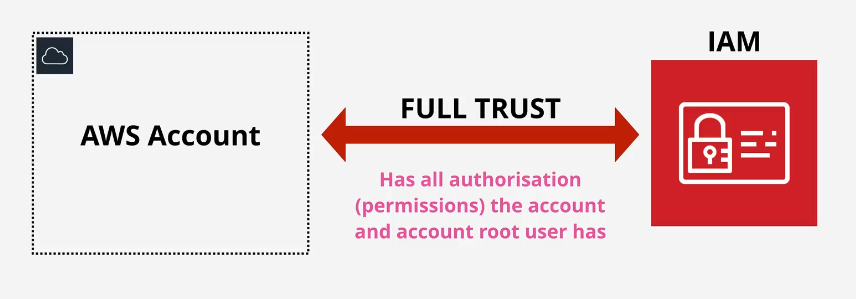
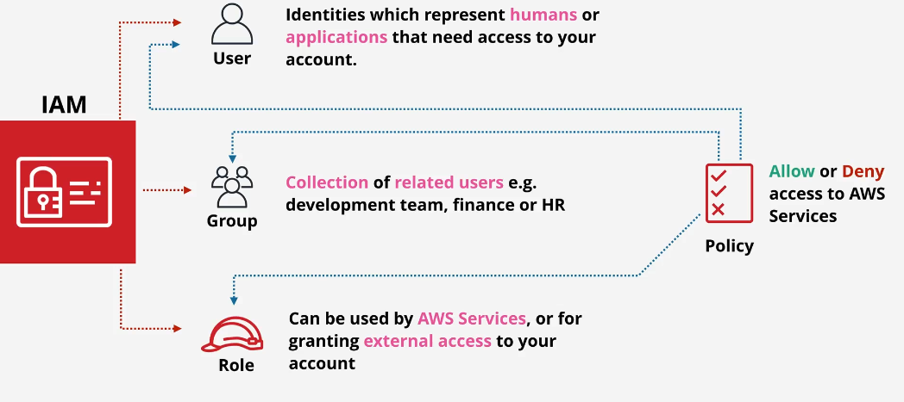

# 🔐 **AWS Identity and Access Management (IAM)**

**Secure, Control, and Simplify Access to Your AWS Resources!**

AWS **Identity and Access Management (IAM)** is a free, secure, and essential AWS service that allows you to **manage user identities** and securely **control access** to AWS resources. IAM helps you establish clear permissions, reduce security risks, and streamline resource access across your AWS infrastructure.

---

  

---

<!-- 

  

 -->

<!-- --- -->

## 🌟 **Key Features of IAM**

1. 🌎 **Global Service**: IAM configurations automatically apply to all AWS regions.
1. 👥 **Multiple Users & Shared Access**: Allows multiple individuals to safely share access to your AWS resources.
1. 🎛️ **Granular Permissions**: Highly specific control over who can access what and when.
1. 🔐 **Multi-Factor Authentication (MFA)**: Add extra protection to user logins.
1. 🔗 **Identity Federation**: Integrate with external identity providers (like Microsoft AD, Google, or Okta).
1. 📋 **Auditing and Compliance**: Detailed tracking of identity actions for auditing (using CloudTrail).
1. ⏳ **Temporary Credentials**: Short-term secure access through AWS STS.

---

## ⚠️ **IAM Limitations to Keep in Mind**

| ⚠️ Limitation                          | ✅ Recommendation                                   |
| -------------------------------------- | --------------------------------------------------- |
| **Max. 5,000 users per AWS account**   | Use IAM Roles and Federation for large user bases.  |
| **Users can belong to max. 10 groups** | Plan group assignments carefully.                   |
| **Nested groups not supported**        | Design flat and logical group structures.           |
| Default limit of **300 IAM groups**    | Request AWS support to increase limit if necessary. |

---

## 🚦 **IAM Best Practices**

| 💡 Best Practice                 | ✅ Recommended Action 🛠️                                     |
| -------------------------------- | ------------------------------------------------------------ |
| 🛡️ Protect Root User Credentials | Enable **MFA**; minimize use of root credentials.            |
| 👤 Create Individual IAM Users   | Each user or app should have dedicated credentials.          |
| 🔒 Enforce Least Privilege       | Grant only minimum necessary permissions.                    |
| 📂 Manage Users via Groups       | Use groups to assign permissions efficiently.                |
| 🔐 Enable Multi-Factor Auth      | Require **MFA for critical users and resources**.            |
| 🔄 Regular Credential Rotation   | Frequently update passwords and access keys.                 |
| 📑 Leverage AWS Managed Policies | Simplify permissions using managed policies.                 |
| 🔑 Strong Password Policies      | Enforce complex and regularly changed passwords.             |
| 📊 Audit and Monitor Activity    | Utilize **CloudTrail** and **IAM Access Analyzer**.          |
| 🎭 Delegate via IAM Roles        | Prefer roles for **temporary** and **cross-account access**. |

---

## 📇 **IAM Identities Explained**

IAM identities are the entities you manage in IAM to define permissions:

### **👤 IAM Users**

- Individual users with personal login credentials and access keys.
- Ideal for developers, admins, or application-specific access.

### **📂 IAM Groups**

- Collections of users to simplify permission management.
- Users inherit permissions granted to their assigned groups.

> ⚠️ **Note:** Groups are management tools, **not identities** themselves.

### **🎭 IAM Roles**

- Temporary credentials without permanent access keys.
- Ideal for AWS service permissions, cross-account access, or federated identities.

---

  

---

## 📜 **IAM Policies**

Policies define permissions (allow/deny) attached to users, groups, or roles:

| Policy Type 📄                  | Use Case 🛠️                                                     |
| ------------------------------- | --------------------------------------------------------------- |
| 🏢 AWS Managed Policies         | Ready-to-use policies provided by AWS (easiest option).         |
| 🧑‍💻 Customer Managed Policies | Custom policies created for specific use cases or requirements. |
| 🏷️ Inline Policies              | Directly embedded policies for single-use or unique scenarios.  |

---

## ⌛ 🔑 **Temporary Access with AWS STS**

AWS **Security Token Service (STS)** generates temporary security credentials, reducing the need for long-term credentials and enhancing security:

- ✅ Short-term access keys
- ✅ Ideal for federated users, cross-account roles, or temporary access scenarios
- ✅ Reduces the risk associated with lost or compromised credentials

---

## 🚧 **Real-World Example: IAM in Action**

**Scenario:**  
_A developer needs secure, temporary access to an Amazon S3 bucket:_

**Steps:**

1. Create an **IAM User** for the developer.
2. Assign permissions through an **IAM Policy** to access only the required S3 bucket.
3. Enable **MFA** for additional security.
4. Developer uses temporary AWS STS credentials to access resources securely.
5. Monitor access via AWS CloudTrail for compliance and auditing.

---

## 💡 **Why IAM Matters**

IAM forms the cornerstone of AWS security by ensuring:

- 🔒 **Controlled Access**: Only authorized personnel and apps access your resources.
- 🎯 **Simplified Management**: Clear, granular control reduces complexity.
- 📈 **Compliance Readiness**: Enables audit trails, essential for compliance (e.g., GDPR, PCI DSS).

> 📌 **Tip:** Always configure IAM first when setting up a new AWS account to avoid security risks and mismanagement.

---

## 🚀 **Quick IAM Setup Checklist**

✅ Secure root account with MFA  
✅ Create individual IAM users & groups  
✅ Enforce a strong password policy  
✅ Apply AWS-managed policies initially  
✅ Enable auditing via CloudTrail  
✅ Regularly review permissions (IAM Access Analyzer)  
✅ Utilize IAM roles for service interactions & cross-account scenarios

---

## 🎖️ **Final Thoughts**

AWS IAM isn’t just about managing credentials; it's about crafting a secure, efficient, and compliance-ready AWS environment. By clearly defining identities, permissions, and access strategies, you create a cloud infrastructure that is both powerful and safe.

> **IAM:** _"Securing access today for a safer tomorrow."_ 🌤️🔐
