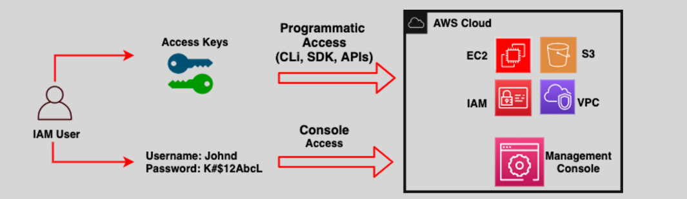

# **🧑‍💻 Programmatic Access to AWS Services**

**AWS Programmatic Access** allows users to securely interact with AWS services through APIs, AWS CLI, or SDKs by using **Access Keys**. These keys provide secure authentication to perform various tasks like automation, integrations, and data management.

---

<div align="center">
  
</div>

---

## **🔑 What Are Access Keys?**

**Access Keys** are a pair of credentials used for programmatic access to AWS services:

- **Access Key ID**: Identifies your access key to AWS.
- **Secret Access Key**: A private key used for cryptographic verification, kept secret and only accessible at the time of creation.

Access keys are **required** for users to make **programmatic calls** to AWS, such as using the AWS CLI or SDK.

## **🖥️ How to Set Up AWS CLI for Programmatic Access**

To use **AWS CLI** and interact with AWS programmatically, you need to set up your access keys.

### **🐧 1. Install AWS CLI**

If you haven't installed the AWS CLI yet, follow these steps (for **Linux**):

```bash
# Remove any previous versions
sudo yum remove awscli

# Download the latest version of AWS CLI
curl "https://awscli.amazonaws.com/awscli-exe-linux-x86_64.zip" -o "awscliv2.zip"

# Unzip the downloaded file
unzip awscliv2.zip

# Run the installer
sudo ./aws/install

# Check installation
which aws
aws --version
```

### **🔧 2. Configure AWS CLI**

Once the AWS CLI is installed, you’ll need to configure it with your **Access Keys**:

```bash
aws configure
```

This will prompt you for:

- **AWS Access Key ID**: Your personal key ID.
- **AWS Secret Access Key**: Your personal secret key.
- **Default Region Name**: The AWS region for your operations (e.g., `us-west-2`).
- **Default Output Format**: Choose between `json`, `text`, or `table`.

## **📁 Where Are Your Access Keys Stored?**

When configuring the AWS CLI, your credentials are saved in **two configuration files** on your local machine:

1. **Configuration File** (`~/.aws/config`): Stores your AWS region and output settings.
2. **Credentials File** (`~/.aws/credentials`): Stores your **Access Key ID** and **Secret Access Key**.

### **📝 Example of Configuration Files**

**config file (`~/.aws/config`)**:

```ini
[default]
region = us-west-2
output = json
```

**credentials file (`~/.aws/credentials`)**:

```ini
[default]
aws_access_key_id = YOUR_ACCESS_KEY_ID
aws_secret_access_key = YOUR_SECRET_ACCESS_KEY
```

## **🔄 Switch Between AWS Profiles**

For users managing **multiple AWS accounts** (e.g., for different projects or environments), AWS CLI supports the use of **profiles**.

### **🎭 Creating Multiple Profiles**

To create a profile for each AWS account:

```bash
aws configure --profile profile_name
```

Example:

```bash
aws configure --profile dev-account
aws configure --profile prod-account
```

This will store different credentials for each account under separate profiles.

### **🤹 Using Profiles**

To run commands using a specific profile, use the `--profile` flag:

```bash
aws s3 ls --profile dev-account
```

If you don’t specify a profile, AWS CLI uses the **default** profile.

### **🏠 Setting a Default Profile**

To avoid specifying `--profile` every time, you can set a **default profile** by exporting the `AWS_PROFILE` environment variable:

```bash
export AWS_PROFILE=dev-account
```

Now, you can run commands without needing the `--profile` flag:

```bash
aws s3 ls
```

## **🛠️ Advanced Configuration: Multi-Account Setup**

### **Editing Profile Files Manually** ✍️

You can also edit the `~/.aws/config` and `~/.aws/credentials` files directly to modify or add profiles.

Example of **config file (`~/.aws/config`)**:

```ini
[profile dev-account]
region = us-west-2
output = json

[profile prod-account]
region = us-east-1
output = text
```

Example of **credentials file (`~/.aws/credentials`)**:

```ini
[dev-account]
aws_access_key_id = <YOUR_DEV_ACCESS_KEY_ID>
aws_secret_access_key = <YOUR_DEV_SECRET_ACCESS_KEY>

[prod-account]
aws_access_key_id = <YOUR_PROD_ACCESS_KEY_ID>
aws_secret_access_key = <YOUR_PROD_SECRET_ACCESS_KEY>
```

## **🌐 Using Environment Variables**

You can also set **AWS credentials** using **environment variables**. This is particularly useful for **temporary setups** or **automated scripts**.

### **🌍 Common Environment Variables**

- **AWS_ACCESS_KEY_ID**: Your access key ID.
- **AWS_SECRET_ACCESS_KEY**: Your secret access key.
- **AWS_SESSION_TOKEN**: For temporary session credentials (optional).
- **AWS_DEFAULT_REGION**: The default region to use.
- **AWS_PROFILE**: The profile to use from the configuration and credentials files.

### **🌱 Setting Environment Variables**

Example for a **Unix Shell**:

```bash
export AWS_ACCESS_KEY_ID=YOUR_ACCESS_KEY_ID
export AWS_SECRET_ACCESS_KEY=YOUR_SECRET_ACCESS_KEY
export AWS_DEFAULT_REGION=us-west-2
```

To use a specific profile with environment variables:

```bash
export AWS_PROFILE=dev-account
aws s3 ls
```

## **🔝 Prioritization of AWS Credentials**

AWS CLI and SDKs prioritize different credential sources in the following order:

1. **Command Line Options**
2. **Environment Variables**
3. **Assume Role** (IAM Role)
4. **AWS IAM Identity Center**
5. **Credentials File**
6. **AWS Config File**
7. **Container Credentials**
8. **Amazon EC2 Instance Profile**

### **🏁 Summary**

- **Programmatic Access** to AWS services is set up using **Access Keys**.
- The **AWS CLI** can be configured to use these keys through **profiles** and **configuration files**.
- You can easily manage **multiple AWS accounts** and switch between them using **AWS profiles**.
- **Environment variables** are a flexible alternative for setting up access keys and configurations temporarily.
