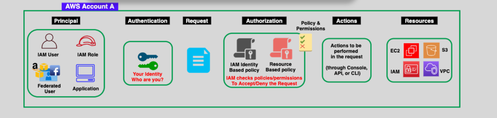
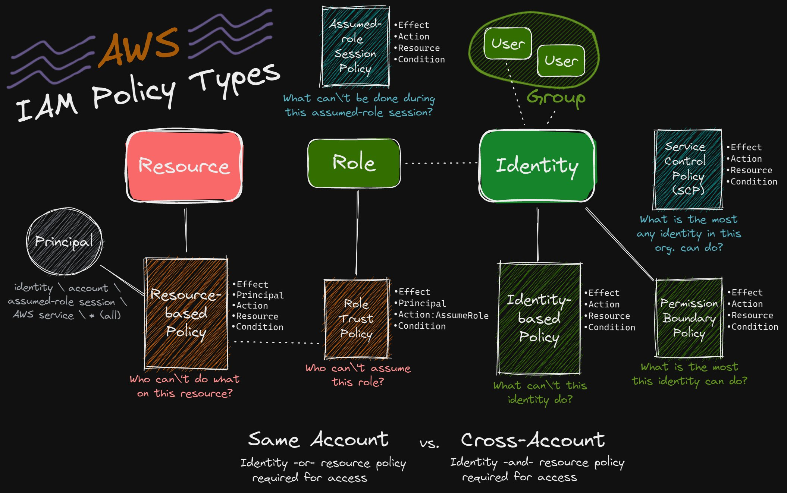

# 📑 **IAM Policies in AWS: Control Access with Precision**

> 📌 "Who can do what, on which resource, under what condition?"

**IAM Policies** are the **brains behind access control** in AWS. They determine **who can do what**, **on which resources**, and **under what conditions**.

They’re written in **JSON**, evaluated by AWS every time an action is attempted, and are essential to implementing the **principle of least privilege**.

---

<div align="center">
  
</div>

---

## 🧠 **What Are IAM Policies?**

IAM Policies are **permissions documents** attached to identities or resources. These JSON-based policies explicitly **allow** or **deny** actions on AWS services.

✅ Think of a policy as a **"rules list"** saying:

> “User X **can** read objects from this S3 bucket, but **can’t** delete them.”

---

## 🧱 **Key Components of a Policy**

```json
{
  "Version": "2012-10-17",
  "Statement": [
    {
      "Effect": "Allow",
      "Action": "s3:GetObject",
      "Resource": "arn:aws:s3:::mybucket/*"
    }
  ]
}
```

| 🔹 Field    | 🧾 Description                                                |
| ----------- | ------------------------------------------------------------- |
| `Version`   | Policy language version (always `"2012-10-17"` for AWS).      |
| `Statement` | One or more permission rules.                                 |
| `Effect`    | `"Allow"` or `"Deny"`. Deny always takes precedence.          |
| `Action`    | The operation to allow/deny (e.g., `"s3:GetObject"`).         |
| `Resource`  | The ARN(s) of the AWS resources to which this action applies. |

---

## **🔍 Policy Evaluation Logic**

IAM policies use a **implicit default deny** model and evaluate requests in a specific way:

1. **🏠 Default Deny**: By default, **all requests are implicit denied** until explicitly allowed by a policy.

2. **✅ Explicit Allow**: If a policy explicitly allows an action, it will be granted even if a general **deny** is in place.

3. **❌ Explicit Deny**: If a policy explicitly denies an action, that denial **overrides any allows**. Deny always takes precedence over allow.

### ✍️ Example: Allow All S3 Actions on a Bucket

```json
{
  "Version": "2012-10-17",
  "Statement": [
    {
      "Effect": "Allow",
      "Action": "s3:GetObject",
      "Resource": "arn:aws:s3:::mybucket/*"
    }
  ]
}
```

### ✍️ Example: Deny All S3 Actions on a Bucket except for `"s3:GetObject"`

```json
{
  "Version": "2012-10-17",
  "Statement": [
    {
      "Effect": "Deny",
      "Action": "s3:GetObject",
      "Resource": "arn:aws:s3:::mybucket/*"
    },
    {
      "Effect": "Allow",
      "Action": "*",
      "Resource": "arn:aws:s3:::mybucket/*"
    }
  ]
}
```

---

## **Types of IAM Policies** 🧩

  

---

We’ll group them into **3 categories** to make them easier to remember:

| Category                     | IAM Policy Types                                                                       | Main Question Answered                                                          |
| ---------------------------- | -------------------------------------------------------------------------------------- | ------------------------------------------------------------------------------- |
| **Attached to Identity**     | ✅ Identity-Based Policy<br>✅ Permissions Boundary<br>✅ SCP (Service Control Policy) | ❓ What _can’t_ this identity do?<br>🧱 What is the _max_ this identity can do? |
| **Attached to Resource**     | ✅ Resource-Based Policy                                                               | ❓ Who _can’t_ do what _on this resource_?                                      |
| **Attached to Role Context** | ✅ Role Trust Policy<br>✅ Assumed-Role Session Policy                                 | ❓ Who _can assume_ the role?<br>❓ What _can’t_ be done during a session?      |

---

### 🟢 **1. Identity-Based Policy** (Most Common)

> 🎯 What _can’t_ this **identity** (user, group, or role) do?

- ✅ Attach to: **IAM users**, **groups**, **roles**
- 🧾 Example:

```json
{
  "Effect": "Allow",
  "Action": "s3:ListBucket",
  "Resource": "arn:aws:s3:::my-bucket"
}
```

- 🔄 Can be:
  - **AWS Managed**
  - **Customer Managed**
  - **Inline**

🔐 **Best For:**  
Controlling access for developers, EC2, Lambda, or service roles.

---

### 🟥 **2. Resource-Based Policy**

> 🎯 Who _can’t_ do what on **this resource**?

- ✅ Attach to: **S3 Buckets**, **Lambda**, **Secrets Manager**, etc.
- 🧾 Example (S3 Bucket):

```json
{
  "Effect": "Allow",
  "Principal": { "AWS": "arn:aws:iam::111122223333:user/Alice" },
  "Action": "s3:GetObject",
  "Resource": "arn:aws:s3:::my-bucket/*"
}
```

- ✅ Must include a `Principal` (i.e., who is allowed)

⚠️ **Important Note:**  
To allow **cross-account access**, a **resource-based policy** is required!

---

### 🟤 **3. Role Trust Policy**

> 🎯 Who _can assume_ this role?

- ✅ Embedded in **IAM Role** definition
- 🧾 Example:

```json
{
  "Effect": "Allow",
  "Principal": {
    "Service": "ec2.amazonaws.com"
  },
  "Action": "sts:AssumeRole"
}
```

🛠️ **Use Cases:**

- Allow EC2 to assume a role (EC2 instance profile)
- Cross-account access
- AWS services using roles (Lambda, ECS)

---

### 🔵 **4. Assumed-Role Session Policy**

> 🎯 What _can’t_ be done **during a temporary session**?

- ✅ Passed during `sts:AssumeRole` API call
- 🧾 Example:

```json
{
  "Effect": "Allow",
  "Action": "s3:*",
  "Resource": "*"
}
```

- Only applies during the **session** lifespan

🛠️ **Use Cases:**

- Limiting access for federated users
- Granting temporary limited permissions (e.g., consultants)

---

### 🟣 **5. Permissions Boundary**

> 🎯 What’s the **maximum** permissions this identity can get?

- ✅ Attach to: IAM **users** or **roles**
- ✅ Acts as a **guardrail**: Identity-based policies must be _within_ this boundary

🧾 Example:

```json
{
  "Effect": "Allow",
  "Action": "s3:*",
  "Resource": "*"
}
```

> If the boundary doesn't allow `s3:DeleteObject`, the user can't perform it, even if their identity policy allows it.

⚠️ Think of it as a **"maximum allowed scope"**.

---

### 🟦 **6. Service Control Policies (SCPs)**

> 🎯 What’s the **maximum** any identity in this org can do?

- ✅ Applies to: **AWS Organization Accounts**
- ✅ Attached to: **OU**, **root**, or **accounts**
- ❌ SCPs don’t grant permissions — they **limit** them.

🧾 Example: Deny deleting buckets

```json
{
  "Effect": "Deny",
  "Action": "s3:DeleteBucket",
  "Resource": "*"
}
```

🧠 **Important:** Even if an IAM policy allows `s3:DeleteBucket`, SCP can block it.

---

## 🎯 **Common Use Cases**

| Scenario                                 | Policy Type            | Description                                                         |
| ---------------------------------------- | ---------------------- | ------------------------------------------------------------------- |
| EC2 instance needs to access S3          | Identity-Based + Role  | Attach a policy to a role, and assign the role to the EC2 instance. |
| Share S3 bucket with another AWS account | Resource-Based         | Add a bucket policy with a cross-account `Principal`.               |
| Prevent S3 bucket deletion org-wide      | Service Control Policy | Use an SCP with `Deny: s3:DeleteBucket`.                            |
| Restrict session to read-only            | Session Policy         | Attach a read-only session policy when assuming a role.             |
| Define max permissions for developers    | Permissions Boundary   | Set a boundary limiting what policies can allow.                    |

---

## 💡 **IAM Groups ≠ Principals**

IAM **Groups** help you organize users, but they **can’t act on their own**.

- ✅ You can attach policies to groups.
- ❌ You **can’t assign roles or trust policies** to groups.

---

## 🔐 **Best Practices for IAM Policies**

| ✅ Practice                              | 💬 Why It’s Important                                           |
| ---------------------------------------- | --------------------------------------------------------------- |
| 🔒 Grant Least Privilege                 | Prevent unintended access or privilege escalation.              |
| 🛠 Use Managed Policies First             | Reduces errors and simplifies maintenance.                      |
| 🧾 Use Customer-Managed for Custom Logic | For business-specific needs.                                    |
| ❗ Avoid Inline Policies When Possible   | They’re hard to audit and reuse.                                |
| 🔁 Regularly Audit and Rotate            | Remove unused policies and review permissions quarterly.        |
| 📋 Tag Your Policies                     | Use tags to organize policies by team, project, or environment. |
| 📚 Use IAM Access Analyzer               | Detect policies that allow unintended access.                   |

---

## ✅ **Summary Table: IAM Policy Types**

| Type                  | Attached To              | Defines Who or What  | Common Use Case                    |
| --------------------- | ------------------------ | -------------------- | ---------------------------------- |
| Identity-Based        | Users, Groups, or Roles  | What they can do     | Access to S3 or EC2                |
| Resource-Based        | AWS Resources (e.g., S3) | Who can access       | Grant cross-account S3 access      |
| Permissions Boundary  | IAM Users or Roles       | Max what they can do | Limit delegated permissions        |
| SCP (Service Control) | AWS Accounts             | Org-wide limits      | Prevent DeleteBucket for everyone  |
| Role Trust Policy     | IAM Roles                | Who can assume       | EC2 assuming a role                |
| Session Policy        | Temporary Role Sessions  | What they can do     | Scoped session for federated users |

---

## 🧠 Final Thoughts

> “**IAM Policies** are your cloud’s rulebook — precise, powerful, and critical.”

- Understand the **types** of policies to choose the right tool for your job.
- Master **policy evaluation logic** to troubleshoot and secure access.
- Always **review and test** policies in a dev/test environment before applying to production.
