# 🧾 **Identity-Based Policies in AWS IAM**

> _"What can’t this identity do?"_

**Identity-based policies** are permission rules that define **what AWS actions are allowed or denied** for a specific IAM **user, group, or role**. These policies are written in JSON and **attach directly to identities**—there's no need to specify a `Principal` because the attachment itself determines it.

---

## 🔑 **Why It’s Called Identity-Based**

| Feature         | Description                                                                  |
| --------------- | ---------------------------------------------------------------------------- |
| 🔗 Attached To  | IAM **User**, **Group**, or **Role**                                         |
| 🚫 No Principal | The policy is applied **to the identity** it’s attached to                   |
| 📦 Policy Types | AWS Managed, Customer Managed, and Inline Policies                           |
| 🧠 Use Cases    | Control permissions for individuals, teams, or roles inside your AWS account |

---

## 🧱 **Structure of an IAM Identity-Based Policy**

```json
{
  "Version": "2012-10-17",
  "Statement": [
    {
      "Effect": "Allow" | "Deny",
      "Action": "service:action",
      "Resource": "arn:aws:...",
      "Condition": {
        "operator": {
          "key": "value"
        }
      }
    }
  ]
}
```

### 📌 Policy Fields Explained

| Field       | Description                                                       |
| ----------- | ----------------------------------------------------------------- |
| `Version`   | Always `"2012-10-17"` (the current IAM policy version).           |
| `Effect`    | `"Allow"` or `"Deny"`. Deny always overrides allow.               |
| `Action`    | One or more actions (like `"s3:PutObject"` or `"ec2:*"`).         |
| `Resource`  | ARN(s) or `"*"` for all. Can be narrowed down.                    |
| `Condition` | (Optional) Add logic such as IP, MFA, Tags, or Time-based checks. |

---

## 🧪 **How Policy Evaluation Works**

```mermaid
---
config:
  look: handDrawn
  layout: elk
  elk:
    mergeEdges: false
---
graph TD
    A[User Requests Access] --> B[All Access Denied by Default]
    B --> C{Explicit Deny Found?}
    C -- Yes --> D[Access Denied ❌]
    C -- No --> E{Explicit Allow Found?}
    E -- Yes --> F[Access Allowed ✅]
    E -- No --> D
```



> 🧠 AWS IAM **starts with deny**, and only **explicit allow** opens access—unless there's an **explicit deny**, which always wins.

---

## 🎯 **Examples of Effect, Action, and Resource**

### ✅ Allow Read Access to S3 Bucket

```json
{
  "Effect": "Allow",
  "Action": "s3:GetObject",
  "Resource": "arn:aws:s3:::my-bucket/*"
}
```

### ❌ Deny Deletion from a Confidential Bucket

```json
{
  "Effect": "Deny",
  "Action": "s3:DeleteObject",
  "Resource": "arn:aws:s3:::confidential-bucket/*"
}
```

---

## ✨ Advanced: `NotAction` Usage

Sometimes you want to say “everything **except** this action”:

```json
{
  "Effect": "Allow",
  "NotAction": "s3:DeleteBucket",
  "Resource": "arn:aws:s3:::*"
}
```

🔒 This allows **all S3 actions** except deleting a bucket.

---

## 🧠 Real-World Examples from Source

### ✅ Allow all services except IAM (NotAction)

```json
{
  "Effect": "Allow",
  "NotAction": "iam:*",
  "Resource": "*"
}
```

### ❌ Deny access to a specific S3 bucket

```json
{
  "Sid": "NoClassifiedBucket",
  "Effect": "Deny",
  "Action": "s3:*",
  "Resource": ["arn:aws:s3:::dolfinedcal123", "arn:aws:s3:::dolfinedcal123/*"]
}
```

---

## 🧩 Conditions in Identity Policies

Conditions are used to **enforce context-sensitive access**, such as:

| Condition Type    | Example Use                               |
| ----------------- | ----------------------------------------- |
| `IpAddress`       | Restrict by source IP or range            |
| `BoolIfExists`    | Enforce MFA only if attribute exists      |
| `StringEquals`    | Match resource tags or session attributes |
| `DateGreaterThan` | Time-limited access                       |

---

### 💡 Condition Examples

#### ✅ Allow EC2 actions from specific IP ranges

```json
"Condition": {
  "IpAddress": {
    "aws:SourceIp": ["203.0.113.0/24", "2001:DB8:1234:5678::/64"]
  }
}
```

#### ❌ Deny Stop/Terminate EC2 if **not** using MFA

```json
"Condition": {
  "BoolIfExists": {
    "aws:MultiFactorAuthPresent": false
  }
}
```

#### ✅ Allow EC2 actions if instance has specific tag

```json
"Condition": {
  "StringEquals": {
    "ec2:ResourceTag/Environment": "Dev"
  }
}
```

---

## 🧪 Practical Use Case: Enforce Secure Access

### ❌ Deny EC2 Stop/Terminate from untrusted IPs

```json
{
  "Effect": "Deny",
  "Action": ["ec2:StopInstances", "ec2:TerminateInstances"],
  "Resource": "*",
  "Condition": {
    "NotIpAddress": {
      "aws:SourceIp": ["203.0.113.0/24"]
    }
  }
}
```

### ✅ Allow EC2 actions only if using MFA

```json
{
  "Effect": "Allow",
  "Action": "ec2:*",
  "Resource": "*",
  "Condition": {
    "Bool": {
      "aws:MultiFactorAuthPresent": true
    }
  }
}
```

---

## 📘 Bonus: JSON Snippet Anatomy

```json
{
  "Sid": "OptionalStatementID",
  "Effect": "Allow",
  "Action": "s3:GetObject",
  "Resource": "arn:aws:s3:::my-bucket/*",
  "Condition": {
    "IpAddress": {
      "aws:SourceIp": "192.168.0.1/24"
    }
  }
}
```

- `Sid` = Statement ID (optional but useful for debugging)
- Multiple `Statements` can live in one policy block

---

## ✅ Summary Table

| Field                | Meaning                                                            |
| -------------------- | ------------------------------------------------------------------ |
| **Attached To**      | IAM User, Group, Role                                              |
| **Principal**        | **Implicit** (policy inherits it from where it’s attached)         |
| **Evaluation**       | Deny by default → Allow → Deny (if explicitly stated)              |
| **Wildcard Support** | ✅ Yes (`*` in action, resource)                                   |
| **Condition Logic**  | ✅ Yes – IP, tags, MFA, time, VPC, Org                             |
| **Use Case**         | Enforce internal permissions for identities within the AWS account |

---

## ✍️ Example Identity-Based Policy

```json
// This policy statement denies any IP
// address outside of the two listed ranges
// from terminating EC2 instances
{
  "Version": "2012-10-17",
  "Statement": [
    {
      "Effect": "Deny",
      "Action": "ec2:TerminateInstances",
      "Resource": "*",
      "Condition": {
        "NotIpAddress": {
          "aws:SourceIp": ["192.0.2.0/24", "203.0.113.0/24"]
        }
      }
    }
  ]
}
```

```json
// This policy statement allows users with
// source IP address from the ranges
// 203.0.113.0/24 or 2001:DB8:1234:5678::/
// to do all  EC2 actions on all EC2 resources
{
  "Version": "2012-10-17",
  "Statement": {
    "Effect": "Allow",
    "Action": "ec2:*",
    "Resource": "*",
    "Condition": {
      "IpAddress": {
        "aws:SourceIp": ["203.0.113.0/24", "2001:DB8:1234:5678::/64"]
      }
    }
  }
}
```

```json
// This policy statement denies users
// who have not been authenticated
// with MFA from terminating or
// stopping EC2 instances.
{
  "Version": "2012-10-17",
  "Statement": [
    {
      "Sid": "DenyStopAndTerminateWhenMFAIsNotPresent",
      "Effect": "Deny",
      "Action": ["ec2:StopInstances", "ec2:TerminateInstances"],
      "Resource": "*",
      "Condition": {
        "BoolIfExists": { "aws:MultiFactorAuthPresent": false }
      }
    }
  ]
}
```
