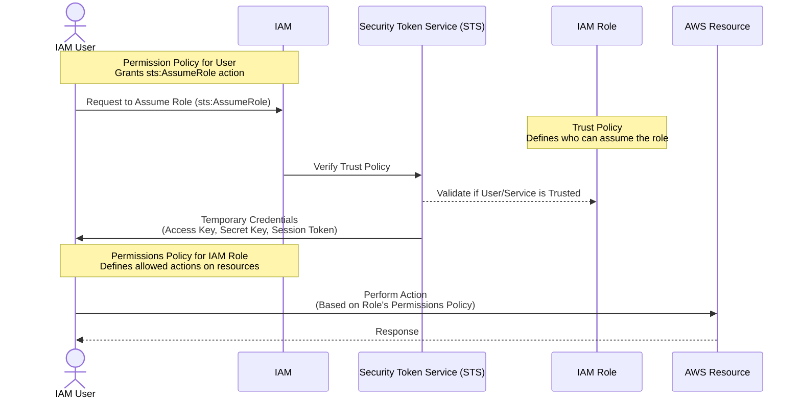
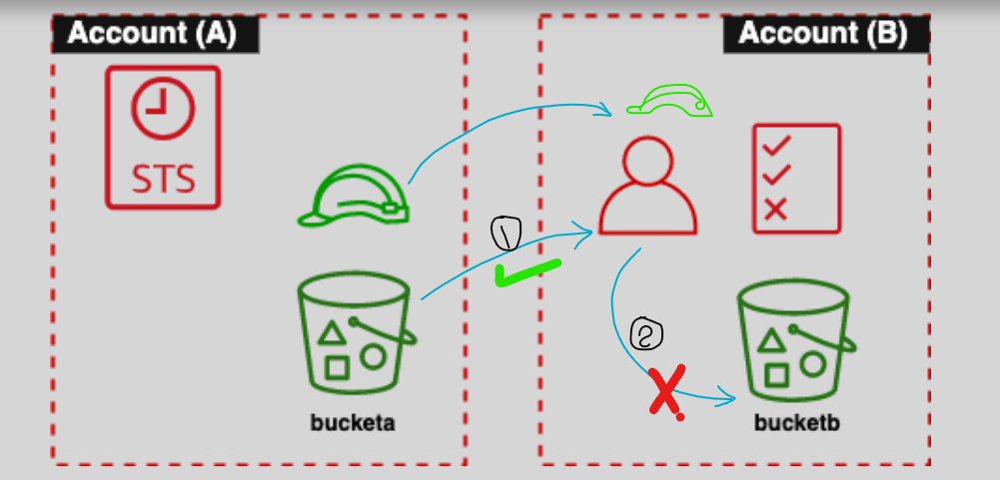

# 🧙‍♂️ **IAM Roles in AWS**

> _“Secure, temporary, permission-based access for humans and machines alike.”_

---

<div style="text-align: center;">
  
</div>

---

## 🧾 **What is an IAM Role?**

An **IAM Role** is a **temporary identity** in AWS with **specific permissions** that trusted entities (like IAM users, AWS services, or federated identities) can assume.

### 🧠 **Unlike IAM Users:**

- IAM Users = **long-term credentials** (Access Key + Secret)
- IAM Roles = **short-term, assumed credentials** with a specific purpose.

---

## ⚙️ **Key Features**

- 🔐 **Temporary Security Credentials** issued through AWS STS.
- ❌ No access keys stored permanently.
- 🔄 Can be **assumed** by IAM users, applications, services, or federated identities.
- 🔐 Fine-grained permissions and trust rules.
- ☁️ Used across **services**, **accounts**, and **organizations**.

---

## **👥 Who Can Assume an IAM Role?**

IAM roles can be assumed by:

1. **IAM Users**: Temporary permissions for specific tasks.
2. **AWS Services**: Services like **EC2**, **Lambda**, and **RDS** can assume roles to access other resources.
3. **Federated Users**: External users authenticated via identity providers (e.g., Google, Microsoft, Active Directory) can assume roles through **web identity federation**.
4. **Applications**: Applications (internal or external) can assume roles to securely interact with AWS resources.

---

## **🔄 How IAM Roles Work**

<div style="text-align: center;">
    
</div>

---



## 🔐 **IAM Role Components**

### 1️⃣ **Trust Policy** 🔓

- Resource-based policy inside the Role.
- Defines **who can assume** the role.

```json
{
  "side": "",
  "Effect": "Allow",
  "Principal": { "Service": "ec2.amazonaws.com" },
  "Action": "sts:AssumeRole"
}
```

### 2️⃣ **Permissions Policy** 🔐

- Identity-based policy **attached to the role**.
- Defines **what actions** can be done using the role.

```json
{
  "side": "",
  "Effect": "Allow",
  "Action": "s3:GetObject",
  "Resource": "arn:aws:s3:::mybucket/*"
}
```

### 3️⃣ **IAM Identity Permission Policy**

- 🤔 **Why Do Users Need Another Policy?** Before a user (or service) can wear a role, they need their own **policy** granting the `sts:AssumeRole` action. Without this, it’s like having a costume but no ticket to enter the party.

---

## **⁉️ How to Use IAM Roles**

### **1️⃣ Prepare and Create the IAM Role**

- Define a **trust policy** to specify the trusted entity (e.g., EC2, Lambda, or another AWS account).
- Attach **permissions policies** to grant specific access.

### **2️⃣ Assume the Role**

- The trusted entity assumes the role to receive **temporary credentials**.
- These credentials are valid for a defined session (e.g., 15 minutes to 12 hours).

### **3️⃣ Perform Actions**

- Use the temporary credentials to perform actions allowed by the role’s permissions policy.

### **4️⃣ Handle Role Session Expiry**

- Once the session expires, credentials become invalid, and the entity must re-assume the role.

---

## **⚙️ Types of IAM Roles**

1. **Service Roles**: Used by AWS services to perform actions on your behalf.
   - **Example**: An EC2 instance accessing S3.
2. **Cross-Account Roles**: Allow access between AWS accounts.
   - **Example**: Account A allows Account B’s users to access its S3 buckets.
3. **Federated Roles**: Used by external users authenticated through identity providers.
   - **Example**: A corporate user accessing AWS via Active Directory.

---

## **🛡️ Trust Policies**

A **Trust Policy** specifies the **trusted entities** allowed to assume a role.

### **Example: Trust Policy for EC2**

```json
{
  "Version": "2012-10-17",
  "Statement": [
    {
      "Effect": "Allow",
      "Principal": {
        "Service": "ec2.amazonaws.com"
      },
      "Action": "sts:AssumeRole"
    }
  ]
}
```

This policy allows **EC2 instances** to assume the role.

---

## **👩‍⚖️ IAM Roles vs. IAM Users**

| **Feature**            | **IAM User**                          | **IAM Role**                                               |
| ---------------------- | ------------------------------------- | ---------------------------------------------------------- |
| **Access**             | Permanent credentials                 | Temporary credentials                                      |
| **Credentials**        | Access Key ID and Secret Access Key   | No permanent credentials                                   |
| **Trust Relationship** | Tied to a specific person/application | Can be assumed by users, services, or federated identities |
| **Duration**           | Unlimited access                      | Time-limited (e.g., 15 minutes to 12 hours)                |

---

## **🤹 Use Cases for IAM Roles**

### **💻 EC2 Role**

Assign an IAM role to an **EC2 instance** to allow it to interact with AWS services (e.g., S3, DynamoDB) without embedding credentials.

**Example**: An EC2 instance reads objects from an S3 bucket using a role with `s3:GetObject` permission.

### **⚡ Lambda Role**

AWS **Lambda functions** can assume roles to interact with AWS resources like DynamoDB, S3, or SNS.

**Example**: A Lambda function writes to a DynamoDB table using a role with `dynamodb:PutItem` permission.

### **⚔️ Cross-Account Access**

An IAM role in one account can be assumed by users or services from another account.

**Example**: Account A creates a role that Account B’s users assume to read S3 buckets.

---

## **✅ Best Practices for IAM Roles**

1. **Principle of Least Privilege**: Assign only the permissions necessary for the role’s task.
2. **Regularly Review and Rotate Roles**: Periodically review roles to ensure relevance and security.
3. **Monitor Role Usage with CloudTrail**: Detect suspicious activity by logging role assumptions.
4. **Use Roles for Cross-Account Access**: Avoid sharing credentials; use roles for secure access between accounts.

---

## **🤔 When to Use Resource-based Policies Instead of IAM Roles**

When an IAM identity (like a user or service) assumes an IAM role:

- The identity **temporarily gives up its original permissions** and takes on the permissions of the IAM role.
- This can be restrictive in scenarios where the original permissions are also needed.

---

<div style="text-align: center;">
    
</div>

---

**Scenario:**

- **Cross-account Copy Operation**: You want a user in Account A to copy files from an S3 bucket in Account B **to another S3 bucket in Account A**.

**Problem with IAM Role:**

- If the user assumes an IAM role in Account B, they temporarily lose their permissions in Account A, making the copy operation difficult.

**Solution with Resource-based Policy:**:

- Instead of using an IAM role, you attach a resource-based policy to the S3 bucket in Account B that allows the user in Account A to access the bucket while retaining their permissions in Account A.

  ```json
  {
    "Version": "2012-10-17",
    "Statement": [
      {
        "Effect": "Allow",
        "Principal": {
          "AWS": "arn:aws:iam::123456789012:user/MyUser"
        },
        "Action": "s3:GetObject",
        "Resource": "arn:aws:s3:::my-bucket/*"
      }
    ]
  }
  ```

## **✔️ Summary**

- **IAM Roles** enable temporary, secure access to AWS resources without permanent credentials.
- **Trust policies** specify **who** can assume the role, and **permissions policies** define **what actions** are allowed.
- IAM roles are versatile and used for scenarios like EC2 instance access, Lambda functions, and cross-account access.
- Following **best practices** ensures roles are secure and efficient.
