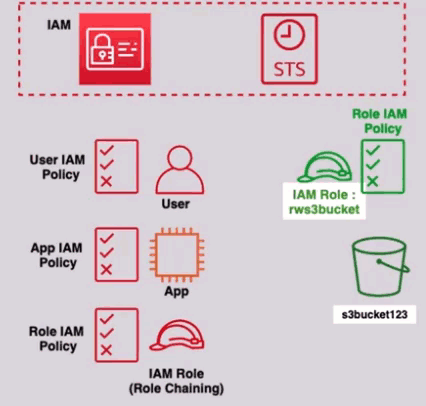
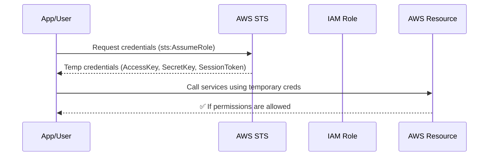

# 🔐 **AWS Security Token Service (STS)**

> _“Secure, short-lived, on-demand credentials—without long-term exposure.”_

---

<div style="text-align: center;">
  
</div>

---

## 📘 **What is AWS STS?**

**AWS Security Token Service (STS)** is a global AWS service that enables you to request **temporary, limited-privilege credentials** for **IAM users**, **federated identities**, or **applications**. These credentials are issued on-demand and **automatically expire**, making them ideal for short-lived operations.

---

## 🌟 **Key Features of STS**

| Feature                             | Description                                                          |
| ----------------------------------- | -------------------------------------------------------------------- |
| 🕒 **Temporary Credentials**        | Valid for 15 minutes to 12 hours (default: 1 hour)                   |
| 🔄 **No Credential Rotation**       | Temporary credentials expire automatically—no manual rotation needed |
| 🌐 **Global Service**               | Can be called from any region using the **global endpoint**          |
| 🔐 **Supports Identity Federation** | External users (Google, AD, etc.) can securely access AWS            |
| ⚙️ **Role-Based Access**            | Easily assume roles across AWS services and accounts                 |

---

## 🎯 **When to Use STS?**

| Use Case                    | Description                                                                   |
| --------------------------- | ----------------------------------------------------------------------------- |
| ✅ **Assume IAM Role**      | Allow a user or service to temporarily take on a different set of permissions |
| 🔁 **Cross-Account Access** | Let users/services in Account A assume roles in Account B                     |
| 🌍 **Federated Identity**   | Allow external users (via SAML, Google, etc.) to temporarily access AWS       |
| 🛠️ **CI/CD or Automation**  | Provide scripts, pipelines, or apps temporary secure access                   |

---

## 🔄 **How STS Works – Behind the Scenes**



---

## 🔧 **How STS Generates Credentials**

1. **User/Service Makes Request**  
   Using the `sts:AssumeRole` API call, a user, service, or federated identity requests credentials.

2. **IAM Policy Check**  
   STS checks if the requester has permission to assume the target role using:

   ```json
   {
     "Effect": "Allow",
     "Action": "sts:AssumeRole",
     "Resource": "arn:aws:iam::123456789012:role/MyRole"
   }
   ```

3. **Trust Policy Validation**  
   The **role's trust policy** must also allow the principal to assume the role:

   ```json
   {
     "Effect": "Allow",
     "Principal": { "AWS": "arn:aws:iam::111111111111:user/John" },
     "Action": "sts:AssumeRole"
   }
   ```

4. **Temporary Credentials Issued**  
   STS returns a temporary credential set:

   - `AccessKeyId`
   - `SecretAccessKey`
   - `SessionToken`

5. **Credential Expiry**  
   By default, credentials last **1 hour**, but can be set between **15 minutes to 12 hours** depending on the role configuration.

---

## 🔑 **STS Credential Format Example**

```json
{
  "AccessKeyId": "ASIA....",
  "SecretAccessKey": "wJalrXUtnFEMI/K7MDENG/bPxRfiCY....",
  "SessionToken": "IQoJb3JpZ2luX2VjE...",
  "Expiration": "2025-04-15T14:30:00Z"
}
```

---

## 👥 **STS and External Identity Federation**

With **Web Identity Federation**, **SAML**, or **AWS IAM Identity Center**, users authenticated outside AWS (e.g., Google, Facebook, Microsoft AD) can temporarily access AWS using STS.

> 💡 Perfect for integrating **single sign-on (SSO)** into your AWS ecosystem.

---

## 🧪 **Real-World Use Cases**

### 🔄 Cross-Account Access

- **Scenario**: DevOps user in Account A wants to manage RDS in Account B
- **Solution**:
  - IAM policy in Account A allows `sts:AssumeRole`
  - Trust policy in Account B allows Account A’s user

### ⚙️ Automation

- **Scenario**: A build pipeline in GitHub Actions needs to deploy to AWS
- **Solution**: GitHub Action assumes a role using STS with a short duration

### 🌐 Federated Login

- **Scenario**: An employee signs in with Google OAuth, then uses AWS via STS.
- **Solution**: Use AWS Cognito or IAM Identity Center to federate login and issue STS credentials.

---

## 📏 **STS Session Duration Limits**

| Method                      | Duration Allowed  |
| --------------------------- | ----------------- |
| `AssumeRole`                | 15 min – 12 hours |
| `AssumeRoleWithWebIdentity` | 15 min – 1 hour   |
| `AssumeRoleWithSAML`        | 15 min – 12 hours |
| `GetSessionToken`           | 15 min – 36 hours |

> 📝 The default is often **1 hour**, but this can be extended only if the role allows longer durations.

---

## ✅ **Benefits Recap**

| Benefit                     | Description                                              |
| --------------------------- | -------------------------------------------------------- |
| 🔐 **Security**             | No long-lived secrets—credentials expire automatically   |
| 🔄 **Flexibility**          | Works with roles, SAML, OIDC, or web identity federation |
| 🛡️ **Fine-Grained Control** | Policies control who can assume which roles and when     |
| 🌍 **Global Access**        | Available in all AWS regions and via global endpoints    |

---

## 🧠 Best Practices for Using STS

1. **Always prefer short sessions** (e.g., 15–30 minutes) for automation.
2. **Audit usage** with **CloudTrail** to detect anomalies.
3. **Do not hardcode STS credentials** in config files or apps.
4. **Use Session Tags** for traceability across microservices or users.
5. **Combine with IAM Roles** for access control and cross-account delegation.

---

## 🧩 Summary Table

| Feature                 | STS Capability                             |
| ----------------------- | ------------------------------------------ |
| Credentials Type        | Temporary                                  |
| Expiration Time         | Configurable (15m–12h or more)             |
| Manual Rotation Needed? | ❌ No                                      |
| Requires IAM Permission | ✅ Yes (`sts:AssumeRole`, etc.)            |
| Supports Federation     | ✅ Web Identity, SAML, IAM Identity Center |
| Used For                | IAM roles, automation, third-party access  |
