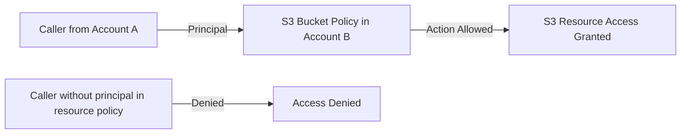

# 🔒 **Resource-Based Policies in AWS**

> _"Who **can’t** do what on this **resource**?"_

A **resource-based policy** is a **JSON policy document** that you attach directly to an AWS resource (e.g., **S3 bucket**, **Lambda function**, **SQS queue**, etc.). It **grants permissions** to a **principal**—an external or internal identity—to perform specific actions on that resource.

---

## 🧩 **Key Characteristics**

| Feature                      | Description                                                             |
| ---------------------------- | ----------------------------------------------------------------------- |
| 📍 **Attached To**           | A specific **AWS resource** (e.g., `S3`, `Lambda`, `SNS`, `SQS`)        |
| 👤 **Principal Required**    | ✅ Must include `Principal` (unlike identity policies)                  |
| 🌐 **Cross-Account Support** | ✅ Yes — ideal for granting access to **other AWS accounts**            |
| 🧷 **Policy Type**           | Always **inline** (exists only on the resource, not reusable)           |
| 🎯 **Granularity**           | Can allow/deny specific actions and resources, under certain conditions |

---

## 📦 **Common Services That Use Resource-Based Policies**

- **S3 Bucket Policies**
- **AWS Lambda Permissions**
- **SQS Access Policies**
- **SNS Topic Policies**
- **Secrets Manager**
- **EventBridge**

---

## 🧠 **Policy Structure Example**

```json
{
  "Version": "2012-10-17",
  "Statement": [
    {
      "Effect": "Allow",
      "Principal": {
        "AWS": "arn:aws:iam::123456789012:user/Alice"
      },
      "Action": "s3:PutObject",
      "Resource": "arn:aws:s3:::example-bucket/*"
    }
  ]
}
```

---

## 🎯 **Examples by Service**

### 1️⃣ S3 Bucket Policy: Public Read Access

```json
{
  "Effect": "Allow",
  "Principal": "*",
  "Action": "s3:GetObject",
  "Resource": "arn:aws:s3:::example_bucket/*"
}
```

➡️ **Use case**: Host a static website or share public files.

---

### 2️⃣ S3 Bucket Policy: Cross-Account Upload

```json
{
  "Effect": "Allow",
  "Principal": {
    "AWS": "arn:aws:iam::777788889999:user/bob"
  },
  "Action": ["s3:PutObject", "s3:PutObjectAcl"],
  "Resource": "arn:aws:s3:::example-bucket/*"
}
```

➡️ **Use case**: Allow Bob from another AWS account to upload objects.

---

### 3️⃣ Lambda Permission: S3 Trigger

```json
{
  "Effect": "Allow",
  "Principal": {
    "Service": "s3.amazonaws.com"
  },
  "Action": "lambda:InvokeFunction",
  "Resource": "arn:aws:lambda:us-west-2:123456789012:function:example_function",
  "Condition": {
    "StringEquals": {
      "AWS:SourceAccount": "123456789012"
    },
    "ArnLike": {
      "AWS:SourceArn": "arn:aws:s3:::example_bucket"
    }
  }
}
```

➡️ **Use case**: Let S3 trigger a Lambda function on new object creation.

---

### 4️⃣ SNS Topic Policy: Cross-Account Publish

```json
{
  "Effect": "Allow",
  "Principal": {
    "AWS": "arn:aws:iam::987654321098:root"
  },
  "Action": "sns:Publish",
  "Resource": "arn:aws:sns:us-west-2:123456789012:example_topic"
}
```

➡️ **Use case**: Let another account publish to your SNS topic.

---

## 🔁 **How They Compare: Resource-Based vs IAM Roles**

| Feature                       | Resource-Based Policy                          | IAM Role (Cross-Account AssumeRole)                      |
| ----------------------------- | ---------------------------------------------- | -------------------------------------------------------- |
| 🎯 Purpose                    | Grant direct access to **a specific resource** | Delegate **temporary access** to AWS **identities**      |
| 🧷 Attach To                  | AWS Resource (e.g., S3, Lambda, SNS)           | IAM Role (identity)                                      |
| 👤 Principal Element Required | ✅ Yes                                         | 🚫 Not in the permission policy, but in **trust policy** |
| 🔄 Cross-Account Access       | ✅ Yes                                         | ✅ Yes                                                   |
| 🔓 Access Mechanism           | Resource checks the principal’s policy         | Principal assumes the role                               |
| 🧠 Role Used by Caller        | Caller retains their identity                  | Caller acts as the **assumed role**                      |

---

## ✅ **When to Use Resource-Based Policies**

✅ **Use them when**:

- You want to **share a resource** with other AWS accounts or services
- You want to allow **access without assuming a role**
- You want to enforce **access at the resource level**

🚫 **Don’t use them when**:

- You need **granular session control or credential expiration**
- You want users to **temporarily act as someone else (assume a role)**

---

## 🛠️ **Visualizing the Evaluation (Cross Account)**



---

## 🔍 Extra Conditions You Can Use in Resource Policies

| Condition Key                | Use Case Example                         |
| ---------------------------- | ---------------------------------------- |
| `aws:SourceIp`               | Restrict access by IP range              |
| `aws:SourceArn`              | Validate event source (e.g., S3 trigger) |
| `aws:PrincipalOrgID`         | Limit to your AWS Organization only      |
| `aws:MultiFactorAuthPresent` | Enforce MFA (rare in resource-based)     |

---

## 🧠 Final Notes

- Resource-based policies are **powerful**, but **must be tightly scoped** to prevent unintended access.
- These policies allow you to **delegate access without transferring identity**—useful for automation and secure integrations.
- You can **combine them** with **IAM identity-based policies** for **layered control**.

---

## 🧾 Summary Table

| Feature                  | Resource-Based Policy                               |
| ------------------------ | --------------------------------------------------- |
| **Attached To**          | AWS Resource (e.g., S3, SNS, Lambda)                |
| **Principal Element**    | ✅ Required                                         |
| **Cross-Account Access** | ✅ Yes                                              |
| **Trust Delegation**     | ❌ Not applicable (use IAM role instead)            |
| **Evaluation Context**   | Evaluated by **resource**                           |
| **Best Use Case**        | Granting access to external users/services          |
| **Limitations**          | Can’t manage temporary credentials or session logic |
