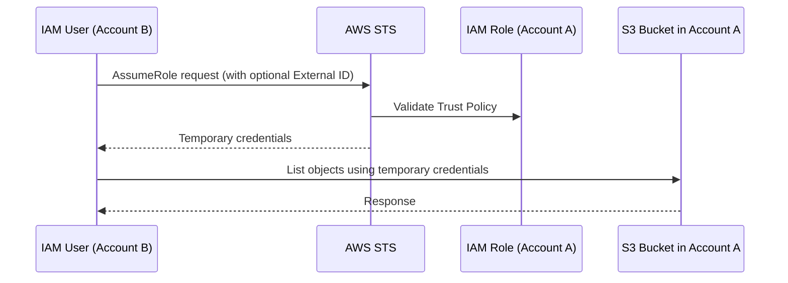

# 🏦 **Cross-Account IAM Roles in AWS**

_Granting temporary access across AWS accounts—securely and smartly._

In AWS, **IAM roles** are often used for **cross-account access**, where resources in **Account A** (Trusting Account) are accessed by users, services, or applications from **Account B** (Trusted Account).

> 💡 **Real-World Analogy:**  
> It’s like giving someone from another company a **visitor badge** to enter your office and access certain rooms—but **only temporarily**, and **only with your approval**.

---

## 🔗 **How Cross-Account Role Assumption Works**



---

## 🧭 **Step-by-Step Example: S3 Access Across Accounts**

### 🧩 **Scenario**

Account A owns `s3bucket123`. You want a user in **Account B** to list its contents **without sharing credentials**.

---

<div align="center">
  
</div>

---

### 🧾 **Step 1: Trust Policy in Account A (Role Definition)**

```json
{
  "Version": "2012-10-17",
  "Statement": {
    "Effect": "Allow",
    "Principal": { "AWS": "arn:aws:iam::AccountB-ID:root" },
    "Action": "sts:AssumeRole"
  }
}
```

- 🎯 **Goal**: Allow only Account B to **assume** the role.
- 👁️ **Principal**: Trusts all entities from Account B.

---

### 🛡️ **Step 2: Permissions Policy for the Role (Account A)**

```json
{
  "Version": "2012-10-17",
  "Statement": {
    "Effect": "Allow",
    "Action": "s3:ListBucket",
    "Resource": "arn:aws:s3:::s3bucket123"
  }
}
```

- 🎯 **Goal**: Grant the role the right (permission) to **list S3 contents**.

---

### 🎟️ **Step 3: IAM Policy for the User (Account B)**

```json
{
  "Version": "2012-10-17",
  "Statement": {
    "Effect": "Allow",
    "Action": "sts:AssumeRole",
    "Resource": "arn:aws:iam::AccountA-ID:role/ls3bucket"
  }
}
```

- 🎯 **Goal**: Let any IAM user in Account B to **assume the role** in Account A.

---

### 🚀 **Step 4: Assume the Role from Account B**

```bash
aws sts assume-role \
  --role-arn arn:aws:iam::AccountA-ID:role/ls3bucket \
  --role-session-name my-s3-session
```

---

## 🔐 **Understanding External ID in Cross-Account Roles**

### ⚠️ **The Problem: What If Account B Gets Compromised?**

- If credentials from **Account B** are leaked, **anyone** could impersonate them and assume the role in Account A!
- AWS **cannot validate** who is really sending the request—there’s **no proof of intent**.

---

### ✅ **The Solution: Use External ID as a Secret Passcode**

> 🧠 **Analogy**:  
> The role ARN is like knowing the door number of your house. The **external ID** is the **PIN code** to unlock it.

---

## 🧰 **Implementing External ID for Extra Security**

### 🔧 **Step 1: Add External ID to the Trust Policy (Account A)**

```json
{
  "Version": "2012-10-17",
  "Statement": [
    {
      "Effect": "Allow",
      "Principal": {
        "AWS": "arn:aws:iam::123456789012:root" // Account B
      },
      "Action": "sts:AssumeRole",
      "Condition": {
        "StringEquals": {
          "sts:ExternalId": "my-secret-external-id"
        }
      }
    }
  ]
}
```

- 🔒 Now, only requests with the **correct external ID** will succeed.

---

### 🔧 **Step 2: Account B Uses the External ID**

```bash
aws sts assume-role \
  --role-arn arn:aws:iam::111122223333:role/ExampleRole \
  --role-session-name MySession \
  --external-id my-secret-external-id
```

---

## 🛡️ **Benefits of Using External ID**

| 🧱 Feature                 | 🔐 Security Impact                                                              |
| -------------------------- | ------------------------------------------------------------------------------- |
| **Adds Second Layer**      | Prevents unknown third-party from hijacking the role                            |
| **Ensures Trust Validity** | Validates that the request is truly coming from the intended partner            |
| **Used with Vendors**      | Third-party services (e.g., New Relic, Datadog) require this to access your AWS |

---

## 📚 **Summary: Cross-Account IAM Roles**

| Concept                       | Summary                                                  |
| ----------------------------- | -------------------------------------------------------- |
| 🔄 **Cross-account Role**     | Role in Account A used by entities in Account B          |
| 🛂 **Trust Policy**           | Allows Account B to assume the role                      |
| 🧾 **Permissions Policy**     | Grants the assumed role access to resources like S3      |
| 🧑‍💼 **IAM User Policy (B)** | Allows IAM user in Account B to request `sts:AssumeRole` |
| 🔐 **External ID**            | Adds a secret token to prevent impersonation             |

---

## 🧠 Final Analogy to Remember It All

| Without External ID            | With External ID                             |
| ------------------------------ | -------------------------------------------- |
| Giving a house key to a friend | Giving a house key **plus** a smart lock PIN |
| Easy to impersonate            | Only authorized persons with PIN get in      |
