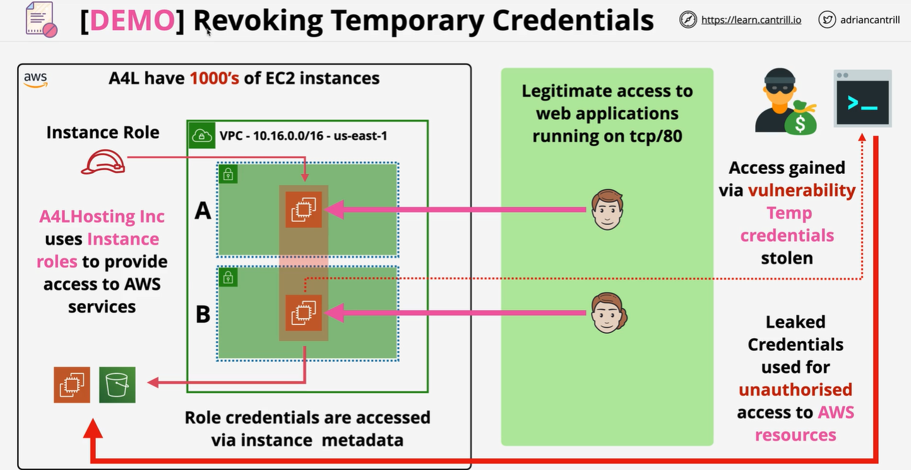

# 🔒 **Revoking Temporary Credentials in AWS IAM**

_They expire automatically—but what if you need to shut them down immediately?_

---

<div align="center">
  
</div>

---

## ⚡ What Are Temporary Credentials?

Temporary credentials are **short-lived credentials** issued by AWS STS when a user or service **assumes a role**. They're secure and time-bound but **cannot be directly revoked once issued**.

> 🧠 **Analogy**:  
> Temporary credentials are like **visitor badges**—they expire after a few hours, but if lost, you need a quick way to block that badge from working.

---

## 🔍 Quick Facts About Temporary Credentials

| 🔎 Property                          | ✅ Behavior                                                          |
| ------------------------------------ | -------------------------------------------------------------------- |
| **Issued via**                       | `AssumeRole`, `GetSessionToken`, or AWS SSO                          |
| **Valid Duration**                   | 15 mins to 12 hours                                                  |
| **Used by**                          | IAM users, roles, federated users, AWS services                      |
| ❌ **Can't revoke directly**         | No API to delete active credentials                                  |
| ⚠️ **Permissions apply immediately** | Changing policies or deleting roles impacts **current sessions too** |

---

## 🚫 Why You Can't Just "Revoke" Temporary Credentials

- AWS does **not offer a direct API** to invalidate temporary credentials.
- However, you can **block or deny access** using clever policy techniques.

---

## 🔐 How to Restrict or Revoke Active Sessions

### ✅ 1. **Use `aws:TokenIssueTime` to Deny Old Sessions**

Add a **deny statement** in a permissions policy that blocks all sessions **issued before** a specific time.

```json
{
  "Effect": "Deny",
  "Action": "*",
  "Resource": "*",
  "Condition": {
    "DateLessThan": {
      "aws:TokenIssueTime": "2025-01-20T12:00:00Z"
    }
  }
}
```

🛡️ **Effect**:

- Any temp credentials issued **before that time** become useless immediately.
- New sessions created **after** that time are still allowed.

---

### 🗑 2. **Delete the Role (Only if Urgent)**

- This is a **last resort** option.
- Deleting the role **immediately invalidates** all temporary credentials issued from it.
- ⚠️ But: It also breaks any application or service relying on the role.

---

## 🧪 Example Scenario: Temporary Credentials Leaked

### 📘 Situation

- `DevUser` in Account A assumed the role `ExampleRole`.
- Their temporary credentials were accidentally leaked.

### 🔐 Mitigation Plan

1. **Find the session in CloudTrail**:  
   Search for the `AssumeRole` event and note the timestamp.

2. **Deny all credentials issued before that moment**:

   ```json
   {
     "Effect": "Deny",
     "Action": "*",
     "Resource": "*",
     "Condition": {
       "DateLessThan": {
         "aws:TokenIssueTime": "2025-01-20T12:00:00Z"
       }
     }
   }
   ```

3. **Apply this deny policy to the affected users/roles**

4. **(Optional)**: Rotate or delete the role to ensure cleanup

---

## 🛠️ Best Practices to Stay Safe

| ✅ Practice                            | 💡 Why It Matters                                         |
| -------------------------------------- | --------------------------------------------------------- |
| ⏳ Use short session durations         | Reduce the window if credentials are leaked               |
| 📜 Monitor with CloudTrail             | Catch suspicious `AssumeRole` activity early              |
| 🧠 Use `aws:TokenIssueTime` conditions | Let you "revoke" past credentials by denying old sessions |
| 🔐 Require MFA for role assumption     | Add a layer of protection before issuing temp creds       |
| 🔄 Rotate roles and permissions        | Minimize damage from leaked access or privilege creep     |

---

## 🧠 Summary

| Concept                            | Explanation                                                         |
| ---------------------------------- | ------------------------------------------------------------------- |
| **Temporary credentials**          | Short-term access keys issued via STS                               |
| ❌ **No direct revocation**        | You can't delete them—but you can block them using policies         |
| 🧾 **`aws:TokenIssueTime`**        | The key trick to deny credentials issued before a certain timestamp |
| 🔄 **Permissions & trust updates** | Changes apply **immediately** to new and existing sessions          |
| 🛡 **Defense-in-depth**             | Monitor, minimize duration, use MFA, and set guardrails             |
