# 🔐 **Encryption: Securing Your Data in the Cloud (Deep Dive)**

Encryption is the **mathematical shield** that secures your data during transmission and storage. In the cloud, it ensures that your sensitive data stays safe from interception, tampering, and unauthorized access.

---

<div style="text-align: center;">
    
</div>

---

## 🛡️ **Two Types of Encryption in the Cloud**

### 🔄 1. **Encryption In Transit**

Protects data **while it travels** from one system to another (e.g., browser → web server).

- ✅ Encrypts traffic using **TLS/SSL**
- ✅ Prevents eavesdropping and MITM attacks
- 🔐 Uses **asymmetric key exchange + symmetric encryption**

### 💾 2. **Encryption At Rest**

Protects data **when it's stored** (e.g., on disk, in databases, or object storage like S3).

- ✅ Ensures data is unreadable without decryption keys
- ✅ Uses **symmetric encryption** (e.g., AES-256)
- 🔐 Common in AWS: EBS, S3, RDS with AWS KMS

---

<div align="center">
  
</div>

---

## 🔑 **Encryption Methods Explained**

Encryption methods define how data is secured using **keys** and **algorithms**. There are two main methods of encryption:

---

### 🧠 1. **Asymmetric Encryption** (Public/Private Key Cryptography) 🔑🔑

<div style="text-align: center;">
    
</div>

#### 📘 Definition

Asymmetric encryption uses a **key pair**:

- **Public key** (shared with anyone) → used to **encrypt**
- **Private key** (kept secret) → used to **decrypt**

> 🔓 Data encrypted with a public key can only be decrypted with its corresponding private key.

---

#### 🔬 How It Works

1. 🧑‍💻 Client obtains the **server’s public key**
2. 🔐 Client encrypts sensitive data using that public key
3. 🔐 Server receives encrypted data
4. 🔓 Server decrypts it using its **private key**

---

#### 🧭 Real-World Usage

- TLS/SSL (key exchange step)
- Email encryption (PGP)
- SSH key pairs
- AWS KMS (asymmetric keys for signing or encryption)

---

#### ✅ Pros

- Public key can be safely distributed
- Supports **digital signatures** (authenticity & non-repudiation)
- Enables **secure key exchange**

---

#### ❌ Cons

- **Slow** for large datasets
- Only used for **small data** or **key exchange**, not bulk encryption

---

#### 📦 Example

```bash
openssl genrsa -out private.pem 2048
openssl rsa -in private.pem -outform PEM -pubout -out public.pem
```

Now you can:

- Encrypt with `public.pem`
- Decrypt with `private.pem`

---

### 🔁 2. **Symmetric Encryption** (Shared Key) 🔑

<div style="text-align: center;">
    
</div>

#### 📘 Definition

Symmetric encryption uses a **single shared secret key** for both:

- **Encryption**
- **Decryption**

> 🔁 Anyone with the key can read the data.

---

#### 🔬 How It Works

1. 🔑 A secure key is shared (manually or using asymmetric encryption)
2. 🧑‍💻 Sender encrypts data with the key
3. 📤 Sends encrypted message
4. 📥 Receiver decrypts using the **same key**

---

#### 🧭 Real-World Usage

- File storage (S3, EBS)
- Database encryption (RDS)
- VPN tunnels
- AWS KMS for envelope encryption

---

#### ✅ Pros

- **Very fast and efficient** (ideal for large files)
- Supported by hardware acceleration

---

#### ❌ Cons

- You must protect the shared key
- Not suitable for untrusted environments by itself

---

#### 📦 Example (AES-256)

```bash
openssl enc -aes-256-cbc -salt -in file.txt -out file.enc
openssl enc -d -aes-256-cbc -in file.enc -out file_decrypted.txt
```

---

### 🔗 Combining Both (Real Cloud Practice)

> 🔐 Use **asymmetric encryption** to securely exchange or wrap a **symmetric key**, then use symmetric encryption for bulk data encryption.

This is called **envelope encryption**—used by AWS KMS, GCP KMS, etc.

---

## 🤝 TLS Encryption in Transit (Deep Internals)

```mermaid
sequenceDiagram
    autonumber
    participant Browser as 🧑‍💻 Browser
    participant Server as 🌐 Web Server
    participant CA as 🏛️ Certificate Authority

    Browser->>Server: ClientHello
    Note right of Browser: Sends TLS version, cipher list, ClientRandom

    Server-->>Browser: ServerHello + Certificate
    Note left of Server: Sends ServerRandom, selected cipher, and X.509 certificate

    Browser->>CA: Validate Certificate
    Note right of Browser: Verifies cert against trusted CA

    Browser->>Server: Encrypted Pre-Master Key (using server's public key)
    Note right of Browser: Only server can decrypt using its private key

    Server->>Server: Decrypt Pre-Master Key (with private key)

    Note over Browser, Server: Both derive same Master Key via PRF(ClientRandom + ServerRandom + PreMaster)

    Browser->>Server: Finished (encrypted)
    Server->>Browser: Finished (encrypted)

    Browser->>Server: Encrypted HTTP request (symmetric)
    Server-->>Browser: Encrypted HTTP response (symmetric)
```

<div align="center">



</div>

---

## 🧱 **Encryption At Rest (with AWS KMS)**

> 🔑 AWS KMS is a **key management service** that provides **encryption at rest** for data stored in AWS
> 🔑 It uses **symmetric encryption**.

1. AWS KMS generates a **Data Encryption Key (DEK)**
2. It:
   - Returns plaintext DEK to encrypt the data
   - Encrypts DEK with a **CMK** (Customer Master Key)
3. Store:
   - Encrypted data
   - Encrypted DEK alongside it
4. On read:
   - Decrypt encrypted DEK with CMK
   - Use DEK to decrypt data

✅ Efficient and secure  
✅ Enables fine-grained key access control via IAM/KMS policies

---

## ✅ Best Practices for Encryption

| Practice                                | Why It's Important                              |
| --------------------------------------- | ----------------------------------------------- |
| Encrypt **in transit** and **at rest**  | Prevent theft from sniffing and storage attacks |
| Use **TLS 1.3** wherever possible       | Faster and more secure handshake                |
| Use **asymmetric key exchange**         | Never transmit symmetric keys in plain          |
| Use **envelope encryption** for storage | Securely handle keys with performance benefits  |
| Store keys in **dedicated KMS/HSM**     | Avoid app-layer key management                  |
| Rotate keys regularly                   | Reduce risk in case of compromise               |
| Enforce IAM permissions on key usage    | Least privilege access to keys and logs         |

---

## 📘 Key Terminology

| Term                    | Definition                                                               |
| ----------------------- | ------------------------------------------------------------------------ |
| **Plaintext**           | Original readable data before encryption                                 |
| **Ciphertext**          | Encrypted, unreadable version of the data                                |
| **Public Key**          | Shared openly for encrypting or verifying                                |
| **Private Key**         | Secret key used for decryption or signing                                |
| **Session Key**         | Symmetric key used for fast encryption during a TLS session              |
| **CMK (KMS)**           | Customer Master Key (in AWS KMS), used to encrypt data keys              |
| **Envelope Encryption** | Secure method to encrypt data using a data key encrypted by a master key |

---

## 🧠 Final Summary

| 🔒 Concept         | 💬 Description                                            |
| ------------------ | --------------------------------------------------------- |
| **In Transit**     | Protects data during communication using TLS (HTTPS, VPN) |
| **At Rest**        | Protects stored data using AES-256 or envelope encryption |
| **Asymmetric**     | Public/private key pair, ideal for secure key exchange    |
| **Symmetric**      | Shared secret key, ideal for speed and large volumes      |
| **TLS + Envelope** | Combined approach used by cloud platforms                 |
