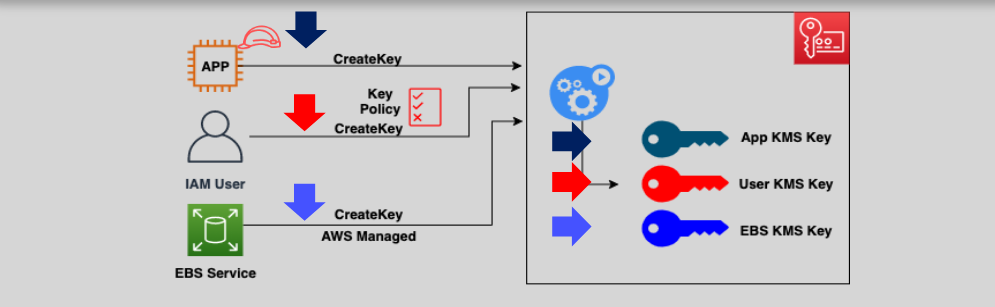
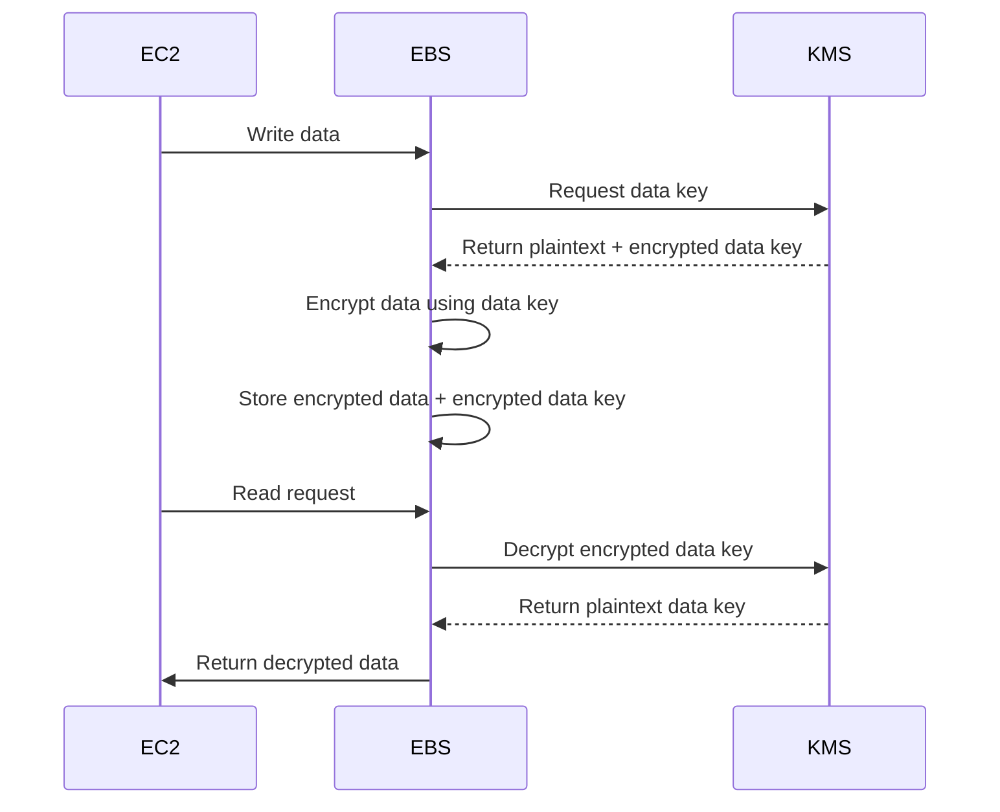

# 🔐 AWS KMS: Centralized Key Management for Secure Cloud Encryption

> _“Encrypt everything — but manage it wisely.”_  
> AWS Key Management Service (KMS) provides a **secure and scalable way** to **create**, **manage**, and **control** encryption keys across AWS services — ensuring both data protection and compliance.

---

## 📦 What is AWS KMS?

AWS Key Management Service (KMS) is a **managed service** that allows you to:

- 🔑 **Create and control cryptographic keys** (symmetric & asymmetric)
- 🧠 **Encrypt/decrypt data directly or indirectly**
- 🔁 **Rotate keys** securely and automatically
- 🧾 **Audit all key usage via CloudTrail**
- 🔐 **Meet compliance standards** (e.g., FIPS 140-2)

---

  

---

## 🌍 Why Use AWS KMS?

| **Feature**                    | **Benefit**                                                              |
| ------------------------------ | ------------------------------------------------------------------------ |
| ✅ Centralized Key Management  | One place to manage keys across all AWS services                         |
| 🔐 Strong Security Controls    | IAM policies + key policies + condition-based access                     |
| 📈 Integrated Audit Logging    | Integrated with CloudTrail for complete key usage visibility             |
| 🔁 Key Rotation & Expiry       | Automatic or manual rotation of keys for compliance                      |
| 🧪 Fine-Grained Access Control | Define **who** can use a key and **how**, with full policy control       |
| 🛠️ Multi-Service Integration   | Out-of-the-box support for S3, EBS, RDS, Redshift, Secrets Manager, etc. |

---

## 🔑 Types of KMS Keys

### 1️⃣ Symmetric CMK (Customer Master Key)

- Single key used for both **encryption** and **decryption**
- Used by most AWS services (S3, EBS, RDS, Lambda, etc.)
- Fast, efficient, and FIPS 140-2 validated

### 2️⃣ Asymmetric CMK

- Uses a **public/private key pair**
- Ideal for:
  - Digital signatures
  - Key exchange
  - Public key infrastructure (PKI)

| **Symmetric**                | **Asymmetric**                        |
| ---------------------------- | ------------------------------------- |
| Encrypts/Decrypts with 1 key | Uses public/private key pair          |
| Preferred by AWS Services    | For signing or encryption outside AWS |
| Faster & more cost-effective | Used in custom integrations           |

---

## 🧰 AWS Managed vs. Customer Managed Keys

| Feature                | AWS-Managed CMK           | Customer-Managed CMK           |
| ---------------------- | ------------------------- | ------------------------------ |
| Created by             | AWS                       | You                            |
| Access control         | Limited (automated)       | Full via IAM and key policies  |
| Rotation               | Automatic (every 3 years) | Optional (recommended yearly)  |
| Logging and monitoring | Basic                     | Full visibility via CloudTrail |
| Use case               | Quick-start, no setup     | Advanced control, compliance   |
| Pricing                | Free for automatic keys   | \$1/month/key                  |

---

## 🔄 KMS Key Lifecycle in EBS Encryption

Let’s dive into the **actual flow** of how data is encrypted and decrypted using AWS KMS and EBS.

### 💡 Mermaid Diagram — End-to-End Flow

---

## 🔐 Step-by-Step Encryption Flow

### 🟢 Step 1: KMS Key Creation

- You create a **CMK** (Customer Master Key) in AWS KMS.
- This CMK will be used to encrypt the **data key**, not the actual data itself.

---

### 🟠 Step 2: Volume Creation & Data Key Request

- EBS requests a **data key** from KMS.
- KMS returns:
  - 🔓 **Plaintext data key** (used to encrypt data)
  - 🔒 **Encrypted data key** (encrypted using CMK)

---

### 🔵 Step 3: Data Write to EBS

- EC2 writes unencrypted data to EBS.
- EBS encrypts it with the plaintext **data key**.
- Only the **encrypted version** of the data key is stored with the data.

> 🔑 KMS CMK **never** leaves the KMS service!

---

### 🟣 Step 4: Data Read from EBS

- EBS detects encrypted data, needs **plaintext data key** to decrypt.
- Sends **encrypted data key** to KMS.
- KMS returns decrypted **data key**.
- EBS decrypts the data and returns it to EC2.

---

## 🎮 Who Can Use or Manage Keys?

| Actor         | Capability                                  |
| ------------- | ------------------------------------------- |
| IAM User      | Create, manage, and rotate keys             |
| IAM Role      | Automatically manage keys in apps           |
| AWS Services  | Use keys via service-linked roles           |
| External User | If federated, can assume roles and use keys |

---

## ⚙️ Best Practices for AWS KMS

### ✅ Enable Key Rotation

Rotate CMKs annually to meet compliance and reduce key reuse risks.

### 🔐 Use IAM + Key Policies

Use both **IAM policies** and **Key policies** for fine-grained access control.

### 🔍 Enable CloudTrail Logs

Track every use of the key (Encrypt, Decrypt, GenerateDataKey) to detect misuse.

### 🌍 Use Multi-Region Keys

Replicate keys to other regions for geo-resilient encryption support.

### 🛡️ Avoid Wildcard Policies

Restrict `kms:*` or overly broad `Resource: *` grants to avoid accidental exposure.

---

## 📌 KMS Concepts Summary Table

| Concept                 | Description                                                                |
| ----------------------- | -------------------------------------------------------------------------- |
| **CMK**                 | Customer Master Key — master encryption key stored in KMS                  |
| **Data Key**            | Temporary key used to encrypt actual data (generated by KMS)               |
| **Key Policy**          | Resource policy attached to a CMK                                          |
| **Envelope Encryption** | Encrypt data using a data key, then encrypt that data key with a CMK       |
| **Key Rotation**        | Automatic or manual regeneration of CMKs for security                      |
| **Grants**              | Temporary permission for another principal to use the key without full IAM |

---

## 🧠 Conclusion

AWS KMS is the **backbone of encryption** for nearly all AWS services. It ensures that:

- You don’t need to manually manage key storage or lifecycle
- Your data stays encrypted at rest and in transit
- Access is always monitored, logged, and controlled

🔐 Use **Customer Managed Keys (CMKs)** for full visibility and control.  
✅ Follow best practices for **auditability, key rotation, and least privilege**.

> AWS KMS is not just a security feature — it's a **compliance enabler** and a **data guardian** for your cloud!
