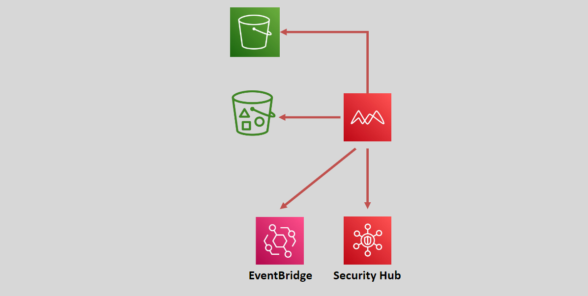

# 🪣🛡️ AWS Macie: Data Security and Privacy

  

## ❓ What is AWS Macie?

**Amazon Macie** is a fully managed data security and data privacy service that helps you discover and protect sensitive data stored in AWS. It uses advanced machine learning and pattern matching techniques to identify and secure your data.

## 🛠️ Key Features of AWS Macie

- **Data Discovery:** Utilizes machine learning and pattern matching to find and protect sensitive data, such as Personally Identifiable Information (PII).
- **S3 Bucket Inventory:** Automatically provides an inventory of `S3 buckets` that are:
  - **Unencrypted**
  - **Publicly Accessible**
  - **Shared with other AWS accounts outside of your AWS Organizations**

## 🚨 How AWS Macie Works

- **Data Discovery Jobs:** Macie runs data discovery jobs to identify and notify you about sensitive data.
- **Findings and Alerts:** Generates findings which can be sent to Amazon EventBridge or Security Hub.
  - **EventBridge Integration:** Findings sent to EventBridge can trigger step functions to activate remediation actions.
  - **Security Hub Integration:** Findings can also be sent to Security Hub for centralized management.

### 🌟 Benefits of AWS Macie

- **Automated Data Protection:** Automatically scans and protects your data without manual intervention.
- **Multi-Account Support:** Can be used across multiple accounts or an entire AWS organization from a single Macie account.
- **Enhanced Security:** Helps you maintain data security and compliance by identifying risks in your AWS environment.
