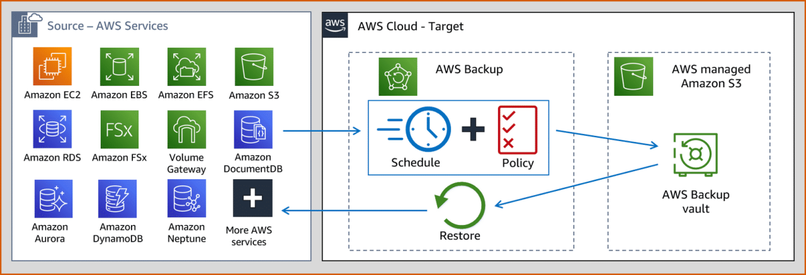

# 🛡️ **AWS Backup**

**AWS Backup** is a fully managed backup service that centralizes and automates backup activities across various AWS services and on-premises environments. It ensures your data is securely backed up, easily recoverable, and compliant with your organizational policies.

  

---

## 🌟 **Key Features of AWS Backup**

### 🔄 **Centralized Backup Management**

- **Unified Control:** Manage backups for multiple AWS services like EC2, EBS, EFS, DynamoDB, RDS, Aurora, and Storage Gateway from a single console.
- **On-Premises Support:** Extend backup management to on-premises resources, ensuring comprehensive data protection.

### 📅 **Backup Plans**

- **Automated Policies:** Create **backup plans** (backup policies) that define your backup schedule, retention periods, and lifecycle rules.
- **Consistency:** Ensure consistent backup practices across all your resources by applying standardized backup plans.

### 🛠️ **Backup Jobs**

- **Automated Initiation:** Backups can be created **automatically** based on your backup plans or **manually** as needed.
- **Incremental Backups:** Only changes since the last backup are saved, optimizing storage usage and reducing backup time.

### 🔒 **Data Encryption**

- **Secure at Rest:** All backups are **encrypted at rest** using AWS Key Management Service (KMS) keys (SSE-KMS), ensuring data confidentiality and compliance.
- **Managed Keys:** AWS Backup manages encryption keys by default, but you can customize encryption settings to meet specific security requirements.

### 🔗 **Integration with AWS Services**

- **SNS Integration:** Receive real-time notifications about backup events and job statuses through Amazon Simple Notification Service (SNS).
- **CloudTrail Integration:** Track and audit backup activities using AWS CloudTrail, enhancing visibility and governance.

### 🔄 **Restore Options**

- **Resource Restoration:** Restore backups to **new AWS resources**, ensuring minimal downtime and data loss.
- **EFS-Specific Restores:** For Amazon EFS, perform **full restores** or **item-level restores** (individual files or directories), providing flexibility in data recovery.

---

## 🛠️ **How AWS Backup Works**

1. **📂 Select Resources:**

   - Choose the AWS resources (e.g., EC2 instances, RDS databases) you want to back up.

2. **📅 Define Backup Plans:**

   - Create backup plans specifying the frequency, retention period, and lifecycle policies for your backups.

3. **🔄 Initiate Backup Jobs:**

   - AWS Backup automatically starts backup jobs based on your defined plans or allows manual initiation as needed.

4. **🔒 Ensure Data Security:**

   - Backups are encrypted using KMS keys, ensuring data protection both in transit and at rest.

5. **🔄 Restore When Needed:**
   - Easily restore your data to new resources or perform item-level restores for granular recovery.

---

## 📝 **Important Notes**

- **🔧 Permissions:** Ensure that the destination bucket for storing backups has the necessary **s3:PutObject** permissions for AWS Backup to write backups.
- **📈 Monitoring:** Use AWS CloudWatch and AWS Backup reports to monitor backup job statuses and performance.
- **🔄 Replication:** AWS Backup supports cross-region backup replication, enhancing data durability and disaster recovery capabilities.
- **💡 Best Practices:** Regularly review and update your backup plans to align with evolving data protection needs and organizational policies.
