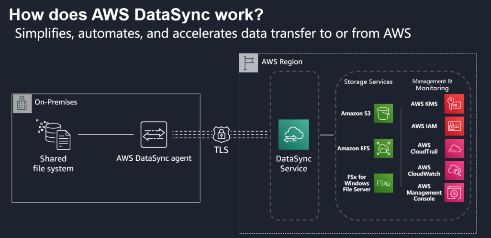
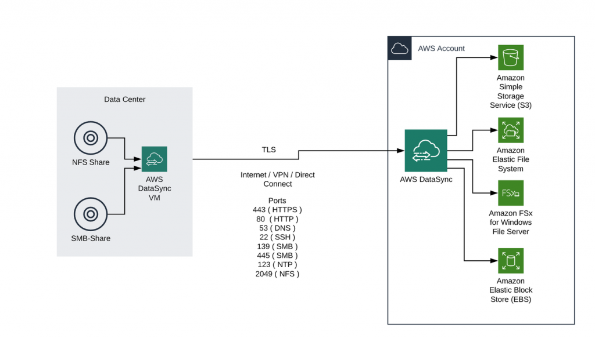
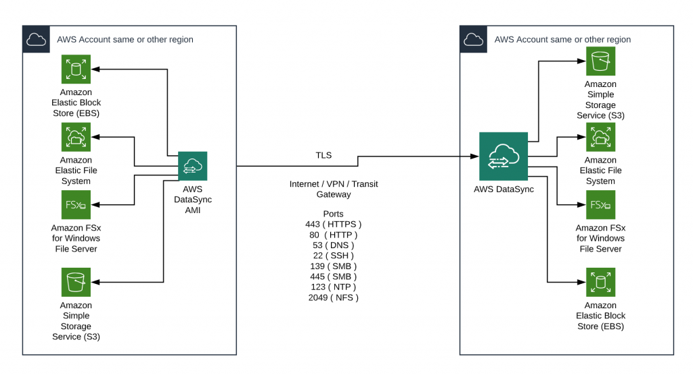
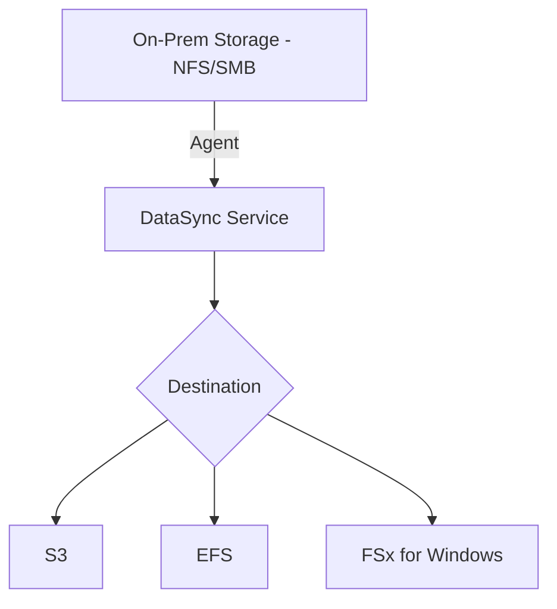

# 🔄 **AWS DataSync: Fast & Automated Data Transfers to AWS**

> _“Need to move massive data to AWS without losing time or sleep? This is your best friend.”_

**AWS DataSync** is a secure, managed service that **automates and accelerates** the transfer of large datasets between **on-premises storage** and **AWS storage services** such as **Amazon S3**, **EFS**, or **FSx**.

  

---

## 📌 **Why Use AWS DataSync?**

| Feature               | What It Means                                                           |
| --------------------- | ----------------------------------------------------------------------- |
| ⚡ **High Speed**     | Transfers data up to **10x faster** than traditional tools like `rsync` |
| 🔐 **Secure**         | Uses **TLS encryption** for data in transit                             |
| 🔧 **Automated**      | Handles scheduling, retry logic, metadata, and verification             |
| 🧰 **Easy to Deploy** | Install an on-prem **agent**, set up your task in minutes               |
| 🧩 **Multi-Protocol** | Supports **NFS**, **SMB**, and connects with **AWS Snowcone** if needed |

---

## 📦 **Common Use Cases**

### 🏢 **1. On-Prem to AWS Migration**

Move your legacy file shares or entire NFS/SMB server contents to Amazon S3, EFS, or FSx.

  

---

### 🌍 **2. AWS Region to Region Transfer**

Copy data between S3 buckets or file systems across regions for backup, compliance, or DR.

  

---

## ⚙️ **How AWS DataSync Works**

### 🔧 **1. Deploy DataSync Agent**

- Deploy as a **VM** on your on-premises infrastructure (VMware/Hyper-V/EC2).
- Connects to your local **NFS** or **SMB** server.

### 🗂️ **2. Create a Task**

- Define **source & destination** (e.g., SMB → S3).
- Add filters, bandwidth limits, and scheduling.

### 🚀 **3. Transfer & Sync**

- Launch the task and monitor via **AWS Console or CLI**.
- Data is validated and **integrity checked**.

### 🔁 **4. Optional Ongoing Sync**

- Automate incremental syncs for daily/hourly transfers.

---

## 🧾 **Pricing Overview**

| Cost Component         | Description                             |
| ---------------------- | --------------------------------------- |
| 💾 **Per GB Transfer** | Pay for data transferred — not storage  |
| 🧠 **Free Agent**      | Agent VM is free to deploy              |
| 📉 **Optimizations**   | Use filters, throttling, off-peak hours |

### 💡 **Pro Tips**

- Use **filters** to skip unnecessary files.
- Run tasks **overnight** to avoid peak-time network congestion.
- Use **Cost Explorer** to monitor your DataSync expenses.

---

## 🧪 **DataSync vs Other Services**

### ⚖️ **DataSync vs AWS Snow Family**

| Feature             | **AWS DataSync**                         | **AWS Snow Family**                            |
| ------------------- | ---------------------------------------- | ---------------------------------------------- |
| 🔗 Type             | Online (over internet or Direct Connect) | Offline (physical device shipped to you)       |
| 📦 Size             | TBs to 100s of TBs                       | TBs to **exabytes**                            |
| 🕸️ Network Required | Yes                                      | Not necessarily                                |
| 🔁 Sync Capable     | Yes (incremental support)                | No – one-time transfer unless re-deployed      |
| 🧩 Best For         | Continuous or frequent data movement     | Remote, **air-gapped**, or low-bandwidth sites |

---

### ⚖️ **DataSync vs Storage Gateway File Gateway**

| Feature                     | **DataSync**                         | **File Gateway**                                 |
| --------------------------- | ------------------------------------ | ------------------------------------------------ |
| 🎯 Purpose                  | Data **migration & sync**            | On-prem apps with **S3-backed file storage**     |
| 🧩 Protocol Support         | NFS, SMB (client)                    | NFS, SMB (server)                                |
| 🔁 Ongoing Sync             | Yes                                  | Yes (real-time)                                  |
| 🧠 Provides Storage?        | No                                   | Yes (local cache + cloud-backed)                 |
| 🧠 Provides Storage Access? | No                                   | Yes (local cache + cloud-backed)                 |
| ⚙️ Best For                 | Bulk transfer or scheduled sync jobs | Apps needing low-latency access to cloud storage |

---

## 🧠 **Key Benefits of AWS DataSync**

| 🔍 Area               | ✅ Benefit                                               |
| --------------------- | -------------------------------------------------------- |
| ⚡ Performance        | Transfers 10x faster than traditional tools              |
| 🔐 Security           | TLS encryption, IAM integration, CloudWatch logs         |
| 🎯 Precision          | Control over what to transfer and when                   |
| 🔄 Scheduling & Retry | Auto-retries, cron-like scheduling, bandwidth throttling |
| 💸 Cost Control       | Pay only for transferred data; no fixed fees             |
| 🧰 Monitoring         | Track status and history from Console or API             |

---

## 🏁 **Final Thoughts**

**AWS DataSync** is your **go-to tool** when you need to:

- ✅ Migrate millions of files or petabytes of data.
- ✅ Keep cloud and on-premises data **in sync**.
- ✅ Maintain **security**, **speed**, and **simplicity**.

It's fast, scalable, scriptable, and works across **on-prem**, **multi-region**, and **hybrid** architectures.
