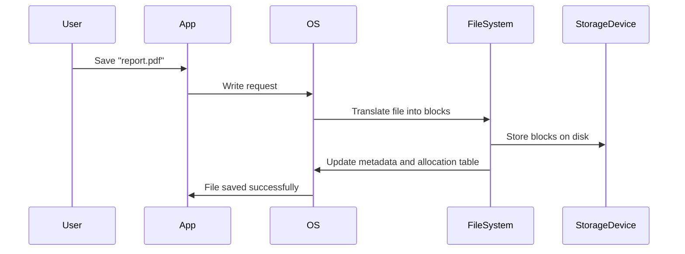

# 🗂️ **File System Explained: The Operating System’s Librarian**

> _A file system is like the librarian of your digital world — keeping your data organized, searchable, and accessible._

---

## 📌 **What Is a File System?**

A **File System** is a software layer that an **Operating System (OS)** uses to:

- **Store** files on storage devices (like SSDs, HDDs, USBs)
- **Organize** those files in a readable structure (like folders)
- **Track** where each file is located
- **Manage** how files are read, written, and deleted

> 🔍 Without a file system, your data would just be a huge pile of 1s and 0s — completely unreadable chaos.

---

## 🧠 **What Makes Up a File System?**

Think of the file system as a software **map + controller** sitting between you and your hard drive:


The **File System** acts like a translator and manager between your apps and your physical storage.

### 🧩 Core Components of a File System

| Component              | Description                                                       |
| ---------------------- | ----------------------------------------------------------------- |
| 📚 File Metadata       | Info about the file: name, size, timestamps, permissions          |
| 🗺️ Directory Structure | The hierarchy of folders and subfolders                           |
| 🧮 Allocation Table    | A map of where files are physically stored on the disk            |
| 🗑️ Free Space Tracker  | Keeps track of what blocks of storage are free or used            |
| 🔐 Permission System   | Determines who can read/write/execute files (e.g., POSIX or ACLs) |

---

## 🛠️ **Popular Types of File Systems**

Different devices and operating systems use different file systems, each with strengths and limitations.

| File System   | Common Use Case                         | OS Support                        |
| ------------- | --------------------------------------- | --------------------------------- |
| **FAT32**     | USB drives, SD cards                    | Windows, Linux, macOS             |
| **exFAT**     | Large file support on flash storage     | Windows, Linux, macOS             |
| **NTFS**      | Windows internal drives                 | Windows (full), macOS (read-only) |
| **ext4**      | Most Linux distributions                | Linux only (natively)             |
| **APFS**      | macOS and iOS devices                   | macOS, iOS only                   |
| **XFS / ZFS** | Enterprise and high-performance storage | Linux, BSD                        |

> 💡 Each file system has tradeoffs in performance, compatibility, and features like journaling or encryption.

---

## 🏗️ **How File Systems Work Internally**

### Example: Saving a File (e.g., `report.pdf`)



When you save a file:

- It gets broken into chunks (blocks)
- File system finds empty spots on the disk
- Writes the data and updates the “map” (allocation table)
- Creates metadata: file name, time, size, etc.

---

## 🧹 **File Systems Handle Deletions Too**

When you **delete** a file, most file systems:

- Don’t erase the data immediately
- Just **mark the space as available**

That’s why deleted files can sometimes be recovered!

---

## 📦 **Comparison: File System vs Database vs RAM**

| Aspect                    | File System          | Database                   | RAM                       |
| ------------------------- | -------------------- | -------------------------- | ------------------------- |
| Persists after power loss | ✅ Yes               | ✅ Yes                     | ❌ No                     |
| Structured Data           | ❌ Not enforced      | ✅ Strong structure        | ❌ Temporarily structured |
| Access Speed              | 🐢 Slower (disk I/O) | ⚡ Faster (indexed)        | ⚡⚡ Super fast           |
| Complexity                | Simple (flat files)  | Complex (schemas, queries) | Simple (temporary)        |

> 📘 File systems are foundational — **databases** and **apps** are built on top of them.

---

## 🔐 **Security in File Systems**

Most modern file systems implement:

- 🔒 **Permissions** (who can access what)
- 🧾 **Journaling** (track changes for recovery)
- 🔑 **Encryption** (protect data at rest)
- 🧠 **Snapshots** (for backups and rollback)

---

## 🔍 **How to View or Format File Systems**

### 🖥️ On Windows

- Open **Disk Management**
- See partitions and file systems (e.g., FAT32, NTFS)
- Format drives with right-click → “Format”

### 🐧 On Linux

```bash
lsblk -f
```

See file systems with `ext4`, `xfs`, etc.

Format a drive:

```bash
mkfs.ext4 /dev/sdx1
```

---

## 🧠 When You Plug in a USB Drive… Who Does the Work?

### 📦 Your USB Has

- A **storage chip** (like a mini SSD)
- It is **formatted** with a file system (like **FAT32**, **exFAT**, or **NTFS**)

But here’s the key:

> 🧠 **Your operating system** (Windows, Linux, macOS) is what _reads_, _interprets_, and _works with_ that file system.

---

### 🤔 So Where’s the Logic — In the USB or the OS?

| 💾 USB Drive                                                     | 🧠 Operating System                                                                          |
| ---------------------------------------------------------------- | -------------------------------------------------------------------------------------------- |
| Just stores raw 1s and 0s, formatted with a structure like FAT32 | Understands how FAT32 works and knows how to read/write files from/to the USB                |
| Has no intelligence to manage files                              | Has **file system drivers** that know how to handle different formats like FAT32, NTFS, ext4 |

> ✅ **Conclusion:** The **USB itself does NOT contain the software** to manage the file system — your **OS does**.

---

### 🔍 Real Life Analogy

Imagine the USB is like a **book written in a specific language (e.g., FAT32)**.  
Your **OS is the translator** who knows how to read that language and tell you what’s in the book.

So when you insert a USB drive:

1. Your OS detects the device.
2. It sees the file system (e.g., FAT32).
3. It uses its **built-in file system driver** to read it.
4. You see folders and files show up on your screen like magic. 🪄

---

### ⚠️ What if Your OS Doesn’t Support the File System?

- Plug a **Linux-formatted ext4 drive into Windows** — and you’ll get nothing unless you install special drivers.
- Plug a **macOS APFS-formatted disk into Windows** — again, nothing unless extra tools are installed.

> 👉 Because the OS **must understand the file system format** to interpret the data.

## 🧠 Summary: Why File Systems Matter

| 🎯 Purpose         | ✅ Description                          |
| ------------------ | --------------------------------------- |
| Store Data         | Organizes your files on a physical disk |
| Access & Retrieval | Makes finding and using files fast      |
| Track & Audit      | Uses metadata and logs for transparency |
| Secure & Share     | Manages who can do what with your data  |
| Power Every Device | Phones, laptops, servers, and the cloud |

---

## 📦 Bonus: File System in the Cloud

In AWS, you’ll see file systems in:

- **EFS** (Elastic File System): POSIX-compatible network file system
- **FSx**: Managed Windows/Linux file systems (NTFS, Lustre, ZFS, etc.)
- **S3** is _not_ a file system – it’s an object store, but often used like one!
