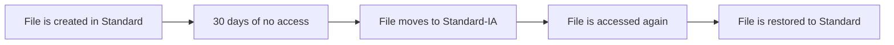
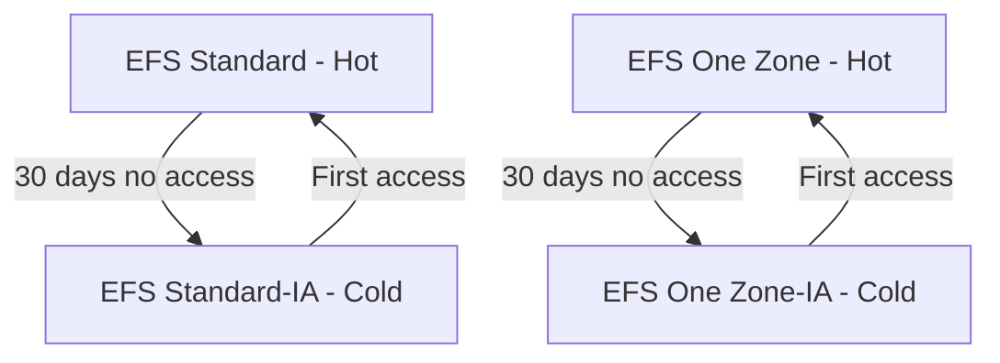

# 📁 **Amazon EFS Storage Classes**

> _Smart file storage starts with the right class._

Amazon **Elastic File System (EFS)** offers multiple **storage classes** to help you balance **performance**, **availability**, and **cost** for different workloads. Understanding and using these classes correctly lets you scale your applications efficiently while saving money.

---

  

---

## 🌟 **EFS Storage Class Overview**

EFS provides **four primary storage classes**, divided by **access pattern** and **Availability Zone (AZ)** resilience:

| Class Name     | Access Pattern | Availability Zone Scope | Best Use Case                         |
| -------------- | -------------- | ----------------------- | ------------------------------------- |
| 🔵 Standard    | Frequent       | Multi-AZ                | Active, frequently accessed workloads |
| 🟠 Standard-IA | Infrequent     | Multi-AZ                | Archives, backups, cold data          |
| 🟣 One Zone    | Frequent       | Single-AZ               | Cost-effective single-AZ apps         |
| 🟡 One Zone-IA | Infrequent     | Single-AZ               | Archiving in a specific AZ            |

---

## 🔵 **1. EFS Standard**

- **💬 What it is:** Default, high-performance file system class.
- **📌 Use it for:**
  - Web apps
  - CI/CD pipelines
  - Big data analytics
- **🚀 Benefits:**
  - Multi-AZ durability
  - High availability
  - Sub-millisecond latency
  - Automatically scales with your data

---

## 🟠 **2. EFS Standard-IA (Infrequent Access)**

- **💬 What it is:** Cheaper alternative for less-accessed data.
- **📌 Use it for:**
  - Compliance logs
  - Long-term project data
  - Restore points
- **💰 Savings:**
  - ~85% cheaper than Standard
  - Per-GB retrieval fee when accessed

---

## 🟣 **3. EFS One Zone**

- **💬 What it is:** Similar to Standard, but stores data in a **single AZ**.
- **📌 Use it for:**
  - Temporary data
  - Internal dev/test workloads
  - Media pipelines with AZ-local access
- **💸 Why use it:**
  - ~47% cheaper than Standard
  - Same performance, lower redundancy

---

## 🟡 **4. EFS One Zone-IA**

- **💬 What it is:** Infrequent Access class scoped to a single AZ.
- **📌 Use it for:**
  - Archival inside one AZ
  - Data lakes that don't require multi-AZ durability
- **💸 Cost Benefits:**
  - Cheapest storage option
  - Per-GB retrieval fee applies

### 🧠 Did You Know?

> Even though **One Zone** options are single-AZ, AWS **automatically backs them up** across 3 AZs via AWS Backup, so you're not flying blind!

---

## 🤖 **EFS Intelligent-Tiering**

Let AWS do the thinking for you! With **EFS Lifecycle Management**, files automatically move between Standard and IA classes based on access.

### ⚙️ How to Enable

1. Go to your EFS File System.
2. Navigate to **"Lifecycle Management"**.
3. Set transition policy to move files to IA after **7, 14, 30, 60, or 90 days** of no access.

---

## 🧪 Example Use Case: Web App + Archive

| Data Type           | Storage Class | Why?                                     |
| ------------------- | ------------- | ---------------------------------------- |
| User uploads        | Standard      | Frequently accessed in live app          |
| Logs older than 30d | Standard-IA   | Rarely used, but kept for audit purposes |
| Internal reports    | One Zone-IA   | Low-traffic, single-AZ system            |

---

## 💵 **Pricing Summary**

| Storage Class | Approx. Cost\* | Retrieval Fee | AZ Redundancy |
| ------------- | -------------- | ------------- | ------------- |
| Standard      | Highest        | None          | Multi-AZ      |
| Standard-IA   | ~85% cheaper   | Yes           | Multi-AZ      |
| One Zone      | ~47% cheaper   | None          | Single-AZ     |
| One Zone-IA   | Lowest         | Yes           | Single-AZ     |

> 💡 \*Pricing varies by region. See [AWS EFS Pricing](https://aws.amazon.com/efs/pricing/) for details.

---

## ✅ **Best Practices for Choosing a Storage Class**

- 🎯 Use **Standard** for hot data (active).
- 📦 Use **IA** classes for cold data you don’t access frequently.
- 🛠️ Enable **Lifecycle Policies** to automate transitions.
- 🏷️ Use **tags** and **monitoring tools** (e.g. CloudWatch) to analyze usage.

---

## 📈 **Visual Recap**

---

## 🔚 **Conclusion**

Amazon EFS Storage Classes give you **complete flexibility** to handle both hot and cold data efficiently:

- 🔥 High-speed storage for demanding workloads
- ❄️ Cost-effective options for rarely accessed files
- 🧠 Smart automation to keep everything optimized
