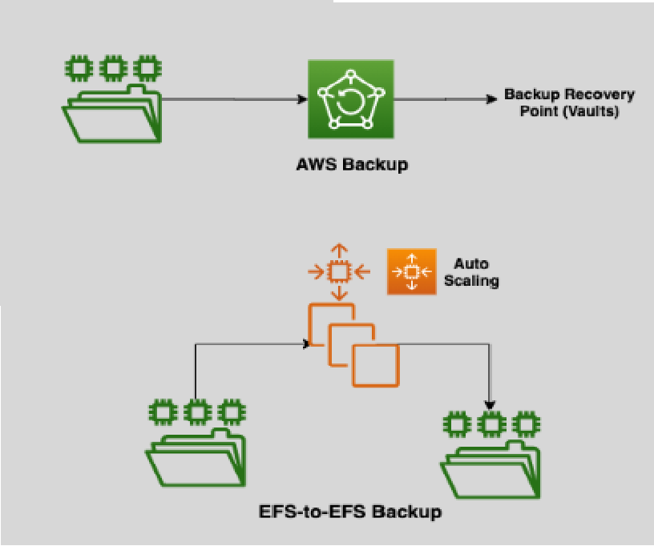
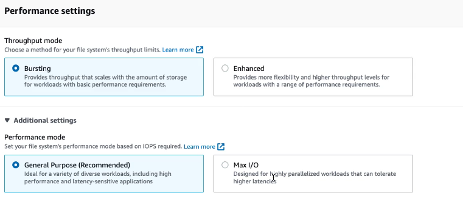
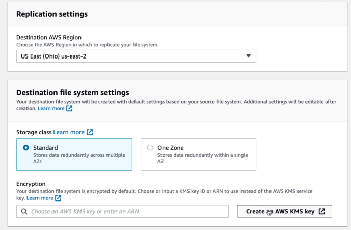

# 🛠️ **Amazon EFS Additional Features**

Enhance your Amazon Elastic File System (EFS) with a range of additional features designed to optimize security, performance, and data management. These functionalities ensure that your file storage is not only scalable and reliable but also tailored to meet your specific application needs.

---

## 🔒 **Data Encryption**

Protect your data with robust encryption mechanisms, ensuring both security and compliance.

### 🛡️ **Encryption in Transit**

- **Secure Transfers:** EFS supports encryption of data as it moves between your applications and the file system, safeguarding it from interception.

### 🔐 **Encryption at Rest**

- **KMS Integration:** Data is automatically encrypted at rest using AWS Key Management Service (KMS) keys. By default, EFS handles key management, but you can opt to disable this feature if needed.

---

## 💾 **Backup & Restore**

  

---

Ensure data durability and quick recovery with comprehensive backup solutions.

### 🔄 **1. AWS Backup** - _recommended ✅_

- **Comprehensive Solution:** Simplifies the creation, scheduling, restoration, deletion, and reporting of backups.
- **Flexible Restoration:** Restore your EFS file system from backups to the same or a new EFS file system, ensuring minimal downtime and data loss.

### 🔄 **2. EFS to EFS Backup**

- **Cross-Region Replication:** Copy data between EFS file systems in the same or different AWS Regions.
- **Use Case:** Ideal for scenarios where AWS Backup is unavailable in your target region.

---

## 🚀 **Performance Settings**

  

---

### 📈 **Throughput Modes**

Adjust throughput to match your workload's demands for optimal performance and cost-efficiency.

#### 🎈 **1. Bursting Mode (Default & Recommended)**

- **Automatic Scaling:** Throughput scales as file system size increases.
  - **Exist Credits:** If burst credits are available, throughput scales up to **100 MB/s per TB**.
  - **No Credits:** If no burst credits are available, throughput scales up to **50 MB/s per TB**.
- **Cost-Effective:** Ideal for most use cases where access patterns are unpredictable or variable.

#### ♎ **2. Provisioned Mode**

- **Consistent Throughput:** Maintains a consistent throughput regardless of file system size.
- **Cost-Optimized:** Suitable for applications with predictable workloads and predictable access patterns.

#### 💫 **3. Elastic Mode**

- **Auto-Scaling:** Throughput scales as file system size increases.
- **Use Case:** Ideal for applications with spiky or unpredictable access patterns.

> 💡 You can switch between throughput modes (only once in any 24 hours period)

---

### ⚙️ **Performance Modes**

Choose the right performance mode to align with your application's requirements.

#### 🟢 **1. General Purpose (AWS Recommended)**

- **Optimal for Most Use Cases:** Ideal for latency-sensitive applications like web serving, content management, and home directories.
- **High IOPS:** Supports up to **35,000 IOPS**, ensuring swift file operations.

#### 🔵 **2. Max I/O**

- **For Highly Parallelized Workloads:** Suited for big data, media processing, and genomics analysis.
- **Extreme IOPS:** Capable of **500,000+ IOPS**, accommodating intensive data processing needs.

---

## 🔄 **EFS Replication**

  

---

Enhance data resilience and availability by replicating your EFS file systems across regions.

- **Cross-Region Replication:** Create replicas of your EFS file system in different AWS Regions.
- **Automatic Syncing:** Ensures data and metadata are continuously synchronized, providing a **Recovery Point Objective (RPO)** and **Recovery Time Objective (RTO)** of minutes.
- **Read-Only Access:** Replicated file systems are read-only, safeguarding the integrity of your backup data.

---

## 📜 **File System Policy**

  

---

Control access and manage permissions at the file system level with resource-based policies.

- **Granular Access Control:** Define who can perform specific actions on your EFS file system.
- **Resource-Based Policies:** Attach policies directly to the file system to manage access without relying solely on IAM roles.
- **Enhanced Security:** Ensure that only authorized users and services can interact with your file system, maintaining data security and compliance.
