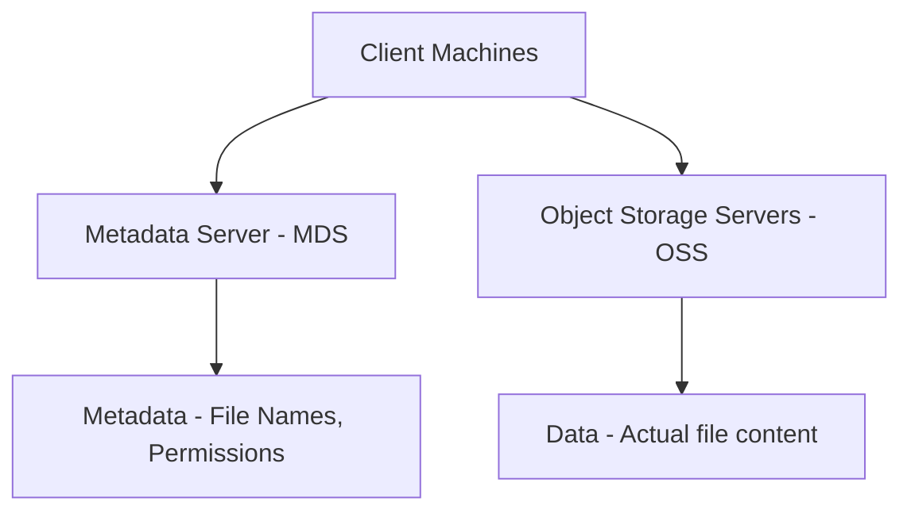

# ⚡️ **What is Lustre? — The Super-Fast File System for Big Data**

> _"Lustre" = Linux + Cluster_  
> It’s not just fast — it’s **parallel, scalable**, and **built for performance-hungry workloads**.

---

## 🧠 **Definition (Official + Simple)**

**Lustre** is a **high-performance, distributed file system** designed for **massive-scale computing** — like **supercomputers**, **machine learning**, **financial modeling**, and **scientific simulations**.

> Think of it as a **supercomputer’s file system**: multiple machines reading and writing data **at the same time**, with blazing speed. 💨

---

## 🚀 **Why Lustre?**

| Feature                      | Benefit                                                                |
| ---------------------------- | ---------------------------------------------------------------------- |
| 📊 **Parallel Access**       | Multiple clients can read/write at once — no bottlenecks               |
| 🗃️ **Scalable to Petabytes** | Handles **millions of files** and massive datasets seamlessly          |
| ⚡ **High Throughput**       | Speeds up workloads that require rapid data access (AI/ML, HPC, video) |
| 🧩 **POSIX-Compliant**       | Looks and feels like a regular Linux file system                       |

---

## 🧱 **How Lustre Works**



### 🧩 Components

| Component                           | What it does                                                           |
| ----------------------------------- | ---------------------------------------------------------------------- |
| 🧠 **Metadata Server (MDS)**        | Stores file names, permissions, structure — like a **library catalog** |
| 💾 **Object Storage Servers (OSS)** | Store the actual file content — like **bookshelves** in the library    |
| 💡 **Clients**                      | Access the file system — like **users reading/writing books**          |

---

## 📈 **How Lustre Speeds Up Performance**

### ⚙️ **Striping**

- Files are **split into chunks** and stored across **multiple OSS**.
- Clients **fetch these chunks in parallel**, boosting speed dramatically.

> It’s like having **multiple cashiers** at a grocery store. Everyone gets served faster!

---

## ☁️ **Amazon FSx for Lustre**

> _“All the power of Lustre, zero maintenance”_

**Amazon FSx for Lustre** is a fully managed Lustre service from AWS. You get all the performance benefits of Lustre **without** having to set up or operate the infrastructure.

---

### 🎯 **Why Use FSx for Lustre?**

| Advantage                     | Description                                                              |
| ----------------------------- | ------------------------------------------------------------------------ |
| 🔧 **Fully Managed**          | AWS handles setup, patching, scaling, failover, backups                  |
| ☁️ **S3 Integration**         | Easily link FSx with an Amazon S3 bucket — import/export data seamlessly |
| 🚀 **Ultra-Fast Performance** | Up to **hundreds of GB/s** throughput + millions of IOPS                 |
| 💼 **Flexible Deployment**    | Use with EC2, ECS, EKS, or HPC workloads in AWS                          |
| 🔐 **Secure**                 | Supports VPC, IAM, encryption at rest and in transit                     |

---

## 🛠️ **Common Use Cases for Lustre / FSx for Lustre**

| Use Case                        | Why Lustre/FSx is Ideal                                                   |
| ------------------------------- | ------------------------------------------------------------------------- |
| 🧬 **Life Sciences (Genomics)** | Parallel access to massive datasets like DNA sequences                    |
| 🧠 **Machine Learning (ML)**    | High-speed access to training data (think ImageNet, video datasets)       |
| 🎥 **Media Rendering**          | Render farms pulling high-res video frames simultaneously                 |
| 📊 **Big Data Analytics**       | Hadoop/Spark workloads needing shared, fast, temporary storage            |
| ☁️ **Burst to Cloud**           | Sync large datasets from on-premises or S3, run analytics, then tear down |

---

## 🔗 **How to Use FSx for Lustre with S3 (Example)**

### Step-by-Step

1. 📁 Create an **FSx for Lustre** file system linked to an **S3 bucket**
2. ⬇️ AWS automatically **loads S3 files into FSx** when accessed (lazy-loading)
3. ⬆️ When you're done, FSx can **export modified files** back to S3

```bash
aws fsx create-file-system \
  --file-system-type LUSTRE \
  --storage-capacity 1200 \
  --lustre-configuration ImportPath=s3://my-dataset
```

---

## 🧠 **Lustre vs EFS vs S3**

| Feature         | Lustre / FSx             | EFS                      | S3                       |
| --------------- | ------------------------ | ------------------------ | ------------------------ |
| ⚡ Speed        | Very high (parallel I/O) | Medium                   | Slower (object-based)    |
| 👥 Multi-client | Yes                      | Yes                      | Yes                      |
| 📁 File System  | Yes (POSIX)              | Yes (POSIX)              | No (Object storage)      |
| 🔄 Use Case     | ML, HPC, analytics       | Web servers, shared apps | Archival, static content |
| 💾 Persistent   | Temporary or persistent  | Persistent               | Persistent               |
| ☁️ AWS Service  | FSx for Lustre           | Amazon EFS               | Amazon S3                |

---

## ⚖️ **Lustre vs Hadoop HDFS**

| Feature / Aspect         | 🧠 **Lustre**                              | 🧱 **Hadoop HDFS**                         |
| ------------------------ | ------------------------------------------ | ------------------------------------------ |
| 🎯 **Purpose**           | High-performance computing (HPC), AI/ML    | Big Data storage for Hadoop ecosystem      |
| ⚙️ **Designed For**      | **Fast file access** from many clients     | **Batch processing** with Hadoop MapReduce |
| 🧩 **Access Pattern**    | Shared read/write from multiple nodes      | Write-once, read-many (append-only model)  |
| 📁 **File System Type**  | POSIX-compliant (like Linux ext4)          | Not POSIX-compliant                        |
| 🔄 **Data Access**       | Direct file access via NFS/SMB             | Access via HDFS API                        |
| 🧠 **Metadata Handling** | Dedicated **Metadata Server (MDS)**        | **NameNode** handles metadata              |
| 🚀 **Performance**       | Ultra-low latency, parallel I/O            | Optimized for throughput, not low latency  |
| 📤 **Deployment**        | Used in HPC clusters, scientific computing | Used with Hadoop, Spark, Hive, etc.        |
| ☁️ **AWS Offering**      | **Amazon FSx for Lustre**                  | Amazon EMR with HDFS                       |

---

## 🧠 Summary

- **Lustre** is great when:

  - You want **POSIX-like file system access**
  - You need to **read/write large files with low latency**
  - You're doing **scientific computing**, **ML training**, or **rendering**

- **HDFS** is great when:
  - You're working with **batch data processing**
  - You use **Hadoop, Spark, Hive, etc.**
  - Your data is mainly **write-once, read-many**
