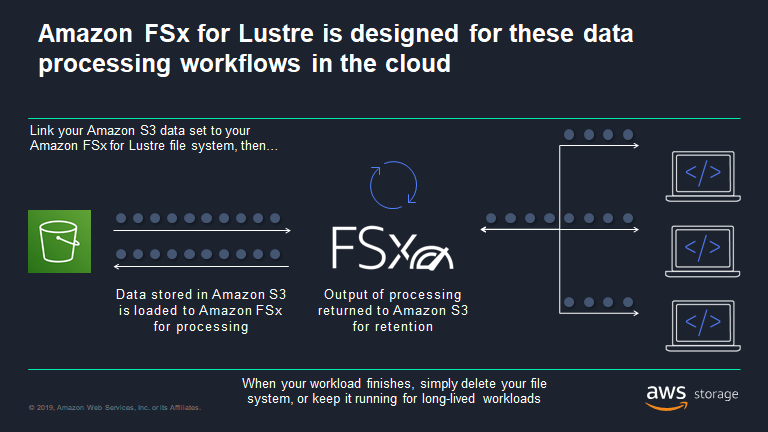
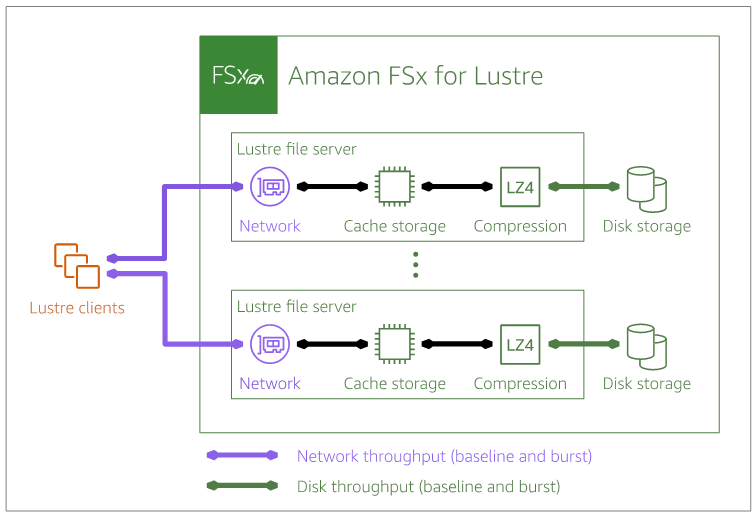
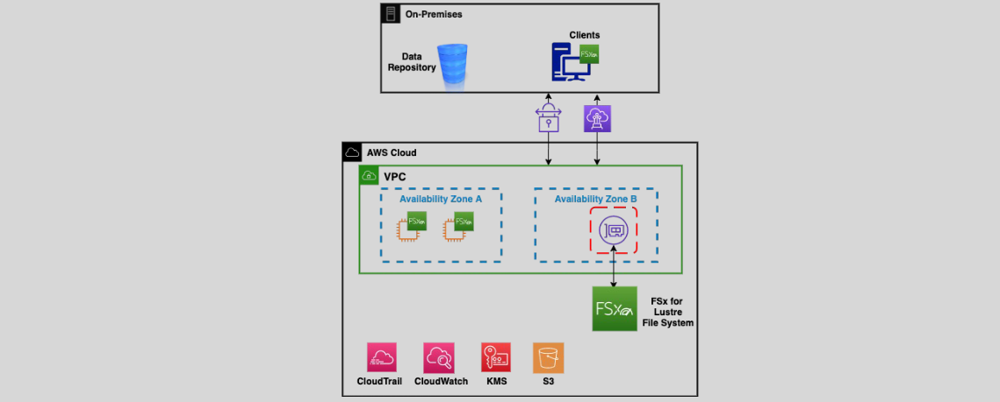

# ⚡ **Amazon FSx for Lustre**

<div align="center">
  
</div>

---

<div align="center">
  
</div>

---

## 🗄️ **What is FSx for Lustre?**

Amazon **FSx for Lustre** is your go-to solution when you need blazing-fast, parallel-access file storage for compute-heavy tasks like machine learning, big data analytics, media rendering, and scientific simulations. It's built on the open-source **Lustre** file system, widely used in high-performance computing (HPC) environments—and AWS makes it fully managed and cloud-integrated.

---

## 🚀 Key Benefits of FSx for Lustre

| Feature             | Description                                                       |
| ------------------- | ----------------------------------------------------------------- |
| ⚙️ Fully Managed    | AWS handles all provisioning, patching, and backups               |
| ⚡ High Performance | Up to **hundreds of Gbps throughput** and **millions of IOPS**    |
| 🔁 S3 Integration   | Link S3 buckets for seamless import/export                        |
| 🧪 Parallel Access  | Designed for simultaneous access from many EC2 nodes              |
| 📏 Elastic Scaling  | Grows/shrinks automatically with demand                           |
| 💾 Storage Options  | Choose between **SSD** or **HDD** based on cost/performance needs |
| 🔐 Security         | VPC isolation, IAM, encryption at rest and in transit             |

---

## 💼 Common Use Cases

- **Short-lived compute-intensive tasks** (e.g., machine learning)
- **HPC workloads** (genomics, simulations)
- **ML pipelines** (fast data ingestion + training)
- **Big Data analytics** (e.g., Spark with Hadoop connectors)
- **Video rendering & editing**
- **Software builds & compilations**

---

## 🔗 **Access to FSx for Lustre File Systems**

Accessing your FSx for Lustre file system involves configuring **Elastic Network Interfaces (ENIs)**, also known as **Mount Targets**, within your Virtual Private Cloud (VPC).

<div align="center">
  
</div>

### 🛠️ **Access Configuration:**

- **ENIs and Security Groups:**
  - Each FSx for Lustre file system creates an ENI in your VPC.
  - Associate security groups with mount targets to control access and enhance security.
- **Client Access:**
  - Accessible from AWS services like EC2, ECS, and EKS instances.
  - Can also be accessed from on-premises servers via AWS Direct Connect or VPN connections.
- **Short-Term Workloads:**
  - Optimized for temporary, compute-intensive tasks. For long-term storage, integrate with durable storage solutions like Amazon S3.

---

## 🔄 **Deployment Modes**

Choose the deployment mode that best fits your workload requirements and cost considerations.

### 🟢 **1. Scratch File System (Single AZ)**

- **Cost-Effective:** Lowest cost option, ideal for temporary data storage.
- **Short-Term Processing:** Designed for transient workloads without the need for data persistence.
- **No Backups or Replication:** Data is not backed up or replicated, making it unsuitable for long-term storage.

### 🔵 **2. Persistent File System (Single AZ)**

- **Higher Availability:** Designed for longer-term data storage with high availability within a single AZ.
- **Data Replication:** Data and metadata are replicated within the AZ for durability.
- **Automated Backups:** Supports daily automated backups to ensure data protection.

---

## 🪣 S3 Integration Explained

FSx for Lustre can **import objects from S3** and **export results back to S3**, enabling ultra-fast, short-lived data processing jobs that don’t require persistent file storage.

### Example

1. Import training data from S3 to FSx for Lustre
2. Train your ML model on EC2 GPU instances
3. Export the results (e.g., trained model) back to S3

No need to manually sync—it happens transparently!

---

## 🖧 How to Use FSx for Lustre

### 1. Create File System

- Console or AWS CLI
- Optionally link to S3 bucket

### 2. Launch EC2 Instance

- In the same VPC and subnet as the FSx ENI

### 3. Install Lustre Client

```bash
sudo amazon-linux-extras install -y lustre2.10
```

### 4. Mount File System

```bash
sudo mount -t lustre <fsx-dns-name>@tcp:/fsx /mnt/fsx
```

---

## 🔐 Security and Access Control

- Use **security groups** to allow traffic on **TCP port 988**
- Enable **IAM policies** for granular access control
- Supports **encryption at rest** with AWS KMS
- Integrates with **CloudTrail** and **CloudWatch** for audit and monitoring

---

## 📊 Monitoring and Backups

- **CloudWatch:** Real-time performance metrics
- **AWS Backup:** File-system-consistent, incremental backups
- **Events:** CloudTrail logs every API call for full visibility

---

## 🧠 Final Thought

Amazon FSx for Lustre is the **Ferrari** of AWS file systems—fast, sleek, and built for serious work. If you're pushing petabytes, crunching teraflops, or training gigabyte-hungry models, **this is your go-to file system**.
