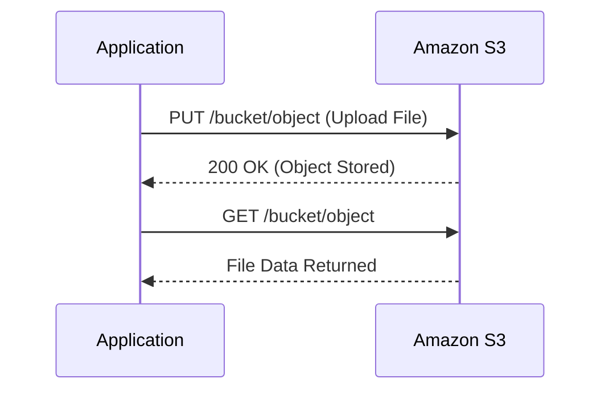

# ☁️ AWS S3 – Your Scalable Cloud Bucket

**AWS Simple Storage Service (S3)** is Amazon’s go-to solution for storing virtually **unlimited data** in the cloud. It offers industry-leading **durability**, **availability**, and **security**.

<div style="text-align:center">
  
</div>

---

## 🌟 Why Use S3?

- 📦 **Unlimited Storage**: No limits — store gigabytes or petabytes.
- 📂 **Flexible Object Sizes**: Upload anything from a **few bytes to 5TB**.
- 🛠️ **Fully Managed**: You don’t manage servers or disks.
- ⚡ **Highly Durable**: **11 nines** (99.999999999%) durability.

---

## 🪣 What’s a Bucket?

Buckets are your **logical containers** for storing objects in S3.

- 🌍 **Region-Specific**: Buckets exist in one region.
- 🔒 **Owned by Your AWS Account**.
- 📁 Think of them like cloud folders — but way more scalable.

---

## 🔐 Access & Ownership

- 🧾 **Bucket Ownership**: Can’t transfer, but you can share access.
- 🚪 **Public or Private**: You control object and bucket-level permissions.
- 🌐 **No VPC Needed**: S3 is publicly accessible (unless you restrict it).

---

## 🔄 Durability & Redundancy

S3 stores **multiple copies across Availability Zones (AZs)**:

- 🛡️ Automatically replicates data in **multiple facilities**.
- 🧬 Prevents single point of failure.

---

## 🔍 How to Access an S3 Object

Every object in S3 is identified by a **unique key** and accessed via URL:

- **Service Endpoint** → `https://s3.amazonaws.com`
- **Bucket Name** → e.g., `my-app-assets`
- **Object Key** → e.g., `profile-pic.jpg`
- **Version ID** → (if versioning is enabled)

📌 Example:

```ini
https://my-app-assets.s3.amazonaws.com/profile-pic.jpg
```

---

## 🧠 Mermaid Sequence: Storing a File

<div style="text-align:center">



</div>

---

## 📌 Use Cases

| Use Case           | Why S3 Rocks 🌟                                   |
| ------------------ | ------------------------------------------------- |
| Backups & Archives | Durable, redundant, cost-effective                |
| Static Websites    | Host HTML, CSS, JS directly with S3 + CloudFront  |
| Data Lakes         | Integrates with Athena, Redshift, EMR             |
| Media Storage      | Store images, videos, PDFs, and serve via HTTP(S) |
| App Assets         | Mobile/web apps load S3 content fast              |

---

## ✅ Summary: Why S3 is Loved

- 🔄 **Durable** → Stores data across multiple AZs.
- 🚀 **Scalable** → No need to provision or resize.
- 🌍 **Global Access** → Easily available via the internet.
- 🛡️ **Secure** → Encryption, access policies, audit logs.
- 💸 **Cost-Effective** → Tiered storage: Standard, IA, Glacier.

---

> 💡 S3 is not just a place to store files — it’s a **backbone for modern cloud apps**, data lakes, analytics platforms, and media delivery systems.
